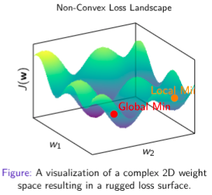
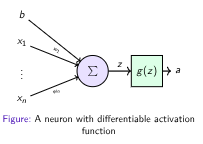
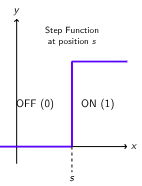
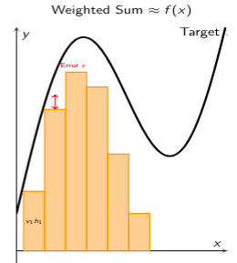

## Slide 21 — Inspiration from the Brain
*(Figure: A biological neuron — Source: Wikipedia)*

**A Simple Model of a Neuron**
- Receives signals via **Dendrites**
- Integrates signals in the **Soma** (Cell body)
- If threshold is met, it **Fires**
- Sends output signal via **Axon**

> **Important: Inspiration, Not a Replica** — Brain is vastly more complex; Biological learning is not backpropagation; This is a useful abstraction, not a perfect model

***
## Slide 23 — M-P Neuron Examples: Logical Functions
Inputs are binary $x \in \{0,1\}$

**1. The AND Function** (Fires only if all inputs are 1), Threshold $\theta = 2$

| x₁ | x₂ | Sum | y |
|---|---|---|---|
| 0 | 0 | 0 | 0 |
| 0 | 1 | 1 | 0 |
| 1 | 0 | 1 | 0 |
| 1 | 1 | 2 | **1** |

**2. The OR Function** (Fires if at least one input is 1), Threshold $\theta = 1$

| x₁ | x₂ | Sum | y |
|---|---|---|---|
| 0 | 0 | 0 | 0 |
| 0 | 1 | 1 | **1** |
| 1 | 0 | 1 | **1** |
| 1 | 1 | 2 | **1** |

> **Observation:** By simply changing the threshold, the same physical structure performs a completely different logical function.

***

## Slide 25 — Geometric Interpretation: Drawing a Line
**The Mathematical Boundary**
- Firing condition for 2 inputs: $x_1 + x_2 \geq \theta$
- Boundary line: $x_1 + x_2 = \theta$ (i.e., $x_2 = -x_1 + \theta$)
- Points **above** the line → Neuron Fires (1); Points **below** → Neuron Silent (0)

> **Key Takeaway — Linear Separability:** The MP Neuron is a **Linear Classifier**. It works by drawing a single straight line to separate "Yes" from "No" answers.

***

## Slide 27 — Critical Limitations of the M-P Neuron
*"A Calculator, Not a Learner"* — The M-P neuron was a fixed logic gate. It could compute, but it could **not** learn.

- ✗ **No Feature Importance:** Equally weighted features; Can't prioritize key inputs → Missing piece: **Weights**
- ✗ **No Automatic Learning:** Threshold is fixed; must be set manually → Missing piece: **A Learning Rule**
- ✗ **Restricted to Binary I/O:** Inputs must be 0 or 1; Can't handle real-valued data

***

## Slide 28 — The Leap to Learning: The Perceptron (1958)
*(Figure: The Perceptron — introduces learnable weights wᵢ on each input)*

- **Innovation 1 — Weighted Inputs:** Each input multiplied by a weight; weights represent feature importance; model can now prioritize signals
- **Innovation 2 — The Learning Rule:** Compares prediction ŷ to true label y; if wrong, adjusts the weights to correct the error

> **Significance:** *The Birth of Learning Machines* — For the first time, a machine could automatically learn to classify patterns, laying the foundation for all of modern deep learning.

***

## Slide 29 — Mathematical Formulation: From Fixed to Flexible

| | McCulloch-Pitts (Old Way) | Perceptron (New Way) |
|---|---|---|
| Inputs | Binary $x_i \in \{0,1\}$ | Real numbers $x_i \in \mathbb{R}$ |
| Weights | None (all 1) | Learnable $w_i \in \mathbb{R}$ |
| Threshold | Fixed | Learnable bias $b$ |
| Rule | $y=1$ if $\sum x_i \geq \theta$ | $y=1$ if $\sum w_i x_i + b \geq 0$ |

**Compact Notation:** $z = \mathbf{w}^T \mathbf{x} + b$

***

## Slide 30 — Implementing Logic Gates with Weights
Same architecture, different tasks by adjusting **w** and **b**:

**1. AND Gate** ($y=1$ iff $x_1=1, x_2=1$): $w_1=1, w_2=1, b=-1.5$
**2. OR Gate** ($y=1$ if any $x_i=1$): $w_1=1, w_2=1, b=-0.5$

***

## Slide 32 — Geometric Interpretation: The Hyperplane
- **The Decision Boundary:** $\mathbf{w} \cdot \mathbf{x} + b = 0$ defines a line in 2D or a hyperplane in nD
  - $\mathbf{w} \cdot \mathbf{x} + b > 0$ → Class 1; $\mathbf{w} \cdot \mathbf{x} + b < 0$ → Class 0
- **The Weight Vector w:** Always orthogonal (perpendicular) to the decision boundary; points toward the "Yes" (1) class

***

## Slide 33 — Geometric Intuition: Rotation vs. Translation
1. **Changing Weights (w) → Controls Orientation:** Rotating the boundary around the center; changes which feature matters more
2. **Changing Bias (b) → Controls Position:** Shifting the boundary without rotating; changes the activation threshold

***

## Slide 34 — The Role of Bias (w₀): Shifting the World
- Without bias ($b=0$), the decision boundary **must pass through the origin**
- **Problem:** What if the data isn't centered at the origin?
- **Solution:** Bias $b$ acts as an offset — shifts the activation function left or right; allows the boundary to move off the origin to fit the data better

***

## Slide 35 — An Intuitive Personality Check
- Think of $\sum w_i x_i$ as **External Evidence** (Is the food good? Is it cheap?)
- Think of Bias $b$ as your **Internal Disposition** (how easy/hard it is to trigger you)

> **Golden Rule:** Evidence + Bias > 0 → Action

- **The Extrovert** ($b=+5$): Even if music is bad (input $x=-2$): $-2+5=3>0$ → **GO!**
- **The Homebody** ($b=-5$): Music must be AMAZING ($x=6$): $6-5=1>0$ → **GO**

***

## Slide 36 — The Learning Problem
**Goal:** Find **w** and **b** such that:
- $\forall \mathbf{x} \in P: \mathbf{w} \cdot \mathbf{x} + b \geq 0$
- $\forall \mathbf{x} \in N: \mathbf{w} \cdot \mathbf{x} + b < 0$

**Challenge:** Start with random weights → line is wrong → how do we move it?

**Approach:** Iterative Error Correction — loop through data, nudge weights on every mistake

***

## Slide 37 — The Perceptron Learning Algorithm
```
Input: Training data D = {(x, y)}
Initialize: w = 0 (or random small numbers)
Loop until convergence (no mistakes):
  For each (x, y) in D:
    1. Predict: ŷ = sign(w·x)  [1 if ≥ 0, else 0]
    2. Update if ŷ ≠ y (mistake):
       - If y=1 but ŷ=0 (False Negative): w ← w + x
       - If y=0 but ŷ=1 (False Positive): w ← w - x
```
*Note: Bias b is absorbed into w by appending a 1 to every input vector x.*

***

## Slide 38 — The Intuition: Steering the Weight Vector
we want the weight vector w to point in the 'correct' direction relative to our input data x.
- For **Positive examples** (y=1): **w** should point roughly the same direction as **x** (angle < 90°)
- For **Negative examples** (y=0): **w** should point away from **x** (angle > 90°)
- On mistake: nudge **w** to fix the angle

***

## Slide 39 — Case 1: False Negative (The Pull Effect)
- **Error:** x is Positive (y=1), model predicted Negative ($\mathbf{w} \cdot \mathbf{x} < 0$) → angle > 90°
- **Fix:** $\mathbf{w}_{new} = \mathbf{w} + \mathbf{x}$ (add input vector → pulls **w** toward **x**)
- **Result:** Angle decreases; $\mathbf{w} \cdot \mathbf{x}$ becomes more positive ✓

***

## Slide 40 — Case 2: False Positive (The Push Effect)
- **Error:** x is Negative (y=0), model predicted Positive ($\mathbf{w} \cdot \mathbf{x} \geq 0$) → angle < 90°
- **Fix:** $\mathbf{w}_{new} = \mathbf{w} - \mathbf{x}$ (subtract input vector → pushes **w** away from **x**)
- **Result:** Angle increases; $\mathbf{w} \cdot \mathbf{x}$ becomes more negative ✓

***

## Slide 41 — Mathematical Proof: Why the Dot Product Improves

**1. False Negative Update ($\mathbf{w} \leftarrow \mathbf{w} + \mathbf{x}$):**
$$\mathbf{w}_{new} \cdot \mathbf{x} = (\mathbf{w}_{old} + \mathbf{x}) \cdot \mathbf{x} = \underbrace{\mathbf{w}_{old} \cdot \mathbf{x}}_{\text{Old Score}} + \underbrace{\|\mathbf{x}\|^2}_{>0}$$
→ Score **increases** ✓

**2. False Positive Update ($\mathbf{w} \leftarrow \mathbf{w} - \mathbf{x}$):**
$$\mathbf{w}_{new} \cdot \mathbf{x} = (\mathbf{w}_{old} - \mathbf{x}) \cdot \mathbf{x} = \underbrace{\mathbf{w}_{old} \cdot \mathbf{x}}_{\text{Old Score}} - \underbrace{\|\mathbf{x}\|^2}_{>0}$$
→ Score **decreases** ✓

Since $\mathbf{w} \cdot \mathbf{x} = \|\mathbf{w}\|\|\mathbf{x}\|\cos\theta$, increasing the dot product decreases the angle, and vice versa. 

***

## Slide 42 — Real Inputs, Rigid Boundaries
- **The Misconception:** "Since we use real numbers, can't we solve complex problems?"
- **The Reality:** $\sum w_i x_i + b = 0$ is still a **Linear Hyperplane** — in 2D, a straight line $y = mx + c$ — it cannot bend, curve, or encircle data
- Changing the domain from Binary to Real only *fills the space* — it doesn't bend the ruler

***

## Slide 43 — Perceptron Strengths & Limitations

**Strengths**
- **It Learns!** Automatic learning rule adjusts weights from data
- **Feature Importance:** Learns which inputs are more important via weights
- **Convergence Guarantee:** If data is linearly separable, guaranteed to find a solution

**Limitations**
- **Linear Separability:** Only works where a single straight line (or hyperplane) can separate the classes
- **Harsh Threshold:** The step function activation is not differentiable — prevents modern gradient-based training

***

## Slide 44 — From Neuron to Network: Multilayer Perceptrons (MLP)
1. **Input Layer:** Raw data **x**; no computation — just passes values forward
2. **Hidden Layers:** The core innovation; hidden from the outside world; transform input into new features
3. **Output Layer:** Final decision **y**; combines features from the hidden layer

*(Figure: x₁, x₂, x₃ → [h₁, h₂, h₃, h₄] Hidden Layer → y Output)*

***

## Slide 45 — How Hidden Layers Solve the Impossible
*Logic: Divide and Conquer*

- A single Perceptron draws **one line** → fails at XOR
- A Network draws **multiple lines:**
  1. Hidden Neuron 1: Draws Line A (separates top-left)
  2. Hidden Neuron 2: Draws Line B (separates bottom-right)
  3. Output Neuron: Combines them (Active if Line A OR Line B)

> **Key Insight:** Hidden layers transform the space so that the problem becomes linearly separable for the output layer.

***

## Slide 46 — Visualizing the Transformation: XOR Solved (Part 1)
**Simple MLP (1 hidden layer, 2 neurons, step activation):**
- $h_1$ acts like OR ($x_1+x_2 \geq 0.5$): $w_0=-0.5, w_1=1, w_2=1$
- $h_2$ acts like AND ($x_1+x_2 \geq 1.5$): $w_0=-1.5, w_1=1, w_2=1$
- Output y: $h_1 - h_2 \geq 0.5$ (essentially $h_1$ AND NOT $h_2$)

**Computation Trace:**

| (x₁,x₂) | (h₁,h₂) | y |
|---|---|---|
| (0,0) | (0,0) | 0 |
| (0,1) | (1,0) | **1** |
| (1,0) | (1,0) | **1** |
| (1,1) | (1,1) | 0 |

> **Key Observation:** Inputs (0,1) and (1,0) are distant in input space, but the hidden layer maps them to the **exact same point** (1,0) in hidden space.

***

## Slide 47 — Visualizing the Transformation: XOR Solved (Part 2)
- **A. Input Space:** XOR is inseparable by a straight line
- **B. Hidden Space:** After transformation — the classes become **linearly separable!**

***

## Slide 48 — Weights in a Network: Enter Linear Algebra
- In a single perceptron, weights were a **vector** **w**
- In a network: if Layer 1 has **m** neurons and Layer 2 has **n** neurons → we need $m \times n$ connections

**The Weight Matrix:**
$$\mathbf{h} = f(\mathbf{W}\mathbf{x} + \mathbf{b})$$
where **W** is a matrix of size $n \times m$; Row $i$ contains weights for Neuron $i$ — it learns to detect one specific feature

***

## Slide 49 — A Provocative Thought: The Lego Block of Intelligence?
- 2 neurons carved out the XOR shape by combining straight lines — essentially a "cut-out" in space

> **The Big Question:** If 2 neurons can carve out an XOR shape... what could we carve out with **100 neurons? Or 1,000,000?**

> **The Hypothesis:** Maybe, just maybe, if we have enough neurons, we can approximate **any shape, any decision boundary, or any mathematical function in the universe.**

***

## Slide 50 — Looking Ahead: From Logic to Calculus (Module 1B)
**Representation & Optimization:**
- **The Universal Approximation Theorem:** Formalizing the idea that MLPs can approximate any continuous function
- **The Modern Neuron:** Why Step functions are dead ends for learning (Derivative is 0 or $\infty$)
- **Enter Calculus:** Transitioning to differentiable activation functions — **Sigmoid, Tanh, and ReLU**

This is the same **1B-Modern-Neuron-and-MLP.pdf** file that was already extracted earlier in this conversation. Since the PDF pages are directly visible above, here is the exact, complete slide-by-slide content — extracted verbatim from all 68 PDF pages (which correspond to **27 unique slides** with Beamer animation overlays): 

***

## Slide 4 — Approach 1: Stochastic Weight Guessing

- **Concept:** Treat the network as a black box. Randomly sample weight vectors **w** from a high-dimensional space until performance is satisfactory.

**Formal Failure Analysis (Curse of Dimensionality):**
- Consider a small network with $N = 1000$ weights.
- Assume each weight is quantized to just two values, $w_i \in \{-1, 1\}$.
- The search space size is $|\mathcal{W}| = 2^{1000} \approx 10^{301}$.
- For context, the number of atoms in the observable universe is $\approx 10^{80}$.

- **Conclusion:** The volume of the parameter space grows exponentially with the number of parameters. Brute-force or undirected random search is theoretically non-viable for practical networks.
- We need a **systematic method** to navigate this space. 

***

## Slide 5 — Approach 2: Parameterization

**Core Idea:** We define our network as a function with a set of learnable parameters (weights and biases), denoted by **w**. The goal is to find the optimal values for $\theta$.

**The Network as a Function:**

$$\hat{y} = f(\mathbf{x}; \mathbf{w})$$

where:
- $\mathbf{x}$ is the numerical input data
- $f$ is the network architecture (e.g., layers, activation functions)
- $\mathbf{w}$ represents all the weights and biases in the network
- $\hat{y}$ is the model's prediction 

***

## Slide 6 — Quantifying Performance: The Loss Function

- To improve, we must quantify "badness." We define a **Loss Function** (or Cost/Objective Function), $\mathcal{L}$.
- Given a dataset $\mathcal{D} = \{(\mathbf{x}^{(i)}, y^{(i)})\}_{i=1}^N$, we measure the discrepancy between predictions $\hat{y}^{(i)} = f(\mathbf{x}^{(i)}; \mathbf{w})$ and targets $y^{(i)}$.

**Example: Mean Squared Error (MSE)** used for regression:

$$J(\mathbf{w}) = \frac{1}{N}\sum_{i=1}^{N}(y^{(i)} - \hat{y}^{(i)})^2$$

*(Figure: Visualizing MSE — The loss function minimizes the sum of squared vertical residuals (orange lines).)* 

***

## Slide 7 — The Parameter Space & Loss Landscape

- **Shift in Perspective:** During training, the data $\mathcal{D}$ is fixed. The network's parameters **w** are the variables.
- We view the loss as a function solely of the weights: $J(\mathbf{w}): \mathbb{R}^d \rightarrow \mathbb{R}$.
- This defines a high-dimensional **"loss landscape":**
  - **Coordinates:** The values of the weights $(w_1, w_2, \ldots, w_d)$
  - **Altitude:** The loss value $J(\mathbf{w})$



*(Figure: Non-Convex Loss Landscape — a rugged surface with Global Min and Local Min marked)* 

***

## Slide 8 — Optimization via Calculus

- Assuming $J(\mathbf{w})$ is differentiable, calculus provides the direction of steepest ascent.

**The Gradient** — the vector of partial derivatives with respect to all weights:

$$\nabla_\mathbf{w} J = \left[\frac{\partial J}{\partial w_1}, \frac{\partial J}{\partial w_2}, \ldots, \frac{\partial J}{\partial w_d}\right]^T$$

- The **negative gradient**, $-\nabla_\mathbf{w} J$, points in the direction of steepest *descent*.
- We move **opposite** to the gradient to reach the minimum of the loss function. This is called **Gradient Descent**.

*(Figure: You are here → Gradient \(\nabla_\mathbf{w} J\) points up; Your Step \(-\nabla_\mathbf{w} J\) points down along the curve)* 

***

## Slide 9 — The Supervised Learning Setup

**A typical supervised machine learning system consists of five key components:**

1. **Data:** A collection of $n$ labeled examples, denoted as $\mathcal{D} = \{(\mathbf{x}^{(i)}, y^{(i)})\}_{i=1}^n$.
2. **Model:** An approximation function that maps input $x$ to output $y$.
3. **Parameters:** The unknown variables (e.g., weights **w**) within the model that determine its behavior. These must be learned.
4. **Objective / Loss Function:** A metric $J(\mathbf{w})$ (e.g., Squared Error) that quantifies the difference between the model's prediction $\hat{y}$ and the true label $y$.
5. **Learning Algorithm:** The optimization method (e.g., Gradient Descent) used to adjust the parameters **w** to minimize the Loss Function. 

***

## Slide 10 — Recap: The Perceptron

**Formal Definition:**
A Perceptron is a linear classifier that maps a real-valued input vector **x** to a binary output $y$:

$$y = \phi(\mathbf{w} \cdot \mathbf{x} + b)$$

where $\phi(z)$ is the **Step Function**: $\phi(z) = 1$ if $z \geq 0$, else $0$

**Two Critical Limitations:**

1. **Capacity:** It can only solve linearly separable problems.
   *We addressed this by stacking Perceptrons into a Neural Network (MLP).*

2. **Threshold:** The Step function \((\phi)\) has a "Harsh Threshold." Its derivative is either 0 or undefined.
   *How do we get a Gradient if the derivative is 0?* 

***

## Slide 11 — The Modern Neuron

*(Figure: A neuron with differentiable activation function — inputs x₁…xₙ and bias b → Σ → z → g(z) → a)*



**Step 1: Linear Combination**
- Calculates a weighted sum of inputs plus a bias.
- Output is $z = \mathbf{w} \cdot \mathbf{x} + b$.

**Step 2: Differentiable Activation**
- Passes the linear output \(z\) through a differentiable activation function \(a = g(z)\).

> **Why Differentiability is the Superpower?**
> Differentiable → **gradient**. This gradient is used to adjust weights to fix errors. It is the core requirement for **backpropagation**. 

***

## Slide 12 — The Sigmoid Neuron

**The Definition:**
We replace the sharp Step Function with the smooth **Sigmoid Function** $(\sigma)$:

$$\sigma(z) = \frac{1}{1 + e^{-z}}$$

**Key Properties:**
- **Continuous Output:** Returns a value between 0 and 1 (e.g., 0.73).
- **Probabilistic Interpretation:** Can be seen as $P(y = 1 \mid \mathbf{x})$.
- **Differentiable:** The slope exists everywhere; $\sigma'(z) \neq 0$ (mostly).

*(Figure: Old Perceptron step function vs. smooth Sigmoid S-curve, x-axis = \(z = \mathbf{w} \cdot \mathbf{x} + b\))* 

***

## Slide 13 — Evolution of the Neuron: Side-by-Side Comparison

| | **1. The Perceptron** | **2. The Sigmoid Neuron** |
|---|---|---|
| **Equation** | $y = 1$ if $\mathbf{w}\cdot\mathbf{x}+b \geq 0$, else $0$ | $y = \sigma(z) = \frac{1}{1+e^{-(\mathbf{w}\cdot\mathbf{x}+b)}}$ |
| **Output** | Binary $\{0, 1\}$ | Real value $[0, 1]$ |
| **Nature** | Hard Threshold | Smooth (S-Curve) |
| **Derivative** | 0 or Undefined | Non-zero: $y(1-y)$ |

 

***

## Slide 14 — Worked Example: Hidden Layer with Sigmoid (Part 1)

**Task:** Compute the output of a hidden layer with 3 neurons, receiving input from 2 neurons, using Sigmoid Activation.

*(Figure: x₁ = 0.5, x₂ = 1.0 → hidden neurons h₁, h₂, h₃)*

**1. Define inputs, weights, and biases:**

$$\mathbf{x} = \begin{bmatrix}0.5\\1.0\end{bmatrix}, \quad \mathbf{W} = \begin{bmatrix}0.2 & 0.7\\-0.4 & 0.1\\0.9 & -0.3\end{bmatrix}, \quad \mathbf{b} = \begin{bmatrix}0.1\\0.2\\-0.5\end{bmatrix}$$

**2. Calculate the weighted sum $\mathbf{z} = \mathbf{W}\mathbf{x} + \mathbf{b}$:**

$$\mathbf{z} = \begin{bmatrix}0.2 & 0.7\\-0.4 & 0.1\\0.9 & -0.3\end{bmatrix}\begin{bmatrix}0.5\\1.0\end{bmatrix} + \begin{bmatrix}0.1\\0.2\\-0.5\end{bmatrix} = \begin{bmatrix}0.9\\0.1\\-0.35\end{bmatrix}$$

 

***

## Slide 15 — Worked Example: Hidden Layer with Sigmoid (Part 2)

The activation function is Sigmoid: $g(z) = \sigma(z) = \frac{1}{1+e^{-z}}$

**3. Apply Sigmoid activation $\mathbf{a} = \sigma(\mathbf{z})$:**

$$\mathbf{a} = \begin{bmatrix}\frac{1}{1+e^{-0.9}}\\\frac{1}{1+e^{-0.1}}\\\frac{1}{1+e^{0.35}}\end{bmatrix} \approx \begin{bmatrix}0.71\\0.52\\0.41\end{bmatrix}$$

This vector **a** is the output of this layer. 

***

## Slide 16 — Linear Model vs Artificial Neural Networks

**Linear Model:**

$$\hat{y} = w_0x_0 + w_1x_1 = \sum w_ix_i$$

*A Linear Model is a weighted sum of input features.*

**Neural Network Model:**
*(Input Layer → Hidden Layer → Output Layer)*

$$a = g\left(\sum w_ix_i\right)$$

$$a = \Sigma \rightarrow g \rightarrow \text{To next layer/output}$$

**A Neuron has a linear AND a nonlinear operation** 

***

## Slide 17 — Why Do We Need Activation Functions?

> **The Problem: Stacking Linear Layers is Useless**
> Without a non-linear activation function, a deep network simply collapses into a single linear model, no matter how many layers it has.

**Without Non-Linearity:**
- A layer is a linear operation: $\mathbf{W}\mathbf{x} + \mathbf{b}$
- Stacking them: $L_2(L_1(\mathbf{x})) = \mathbf{W}_2(\mathbf{W}_1\mathbf{x} + \mathbf{b}_1) + \mathbf{b}_2$
- This simplifies to: $(\mathbf{W}_2\mathbf{W}_1)\mathbf{x} + (\mathbf{W}_2\mathbf{b}_1 + \mathbf{b}_2)$
- This is just another linear function: $\mathbf{W}'\mathbf{x} + \mathbf{b}'$
- **A 100-layer linear network has the same power as a 1-layer network.**

**With Non-Linearity $(g)$:**
- The equation becomes: $g(\mathbf{W}_2 g(\mathbf{W}_1\mathbf{x} + \mathbf{b}_1) + \mathbf{b}_2)$
- This function **cannot** be simplified.
- This allows the network to learn arbitrarily complex, "wiggly" functions. 

***

## Slide 18 — Section Divider: Representation Power of MLP

# Representation Power of Multi-Layer Perceptron 

***

## Slide 19 — The Universal Approximation Theorem

> **Theorem (Cybenko 1989, Hornik 1991)**
> Let $\sigma(\cdot)$ be a non-constant, bounded, and continuous activation function (e.g., Sigmoid, Tanh, ReLU).
> Then, for any continuous function $f(x)$ defined on a compact subset of $\mathbb{R}^n$ and for any error tolerance $\epsilon > 0$, there exists a Neural Network with **one hidden layer** containing a finite number of neurons that can approximate $f(x)$ such that:
> $$|F(x) - f(x)| < \epsilon \quad \forall x$$

**Implication:**
- Neural Networks are *universal function approximators*.
- In theory, a simple 2-layer network (1 hidden layer) can solve *any* problem, given enough neurons. 

***

## Slide 20 — Controlling Steepness with Weight \(w\)

**The Mechanism:**
- Consider the sigmoid: $\sigma(w \cdot x)$.
- The weight $w$ acts as a "gain" factor.
- **Small $w$:** The function is lazy and linear near the origin.
- **Large $w$:** The function transitions rapidly from 0 to 1.
- As $w \rightarrow \infty$, the sigmoid converges to a hard step.

*(Figure: Effect of Weight magnitude — 3 sigmoid curves of increasing steepness plotted on \(x \in [-2, 2]\))* 

***

## Slide 21 — Controlling Position with Bias \(b\)

**The Mechanism:**
- Now consider: $\sigma(w \cdot x + b)$.
- The "step" occurs when the input to the sigmoid is 0.
- Equation: $wx + b = 0 \Rightarrow x = -b/w$
- **Interpretation:** The center of the step is shifted to position $s = -b/w$.
- This allows us to place the "switch" **anywhere** on the x-axis.

*(Figure: Shifting the Step \((w=10)\) — red curve shifted left, blue curve shifted right)* 

***

## Slide 22 — Creating the "Hard" Step

**The Limit Definition:**
- By combining a very large weight $(w \rightarrow \infty)$ and a specific bias, we can simulate a Heaviside Step Function $H(x)$.
- We define the step position as $s$; we set $b = -w \cdot s$.

$$\lim_{w \to \infty} \sigma(w(x - s)) = \begin{cases} 0 & \text{if } x < s \\ 1 & \text{if } x > s \end{cases}$$



**Why this matters:** This creates a "switch" that turns ON at exactly position \(x = s\). We will use **pairs of these switches** to build "bumps."

*(Figure: Step Function at position \(s\) — OFF (0) to the left, ON (1) to the right)* 

***

## Slide 23 — Constructing a "Bump"

**The Tower Construction:**
1. Take Neuron 1 with step at $s_1$.
2. Take Neuron 2 with step at $s_2$.
3. Subtract Neuron 2 from Neuron 1:

$$h(x) = \sigma(w(x - s_1)) - \sigma(w(x - s_2))$$

**Result:** A rectangular function (a "bump") that is non-zero **only between \(s_1\) and \(s_2\)**.

*(Figure: Creating a Bump — N₁ rises at s₁, −N₂ falls at s₂, shaded "Bump" region between them)* 

***

## Slide 24 — The Building Blocks (Bumps)

**From Step to Bump:**
- Recall: Two neurons create one "bump" $h_j(x)$.
- We can create $N$ such bumps, scattered across the input space.
- **Key Idea:** Each bump is **local** — it is zero everywhere except for a specific region.
- We can independently control:
  - **Position:** Where the bump sits (via biases $b$)
  - **Width:** How wide the bump is (via weights $w$)

*(Figure: Independent "Hidden" Units — three separate colored rectangular bumps h₁, h₂, h₃ along the x-axis)* 

***

## Slide 25 — Scaling and Summing to Fit

**Fitting the Function:**
- We now have a set of bumps $h_j(x)$.
- The final output neuron computes a weighted sum:

$$F(x) = \sum_{j=1}^{N} v_j \cdot h_j(x)$$

- **Role of Output Weights $(v_j)$:** They scale the height of each bump to match the target function $f(x)$ at that location.
- **Result:** A "histogram-like" approximation (**Riemann Sum**) of the curve.
- As $N \rightarrow \infty$ (more bumps), the approximation error $\rightarrow 0$.

*(Figure: Weighted Sum \(\approx f(x)\) — orange histogram bars under smooth target curve, with error \(\epsilon\) and \(v_1 h_1\) labelled)* 



***

## Slide 26 — Caveats and Practical Reality

> **Theory vs. Practice:** The Universal Approximation Theorem is an **existence theorem**, not a constructive one.

- **Existence:** It says a network *exists*. It does not tell us *how* to find the weights.
- **Efficiency:** The theorem requires a potentially **infinite** number of neurons in the hidden layer as the function becomes more complex.
- **Optimization:** Finding the optimal parameters using Gradient Descent is non-trivial (local minima, saddle points).
- **Why Deep Learning?** Instead of one massive wide layer, we use *deep* layers (many layers). This allows us to represent complex functions **more efficiently** (with fewer total parameters). 

***

## Slide 27 — Looking Ahead: From Existence to Discovery

**Module 2: Optimization & Learning**

In the next section, we will learn how to efficiently navigate the loss landscape to find these parameters using calculus and adaptive algorithms:

- **Backpropagation:** The engine for computing gradients.
- **Gradient Descent:** The fundamental update rule.
- **Advanced Optimizers:** Adam, AdaDelta, and RMSProp. 