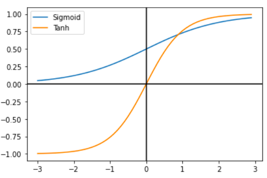
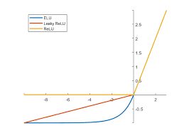
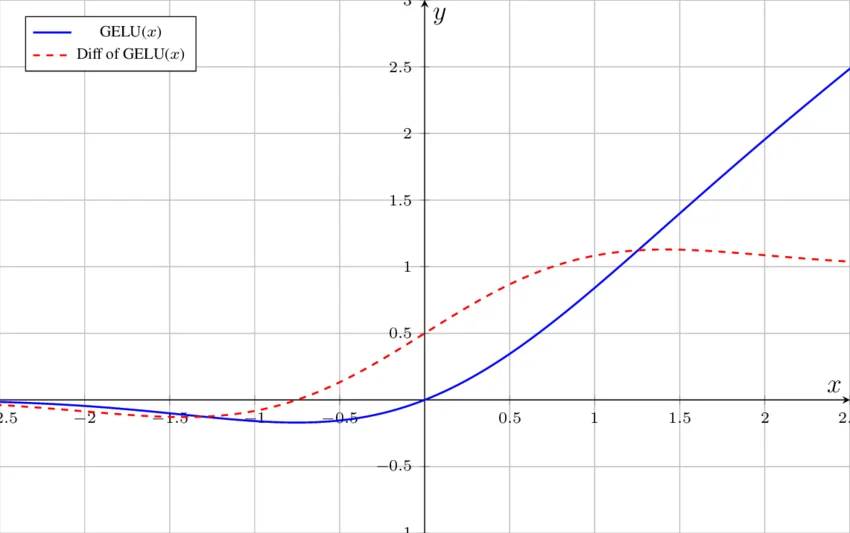
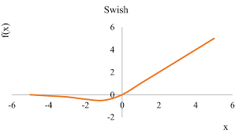
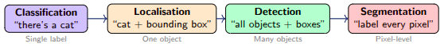
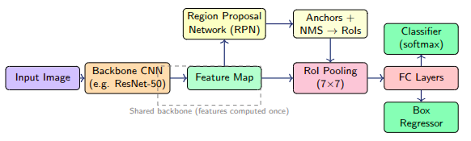
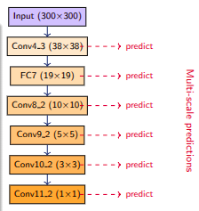
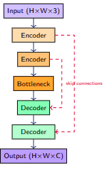
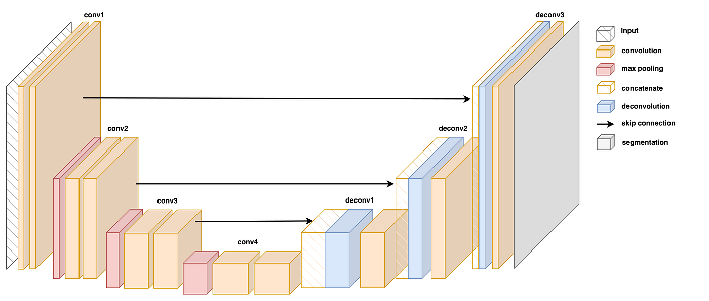
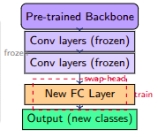

# Convolutional Neural Networks (CNNs)
## Lecture Structure

### Lecture 1 — Fundamentals
- Why CNNs? The spatial inductive bias
- Images as tensors
- Convolution, stride, padding
- Activation functions: ReLU variants, Swish, GELU
- Pooling layers

### Lecture 2 — Architectures
- LeNet → AlexNet → VGGNet
- GoogLeNet & Inception modules
- ResNet & residual connections

### Lecture 3 — Advanced Training
- Batch Normalization
- Regularisation in CNNs
- Data augmentation

### Lecture 4 — Applications
- Object Detection: R-CNN family, YOLO, SSD
- Semantic Segmentation: FCN, U-Net
- Transfer learning

## Why Not Plain MLPs for Images?

### The Problem with Fully-Connected Layers
- A $224 \times 224$ RGB image has $224 \times 224 \times 3 = 150,528$ input pixels
- A single hidden layer with $1024$ units requires $150,528 \times 1024 \approx 154$ million parameters!

### Key Problems with MLPs
1. **Parameter explosion** — intractable for high-resolution images
2. **No spatial awareness** — pixel order is ignored
3. **No translation invariance** — a shifted cat is a new pattern
4. **Overfitting** — too many parameters, too little data

## Foundational Inductive Biases in CNNs
The central challenge CNNs solve is the **parameter explosion problem**. A fully-connected layer applied to a $224 \times 224$ RGB image would require $224 \times 224 \times 3 = 150,528$ input connections *per neuron* — scale that across millions of neurons and the model becomes computationally infeasible. CNNs sidestep this through three tightly coupled structural assumptions baked directly into the architecture.

### Local Connectivity
In a fully-connected layer, every neuron sees every pixel — even pixels on opposite corners of an image that share no meaningful relationship. CNNs instead restrict each neuron to a small **receptive field**: a spatially contiguous patch of the input (e.g., a $3 \times 3$ or $5 \times 5$ region).

This is justified by a powerful prior about natural images: **meaningful visual patterns are local**. An edge, a texture, or a curve is defined by the relationship between nearby pixels, not between pixels separated by hundreds of positions. By enforcing locality, CNNs dramatically reduce the number of parameters while preserving the spatial structure that matters.

### Weight Sharing
Local connectivity alone still leaves a large number of parameters if each receptive field gets its own unique set of weights. Weight sharing goes further: **a single filter (kernel) uses the same weights at every spatial location** as it slides across the image.

The impact is dramatic. A $3 \times 3$ filter applied to a $224 \times 224$ image uses only **$9$ weights + $1$ bias = $10$ parameters**, regardless of image size. Without weight sharing, the same operation would require $3 \times 3 \times 224 \times 224 = 451,584$ parameters. The underlying assumption is equally powerful: **the same feature detector is useful everywhere in the image**. A horizontal edge detector should fire whether the edge is in the top-left corner or the center — there is no reason to learn separate detectors for each location.

### Translation Equivariance
A direct mathematical consequence of weight sharing is **translation equivariance**: if the input shifts spatially, the output feature map shifts by exactly the same amount. Formally:

$$f(\text{shift}(x)) = \text{shift}(f(x))$$

This is distinct from translation *invariance* (where the output is completely unchanged by a shift). Equivariance means the network *tracks* where a feature is, while invariance means it *ignores* position. CNNs provide equivariance at the convolutional layer level, and **invariance emerges** downstream through pooling operations (e.g., max pooling), which discard precise positional information while retaining the presence of a feature. This is the correct ordering — you want to know *where* edges are before deciding that *a face exists*, regardless of where.

### How the Three Ideas Work Together
These three properties are not independent — they form a unified design philosophy:

- **Local connectivity** ensures each filter only needs to learn patterns within a small neighbourhood
- **Weight sharing** ensures the learned pattern detector generalises across all positions
- **Translation equivariance** ensures the spatial relationships between detected features are preserved as information flows deeper into the network

Together, they encode a strong **inductive bias** — a set of built-in assumptions about the structure of the problem. Because these assumptions are almost always true for image data (patterns are local, features recur across positions, spatial relationships matter), CNNs achieve extraordinary generalisation from far less data and far fewer parameters than a fully-connected equivalent would require.

## Representing Images as Tensors

### Tensor Shape Conventions
- **Single image**: $(H \times W \times C)$ - Height $\times$ Width $\times$ Channels
- **Mini-batch of N images**: $(N \times C \times H \times W)$ - PyTorch convention (NCHW)
- **After conv layer with K filters**: output shape = $(N \times K \times H' \times W')$

### Pixel Values
- **Raw**: integer in $[0, 255]$
- **Normalized (typical)**: float in $[0, 1]$ or zero-mean: $\frac{x-\mu}{\sigma}$ per channel

## The Convolution Operation

### Discrete 2D Convolution
The convolution operation computes a dot product between a kernel and local patches of the input:

$$(I * K)[i, j] = \sum_m \sum_n I[i + m, j + n] \cdot K[m, n]$$

- **I** - input feature map (or image)
- **K** - learnable kernel (filter)
- Each position $(i, j)$ in the output is a dot product between the kernel and a local patch

**Note**: In deep learning we technically perform cross-correlation, but call it convolution. Weights are learned — the distinction does not matter.

## Stride

### Definition
Stride $s$ is the step size by which the filter moves across the input:
- **Stride = 1**: filter moves one pixel at a time (default)
- **Stride = 2**: filter jumps $2$ pixels — output is roughly half the size

Larger stride ⇒ smaller feature map ⇒ faster computation

### Output Size Formula (no padding)
$$W_{out} = \frac{W_{in} - F}{s} + 1$$

## Padding

### Why Padding?
Without padding, every conv layer shrinks the spatial dimensions. Padding adds extra pixels (usually zeros) around the border:
- **Valid padding ($p = 0$)**: no padding, output shrinks
- **Same padding**: output = input size (for $s = 1$): $p = \lfloor F/2 \rfloor$

Same padding allows building deep networks without spatial collapse.

### General Output Size Formula
$$W_{out} = \frac{W_{in} + 2p - F}{s} + 1$$

where:
- $W_{in}$ = input width
- $F$ = filter size  
- $s$ = stride
- $p$ = padding (number of pixels added to each side)

## Multiple Channels and Filters

### Multi-channel Convolution
For input with $C_{in}$ channels and $K$ filters of size $F \times F$:
- Each filter has shape $C_{in} \times F \times F$
- Output has $K$ channels (one per filter)
- Parameters per layer: $K \times (C_{in} \times F^2 + 1)$

### Example: First AlexNet Conv Layer
- **Input**: $3 \times 224 \times 224$
- **$96$ filters** of $11 \times 11$, stride $4$
- **Params**: $96 \times (3 \times 121 + 1) = 34,944$
- **Output**: $96 \times 55 \times 55$

## Pooling Layers

### Purpose of Pooling
- **Spatial downsampling** — reduce $H$ & $W$
- **Achieves approximate translation invariance** - makes the model less sensitive to the exact position of features; if an edge shifts slightly, the pooled output remains the same
- **Reduces computation and overfitting**
- **No learnable parameters**

### Common Types
- **Max pooling**: take maximum in region - Most common; preserves dominant features
- **Average pooling**: take mean - Smoother; used in GoogLeNet
- **Global average pooling (GAP)**: collapse entire spatial dim to $1 \times 1$ - Used before classifier head in modern CNNs

## The Anatomy of a CNN

### Typical CNN Architecture
A CNN follows a hierarchical pattern:

1. **Input Layer**: Raw pixels (e.g., $3 \times 224 \times 224$)
2. **Feature Extraction Blocks**: Repeated pattern of Conv → BN → ReLU → Pool
3. **Spatial Hierarchy**: 
   - **Early layers**: edges & textures
   - **Deep layers**: parts & objects
4. **Classification Head**: Flatten/GAP → FC → Softmax

### Key Components
- **Conv**: Feature extraction with learnable filters
- **BN + ReLU**: Normalization and non-linearity
- **Max Pool**: Downsampling
- **FC Layers**: Final classification

## Lecture 1 Summary

### Key Takeaways
- **MLPs fail at images** due to parameter explosion and lack of spatial awareness
- **CNNs exploit** local connectivity, weight sharing, and translation equivariance
- **A convolution** is a learnable, sliding dot-product
- **Stride** controls step size; **padding** controls output size
- **Max pooling** downsamples and adds translational invariance

### Essential Formulas
- **Output size formula**: $W_{out} = \frac{W_{in} + 2p - F}{s} + 1$
- **Parameters per conv layer**: $K \times (C_{in} \times F^2 + 1)$

## The ImageNet Challenge and the Architecture Race

### ImageNet Large Scale Visual Recognition Challenge (ILSVRC)
- **1.2M training images, $1000$ classes** — the benchmark for CNN progress

### Top-5 Error Metric
**Top-5 error**: model's top 5 predictions must include correct class

### Architecture Progress Timeline (2012-2016)

   | Year | Model | Top-5 Error (%) |
   |------|-------|-----------------|
   | $2012$ | AlexNet | $\approx 16\%$ |
   | $2013$ | ZFNet | $\approx 12\%$ |
   | $2014$ | GoogLeNet/VGG | $\approx 7\text{--}8\%$ |
   | $2015$ | ResNet | $\approx 3.6\%$ |
   | $2016$ | - | $\approx 3\%+$ |

### Key Achievement
- **Human performance $\approx 5\%$**
- **ResNet (2015)**: First model to surpass human performance on ImageNet

## CNN Architectures

### LeNet-5 (LeCun et al., 1998)

#### Architecture
**Input**: $32 \times 32$ grayscale (MNIST)

1. **Conv1**: $6$ filters, $5 \times 5$, tanh $\to 28 \times 28 \times 6$
2. **AvgPool**: $2 \times 2 \to 14 \times 14 \times 6$
3. **Conv2**: $16$ filters, $5 \times 5$, tanh $\to 10 \times 10 \times 16$
4. **AvgPool**: $2 \times 2 \to 5 \times 5 \times 16$
5. **Flatten → FC($120$) → FC($84$) → $10$ classes**

**Layer stack** (height = feature map size)

**Total parameters**: $\approx 60,000$

#### Historical Significance
- **First practical CNN**; proved CNNs work for digit recognition
- **Deployed in cheque reading systems** at US banks

#### Key Innovations
- **First to demonstrate that a network could learn its own features directly from raw pixels using backpropagation**
- **Weight sharing** (same filter applied across the whole image) dramatically reduces parameters compared to fully-connected networks
- **tanh activation** (not ReLU — that came later with AlexNet 2012)
- **Average pooling** (not max pooling)

#### Architectural Legacy
- **LeNet-5's core idea — conv → pool → conv → pool → FC — is essentially the skeleton that AlexNet, VGG, and ResNet all build upon**

### AlexNet (Krizhevsky et al., 2012)

#### Key Innovations
- **ReLU activations** provided faster training than sigmoid/tanh by a factor of $6 \times$ because they do not suffer from gradient saturation.
- **Dropout ($0.5$) in FC layers** served as regularization, which is a technique that randomly sets a fraction of neuron activations to zero during training.
- **Data augmentation** was implemented through random crops and flips to increase training diversity.
- **GPU training** enabled the first large-scale CNN training on parallel hardware.
- **Local Response Normalization (LRN)** provided lateral inhibition by normalizing strongly activated neurons using their neighbors' activity, making strong activations relatively stronger and weak ones relatively weaker to promote competition and sparsity.
- **Overlapping max-pooling** proved more aggressive than average pooling at retaining dominant features and consistently better at reducing error rates.

#### Impact
- **Cut top-5 error from $26\%$ ($2011$ winner) to $16.4\%$** — a stunning breakthrough that launched the deep learning era in vision.

**Total**: $\approx 60$ million parameters

### VGGNet (Simonyan & Zisserman, 2014)

#### Core Design Philosophy
- **Replace large filters ($7 \times 7$, $11 \times 11$) with stacks of $3 \times 3$ filters**
- **Two $3 \times 3$ convs have receptive field of $5 \times 5$, but fewer params and more non-linearity**
- **Very deep, very simple**: same pattern repeated
- **Variants**: VGG-$11$, VGG-$13$, VGG-$16$, VGG-$19$
- **$\approx 138$ million parameters** (mostly in FC layers)

### Stacking Small Filters — VGGNet Design Principle

### Formula: Number of Operations in a Conv Layer
For a single convolutional layer, the number of **multiply-accumulate operations (MACs)** is:
$$\text{FLOPs} = C_{out} \times C_{in} \times k \times k \times H_{out} \times W_{out}$$

Where:
- $C_{in}, C_{out}$ = number of input and output channels
- $k \times k$ = kernel size
- $H_{out} \times W_{out}$ = spatial size of the output feature map

Each output pixel requires $C_{in} \times k^2$ multiplications — one per kernel element per input channel — and this is repeated for every output pixel and every output channel.

### Parameters in a Conv Layer
Each filter has $k \times k \times C_{in}$ weights plus one bias term. Across all $C_{out}$ filters:
$$\text{Parameters} = (k \times k \times C_{in} + 1) \times C_{out}$$

The "+1" is the bias — a scalar added to every output pixel of that filter. In theoretical comparisons, bias is dropped for simplicity:
$$\text{Parameters} \approx k^2 \times C_{in} \times C_{out}$$

### Receptive Field — Definition
The **receptive field** of a neuron is the region of the original input image it can "see" — i.e., how many input pixels contributed to its value. A larger kernel gives a larger receptive field, but at the cost of more parameters and more FLOPs.

### Why Two $3 \times 3$ = One $5 \times 5$ Receptive Field
**Step 1:** A $3 \times 3$ conv looks at a $3 \times 3$ patch of the input. Each output pixel sees a **$3 \times 3$ region**.

**Step 2:** Apply another $3 \times 3$ conv on top. Each pixel of this output sees a $3 \times 3$ region of the previous output — but each pixel of the previous output already saw a $3 \times 3$ region of the original input.

The total coverage expands by $1$ pixel on each side per additional layer. The general formula is:
$$\text{Receptive field after } n \text{ layers of } k \times k = 1 + n \times (k - 1)$$

$$n=2,\; k=3: \quad 1 + 2 \times (3-1) = 1 + 4 = \mathbf{5} \quad (\text{equivalent to a } 5 \times 5 \text{ filter})$$
$$n=3,\; k=3: \quad 1 + 3 \times (3-1) = 1 + 6 = \mathbf{7} \quad (\text{equivalent to a } 7 \times 7 \text{ filter})$$

### Parameter Reduction — With Numbers
Assume $C$ input and output channels throughout (bias omitted for clarity).

#### Case 1: Two 3×3 vs One 5×5

| | Parameters | FLOPs (per output spatial position) |
|---|---|---|
| One $5 \times 5$ | $5 \times 5 \times C \times C = 25C^2$ | $25C^2$ |
| Two $3 \times 3$ | $2 \times 3 \times 3 \times C \times C = 18C^2$ | $18C^2$ |
| **Saving** | **$28\%$ fewer params** | **$28\%$ fewer FLOPs** |

#### Case 2: Three 3×3 vs One 7×7

| | Parameters |
|---|---|
| One $7 \times 7$ | $7 \times 7 \times C \times C = 49C^2$ |
| Three $3 \times 3$ | $3 \times 3 \times 3 \times C \times C = 27C^2$ |
| **Saving** | **$45\%$ fewer params** |

### The Bonus Advantage: More Non-Linearities
This is **equally important and often missed in exams**. Each conv layer is followed by a ReLU activation:

- One $7 \times 7$ conv $\to$ **$1$ ReLU**
- Three $3 \times 3$ convs $\to$ **$3$ ReLUs**

More ReLUs = more non-linear decision boundaries = **richer feature representations** with the same receptive field coverage. The network becomes more discriminative without costing extra receptive field size.

This is why **VGGNet uses exclusively 3×3 filters** throughout its entire 16–19 layer architecture

#### VGG-16 Architecture
- **Conv×2 (64)** → **Pool**
- **Conv×2 (128)** → **Pool**
- **Conv×3 (256)** → **Pool**
- **Conv×3 (512)** → **Pool**
- **Conv×3 (512)** → **Pool**
- **FC-4096** → **FC-4096** → **FC-1000**

### GoogLeNet (Inception V1)

#### The Problem GoogLeNet Was Solving
Before GoogLeNet, the prevailing wisdom was: make networks deeper and wider to improve accuracy. VGGNet ($2014$ runner-up) followed this and ended up with $138$ million parameters. GoogLeNet won the same ImageNet competition with just $6.8$M parameters — $20\times$ fewer — at higher accuracy. 

The traditional CNN designer also faced a dilemma: which filter size should I use at each layer? A $3 \times 3$ filter captures fine-grained local features; a $5 \times 5$ captures broader patterns. Choosing wrong means missing important information at that scale. GoogLeNet's answer: don't choose — use all of them in parallel.

#### The Inception Module
The Inception module is the core building block of GoogLeNet. It processes the same input simultaneously through four parallel branches, then concatenates their outputs along the channel dimension:

```text
                    ┌──── 1×1 Conv ──────────────────────┐
                    │                                    │
Same input ────────►├──── 1×1 → 3×3 Conv ───────────────┤──► Concatenate → Output
                    │                                    │
                    ├──── 1×1 → 5×5 Conv ───────────────┤
                    │                                    │
                    └──── 3×3 MaxPool → 1×1 Conv ────────┘
```

- **Branch 1 — $1 \times 1$ Conv**: Captures very fine pointwise features; performs dimensionality reduction
- **Branch 2 — $1 \times 1 \to 3 \times 3$ Conv**: Detects medium-scale spatial features (edges, textures)
- **Branch 3 — $1 \times 1 \to 5 \times 5$ Conv**: Detects broad spatial patterns (shapes, large structures)
- **Branch 4 — $3 \times 3$ MaxPool $\to 1 \times 1$ Conv**: Retains dominant features via pooling, then compresses channels

Each branch receives the same input feature map and produces outputs of the same spatial size (H×W). These are then stacked along the channel/depth dimension into one combined output. The key motivation: the network doesn't have to pick one scale — it learns which scales matter by having access to all scales simultaneously, and downstream layers automatically have multi-scale context baked in.

#### Same Padding — A Non-Negotiable Constraint
For branch outputs to be concatenatable, all four branches must produce the same $H \times W$ output. This is enforced via same padding.

**The Problem Without Padding (Valid Padding)**
When a filter of size $K$ slides over an input of size $H_{in}$ with no padding:
$$H_{out} = H_{in} - K + 1$$

A $3 \times 3$ filter on a $28 \times 28$ input $\to 26 \times 26$. A $5 \times 5$ filter on the same input $\to 24 \times 24$. These cannot be concatenated.

**What Same Padding Does**
Same padding adds a border of zeros around the input before convolution, so that the output spatial size equals the input spatial size:
$$\text{Padding required} = \frac{K-1}{2}$$

- 3×3 filter → add 1 pixel of zeros on each side
- 5×5 filter → add 2 pixels of zeros on each side

```
VALID (no padding) on 5×5 input:     SAME (zero border added):

■ ■ ■ ■ ■                            0 0 0 0 0 0 0
■ ■ ■ ■ ■                            0 ■ ■ ■ ■ ■ 0
■ ■ ■ ■ ■  →  3×3 output             0 ■ ■ ■ ■ ■ 0  →  5×5 output (same size!)
■ ■ ■ ■ ■                            0 ■ ■ ■ ■ ■ 0
■ ■ ■ ■ ■                            0 ■ ■ ■ ■ ■ 0
                                      0 0 0 0 0 0 0
```

The filter can now center on border pixels (the zeros give it room to fit), so every input position produces exactly one output value.

**Result for Inception Module**
With same padding applied to all branches on a $28 \times 28$ input:

```
1×1 conv  (pad=0): output → 28×28×64
3×3 conv  (pad=1): output → 28×28×128
5×5 conv  (pad=2): output → 28×28×32
MaxPool   (pad=1): output → 28×28×32
─────────────────────────────────────────
Concatenated:      output → 28×28×256
```

Spatial dimensions stay fixed; only channel depth changes.

#### The 1×1 Convolution — Bottleneck Mechanism
**What a 1×1 Convolution Does**
A $1 \times 1$ convolution has a kernel of size $1 \times 1$ — it looks at no spatial neighbourhood. Instead, at each position $(x,y)$, it takes a weighted dot product across all input channels, producing a new value per output filter. It changes the channel depth without touching $H \times W$.

Every spatial position $(x,y)$ has one value per channel stacked along the depth dimension. For example, with $480$ channels:

```
Position (x,y) across 480 channels:
Channel 1:   0.8  ← horizontal-edge detector response here
Channel 2:   0.1  ← vertical-edge detector response here
Channel 3:   0.9  ← curve detector response here
...
Channel 480: 0.3  ← filter #480 response here
```

A 1×1 conv with 16 output filters computes:
$$\text{Output channel k} = w_{k,1} \cdot c_1 + w_{k,2} \cdot c_2 + \cdots + w_{k,480} \cdot c_{480}$$

Done $16$ times, it compresses the $480$-deep column into a $16$-deep column at the same $(x,y)$ — a learned linear combination that distills which channel patterns co-occur and matter.

**Why It's Called a Bottleneck — The Computation Math**
The cost of any convolution is:
$$\text{Cost} = H_{out} \times W_{out} \times F_{out} \times (K \times K \times C_{in})$$

**Without bottleneck** — $5 \times 5$ conv directly on $14 \times 14 \times 480$ input, $48$ output filters:
$$14 \times 14 \times 48 \times (5 \times 5 \times 480) = 196 \times 48 \times 12,000 = 112.9\text{M ops}$$

**With $1 \times 1$ bottleneck** — compress $480 \to 16$ channels first, then apply $5 \times 5$ conv:

| Stage | Cost |
|-------|------|
| $1 \times 1$ conv ($480 \to 16$ channels) | $14 \times 14 \times 16 \times (1 \times 1 \times 480) = 1.5\text{M}$ |
| $5 \times 5$ conv ($16 \to 48$ channels) | $14 \times 14 \times 48 \times (5 \times 5 \times 16) = 3.8\text{M}$ |
| **Total** | **$5.3\text{M}$** |

A $\approx 21 \times$ reduction in compute. The expensive $5 \times 5$ conv now operates over only $16$ channels instead of $480$ — the $C_{in}$ term drops from $480$ to $16$, shrinking per-pixel cost from $12,000$ to $400$ operations. The $480$ channels contain significant redundancy; the $1 \times 1$ conv learns smart lossy compression, distilling $480$ redundant responses into $16$ compact combinations.

| Problem | GoogLeNet's Solution | Impact |
| ------------------------------------------ | -------------------------------------------- | --------------------------------- |
| Which filter size to use? | Inception module: all sizes in parallel | Multi-scale vision at every layer |
| Expensive $3 \times 3$ and $5 \times 5$ convolutions | $1 \times 1$ bottleneck before each large conv | $\approx 21 \times$ compute reduction |

## ResNet
**He, Zhang, Ren & Sun — CVPR 2016**

### The Problem: Vanishing Gradients & Degradation
Stacking more layers in a vanilla CNN causes **vanishing gradients** — gradient signals become negligibly small in early layers during backpropagation, so the first layers learn almost nothing. As a result, deeper plain networks suffer from the **degradation problem**: training accuracy saturates and then degrades with increasing depth. This is not overfitting — it is a pure **optimization failure**.

### The Residual Learning Framework
Instead of learning a direct mapping $\mathcal{H}(\mathbf{x})$, ResNet reframes the task. The stacked layers learn only the **residual** — the gap between the input and the desired output:

$$\mathcal{F}(\mathbf{x}) := \mathcal{H}(\mathbf{x}) - \mathbf{x}$$

The original mapping is then recovered as:

$$\mathcal{H}(\mathbf{x}) = \mathcal{F}(\mathbf{x}) + \mathbf{x}$$

**Key insight:** If the ideal transformation is the identity (do nothing), the network just needs to push $\mathcal{F}(\mathbf{x}) \to 0$ — pushing weights toward zero is trivially easy. Learning an exact identity mapping $\mathcal{H}(\mathbf{x}) = \mathbf{x}$ from scratch is surprisingly hard. A deeper ResNet is therefore **guaranteed to be at least as good as a shallower one** — extra layers can always learn identity via $\mathcal{F} \to 0$.

### Residual Block — Architecture
The $\mathbf{x}$ that bypasses the conv layers is called the **skip connection** or **shortcut**. The block structure is:

```
x ──────────────────────────────► (+) ──► ReLU ──► output
    │                               ▲
    └──► Conv ──► BN ──► ReLU ──────┘
         (learns only F(x), the small correction)
```

The output of the block:

$$\mathbf{y} = \mathcal{F}(\mathbf{x},\, \{W_i\}) + \mathbf{x}$$

- **Identity shortcut** (no parameters): used when input/output dimensions match
- **Projection shortcut** ($1\times1$ conv $W_s$): used when dimensions differ due to stride or channel change

$$\mathbf{y} = \mathcal{F}(\mathbf{x},\, \{W_i\}) + W_s\,\mathbf{x}$$

**Batch Normalization** is applied after every conv, before ReLU.

### Why Residual Connections Solve Vanishing Gradients

#### The Math
During backpropagation, the gradient of loss $L$ with respect to input $\mathbf{x}$ is:

$$\frac{\partial L}{\partial \mathbf{x}} = \frac{\partial L}{\partial \mathcal{H}} \left(1 + \frac{\partial \mathcal{F}}{\partial \mathbf{x}}\right)$$

Even if $\frac{\partial \mathcal{F}}{\partial \mathbf{x}} \approx 0$ (dead or saturated layers), the gradient **never vanishes** because of the additive "+1" from the skip connection. This is the **gradient highway** — early layers always receive a meaningful learning signal.

#### Numerical Proof
Using a $4$-layer linear network with $w = 0.3$ per layer:

**Plain Network — Backward pass:**
$$\frac{\partial L}{\partial x_0} = 0.3^4 = \mathbf{0.0081} \quad \text{(gradient shrinks $123 \times$)}$$

**ResNet — Backward pass** (per block, gradient is multiplied by $w^2 + 1$):
$$\text{Block 2:} \quad 1.0 \times (0.09 + 1) = 1.09$$
$$\text{Block 1:} \quad 1.09 \times (0.09 + 1) = \mathbf{1.188} \quad \text{(gradient stays healthy)}$$

| | Gradient at Layer 1 | Ratio |
|---|---|---|
| Plain Network | $0.0081$ | Shrinks $123 \times$ |
| ResNet | $1.188$ | Stays healthy |

### Bottleneck Block (ResNet-50+)
For deeper networks, a $3$-layer **bottleneck block** replaces the $2$-layer basic block:

$$1 \times 1 \text{ (reduce)} \;\to\; 3 \times 3 \;\to\; 1 \times 1 \text{ (expand)}$$

| Layer | Operation | Purpose |
|---|---|---|
| Conv 1 | $1 \times 1$, reduce channels | Dimensionality reduction |
| Conv 2 | $3 \times 3$ | Spatial feature learning |
| Conv 3 | $1 \times 1$, expand channels | Restore dimensionality |

**Why it saves FLOPs:** If input is $256$-channel, a direct $3 \times 3$ conv costs $256 \times 256 \times 9$ operations. The bottleneck first reduces to $64$ channels, applies $3 \times 3$, then expands back — reducing FLOPs by $\approx 8 \text{--} 9 \times$ while maintaining representational power. The expansion ratio is typically **$4 \times$** ($64 \to 256$ channels).

### Global Average Pooling — Replacing FC Layers

#### The Problem with FC Heads
In AlexNet and VGG, after the last conv layer you get a large 3D feature map — say $7 \times 7 \times 512$. To feed this into a classifier, it was flattened into a 1D vector of size $7 \times 7 \times 512 = 25,088$ and passed through two or three FC layers of size 4096. The parameters in just FC6 of VGG:

$$25,088 \times 4096 = 102,760,448 \approx \textbf{100 million params in one layer}$$

These FC layers are the main reason VGG has **$138$M total parameters**, most of which are in the classifier head.

#### What GAP Does
GAP **collapses each entire feature map into a single scalar** by taking its spatial average:

$$\underbrace{7 \times 7 \times 512}_{\text{input to GAP}} \xrightarrow{\text{GAP}} \underbrace{512\text{-dim vector}}_{\text{fed directly to classifier}}$$

For each of the $512$ channels: $\text{avg}(7 \times 7 \text{ values}) \to 1 \text{ scalar}$. This $512$-dim vector then goes into a **single FC layer** of size = number of classes (e.g., $1000$ for ImageNet).

#### Input Size Invariance
Because GAP averages over whatever spatial size exists, ResNet can accept **any input image resolution**. VGG with FC layers accepts only $224 \times 224$ because the flattened vector size in FC layer changes with image size. ResNet with GAP has no such restriction — a key practical advantage for deployment.

### Architecture Variants

| Model | Block Type | Layer Config | Params |
|---|---|---|---|
| ResNet-18 | Basic block | [en.wikipedia](https://en.wikipedia.org/wiki/Residual_neural_network) | ~11M |
| ResNet-34 | Basic block | [d2l](https://d2l.ai/chapter_convolutional-modern/resnet.html) | ~21M |
| ResNet-50 | Bottleneck | [d2l](https://d2l.ai/chapter_convolutional-modern/resnet.html) | ~25M |
| ResNet-101 | Bottleneck | [d2l](https://d2l.ai/chapter_convolutional-modern/resnet.html) | ~44M |
| ResNet-152 | Bottleneck | [d2l](https://d2l.ai/chapter_convolutional-modern/resnet.html) | ~60M |

Each stage doubles channels ($64 \to 128 \to 256 \to 512$) and halves spatial resolution via stride-$2$ convolutions.

### Performance
ResNet-152 achieved **3.57% top-5 error on ImageNet**, surpassing human-level performance (~5.1%) at the **2015 ILSVRC competition**.

### Important Points
- Identity shortcuts add **zero extra parameters**
- The $+1$ in the gradient equation is the entire mathematical reason skip connections prevent vanishing gradients
- **Batch Normalization** is used — not LRN like in AlexNet
- ResNet's use of Global Average Pooling reduces the classifier head from $\approx 119$ million parameters (as in VGG) to just $512$ thousand, and removes the fixed input size constraint imposed by fully connected layers.

## Architecture Comparison

| Model | Depth | Params (M) | Top-5 Error (%) |
|-------|-------|------------|-----------------|
| LeNet-5 | $7$ | $60$ thousand | - |
| AlexNet | $8$ | $60$ million | $\approx 16.4\%$ |
| VGG-16 | $16$ | $138$ million | $\approx 7.3\%$ |
| GoogLeNet | $22$ | $5$ million | $\approx 6.7\%$ |
| ResNet-50 | $50$ | $25$ million | $\approx 5.3\%$ |
| ResNet-152 | $152$ | $60$ million | $3.57\%$ |

## Lecture 2 Summary

### Architecture Evolution
- **LeNet**: Proof of concept for CNNs
- **AlexNet**: Deep learning revolution; ReLU, Dropout, GPU training
- **VGGNet**: Simplicity through deep $3 \times 3$ stacks
- **GoogLeNet**: Multi-scale Inception modules, $1 \times 1$ bottlenecks
- **ResNet**: Residual connections solve vanishing gradient — enables very deep networks

### Design Principles to Remember
1. **Depth helps** (if you can train it)
2. **Small filters are better than large ones**
3. **Bottleneck 1×1 convs save compute**
4. **Skip connections are crucial for very deep nets**

## Lecture 3
## Advanced Training: Batch Normalization & Improved Activation Functions

### Why Training Deep CNNs Is Difficult

#### Core Problem: Internal Covariate Shift
The term **covariate shift** comes from classical statistics — a change in input distribution between training and test data. **Internal** covariate shift is the same phenomenon happening *inside* the network, between layers, during training itself.

As gradient descent updates weights in earlier layers, the distribution of inputs seen by every subsequent layer keeps changing throughout training. Each layer is essentially **chasing a moving target** instead of learning a fixed mapping.

This compounds exponentially with depth:

```
Layer 1: Small distribution shift
Layer 2: Adapts to Layer 1's shift + adds its own
Layer 3: Adapts to Layer 2's combined shift + adds more
...
Layer N: Deals with accumulated shifts from ALL previous layers
```

A small perturbation per layer becomes a massive distribution change by deeper layers. This is why vanilla deep CNNs fail beyond $\approx 10$ layers.

#### Four Consequences

**1. Must use very small learning rates**
Large learning rates cause large weight updates $\rightarrow$ drastic distribution shifts per step $\rightarrow$ each layer over-corrects $\rightarrow$ training oscillates or diverges. Small learning rates slow this but drastically increase training time.

**2. Requires careful weight initialization**
Initial weights determine the initial activation distributions. Poor initialization (e.g., all weights too large) causes extreme distribution shifts from the very first forward pass. This is why schemes like Xavier/He initialization exist.

**3. Saturating activations $\rightarrow$ Vanishing gradients**
Sigmoid and tanh saturate (output nearly flat) when inputs are very large or small. Due to covariate shift, inputs drift into saturation zones. When saturated:
- Gradient of sigmoid/tanh $\approx 0$
- Backpropagation multiplies near-zero gradients through every layer
- Gradients vanish before reaching early layers $\rightarrow$ early layers stop learning

**4. Hard to train beyond $10$ layers**
The above three effects combine — large gradient noise, unstable activations, and compounding distribution drift make it practically impossible to train very deep networks reliably without mitigation.

### Batch Normalization (Ioffe & Szegedy, 2015)

#### The Idea
Normalize activations within each mini-batch, then rescale and shift with learnable parameters. This directly attacks the root cause — **re-normalizing the input distribution to each layer at every step**, forcing approximately zero mean and unit variance before the activation.

#### Placement of BN

| Variant | Order |
|---|---|
| Canonical | Conv / FC $\to$ **BN** $\to$ Activation |
| Modern Practice | Conv $\to$ **BN** $\to$ ReLU |
| Pre-activation (He et al., 2016) | **BN** $\to$ ReLU $\to$ Conv |

#### Algorithm

For a mini-batch $B = \{x_1, \dots, x_m\}$:

**Step 1 — Batch Mean:**
$$\mu_B = \frac{1}{m} \sum_{i} x_i$$

**Step 2 — Batch Variance:**
$$\sigma_B^2 = \frac{1}{m} \sum_{i} (x_i - \mu_B)^2$$

**Step 3 — Normalize:**
$$\hat{x}_i = \frac{x_i - \mu_B}{\sqrt{\sigma_B^2 + \epsilon}}$$

**Step 4 — Scale & Shift:**
$$y_i = \gamma \hat{x}_i + \beta$$

- $\gamma, \beta$ — learnable parameters, one per feature
- $\epsilon$ — small constant for numerical stability (prevents division by zero)

#### Why Scale & Shift After Normalizing?
Pure normalization is too restrictive. After Step $3$, every feature is *hard-forced* to mean $= 0$, variance $= 1$ — removing the network's freedom to choose its own activation distribution. But the optimal distribution for a given layer may not be zero-mean unit-variance (e.g., ReLU works better with slightly positive-skewed inputs).

$\gamma$ and $\beta$ give that freedom back in a **controlled, learnable way**. As an extreme case: if $\gamma = \sigma_B$ and $\beta = \mu_B$, then $y_i = x_i$ — BN completely undoes itself and recovers the original distribution. This means BN is at worst a no-op, never harmful.

| Step | Purpose |
|---|---|
| Normalize $(\hat{x}_i)$ | **Stability** — prevents distribution drift, fixes vanishing gradients |
| Scale & Shift $(y_i)$ | **Expressiveness** — lets the network recover any distribution it needs |

#### How Are $\gamma$ and $\beta$ Learned?
They are learned **exactly like any other weight — via backpropagation and gradient descent**:

- **Initialization:** $\gamma = 1$, $\beta = 0$ for all features
- At the start: $y_i = 1 \cdot \hat{x}_i + 0 = \hat{x}_i$ — pure normalized output
- Each training step, gradients $\frac{\partial L}{\partial \gamma}$ and $\frac{\partial L}{\partial \beta}$ are computed and gradient descent nudges them to minimize loss

#### Numerical Example
Mini-batch for one feature: $B = \{1, 3, 5, 7\}$, with learned $\gamma = 2.0$, $\beta = -1.0$.

$$\mu_B = \frac{1+3+5+7}{4} = 4.0 \qquad \sigma_B^2 = \frac{9+1+1+9}{4} = 5.0$$

| $x_i$ | $\hat{x}_i = \frac{x_i - 4.0}{\sqrt{5.0}}$ | $y_i = 2\hat{x}_i - 1$ |
|---|---|---|
| $1$ | $-1.342$ | $-3.684$ |
| $3$ | $-0.447$ | $-1.894$ |
| $5$ | $+0.447$ | $-0.106$ |
| $7$ | $+1.342$ | $+1.684$ |

After normalization: mean $= 0$, variance $= 1$. After scale & shift: mean $= -1.0$, std $= 2.0$ — the network has learned to shift the distribution to where it works best for the next layer.

#### Benefits of BN
- Allows much higher learning rates
- Acts as a regularizer → reduces need for Dropout
- Faster convergence (10× or more)
- Reduces sensitivity to weight initialization
- Gradients flow more cleanly → saturating activations less likely to saturate

#### Regularizing Effect
BN's regularization effect is **serendipitous** — it emerges from the inherent stochasticity of mini-batch statistics, not by design. Because $\mu_B$ and $\sigma_B^2$ are computed from a randomly sampled mini-batch, every activation gets scaled and shifted by a slightly different value each training step. Just like Dropout randomly zeros activations, BN randomly perturbs them — so the network cannot over-rely on any single activation having a precise value, which forces it to learn more robust, generalizable representations.

This directly counters overfitting. Overfitting occurs when a network memorizes specific patterns in training data, making it overly sensitive to exact activation values. BN's mini-batch noise continuously disrupts this memorization process — the network never sees the same activation in exactly the same way twice, so it must learn features that are stable despite the perturbation. These are precisely the features that generalize well to unseen data. This is why BN often reduces the need for Dropout — both achieve similar noise-based regularization through different mechanisms, making them redundant when combined in the same layer.

However, this regularization effect has a clear and important limit — **it weakens as batch size increases**:

- **Larger batches** $\to \mu_B$ and $\sigma_B^2$ become better estimates of the true population statistics $\to$ less noise injected $\to$ weaker regularization effect
- **Very small batches** $\to$ estimates are noisy but also *unstable* $\to$ BN becomes unreliable in a harmful way, hurting both training and regularization

This is why, in practice, BN alone is rarely sufficient regularization for very large models — it helps, but Dropout or L2 regularization may still be needed depending on the architecture and batch size regime. Nevertheless, BN's regularization is real and significant enough that many modern architectures drop Dropout entirely in convolutional layers where BN is already present.

### Batch Normalization: Training vs Inference

#### The Core Problem
During inference you may feed a **single image** (batch size $= 1$):
- Mean $\mu_B = x_1$ (the sample itself)
- Variance $\sigma_B^2 = 0 \to$ division by near-zero $\to$ garbage outputs

Predictions would also become **non-deterministic** — the same image gives different outputs depending on what else is in the batch. This is unacceptable for a deployed model.

#### The Solution: Running Statistics (EMA)
During training, BN does **two things simultaneously**:
1. Normalizes using current batch statistics $\mu_B, \sigma_B^2$ (for stable forward/backward pass)
2. **Silently maintains running estimates** of population mean and variance using Exponential Moving Average (EMA):

$$\mu_{\text{running}} \leftarrow \alpha \cdot \mu_{\text{running}} + (1 - \alpha) \cdot \mu_B$$
$$\sigma^2_{\text{running}} \leftarrow \alpha \cdot \sigma^2_{\text{running}} + (1 - \alpha) \cdot \sigma_B^2$$

where $\alpha$ is momentum (typically $0.9$ or $0.99$). Recent batches contribute more than older ones — it's a smoothed, decaying memory. These running values are **not used during training** — tracked silently and saved with the model weights.

#### What Happens at Inference
After training, the running averages have seen every mini-batch across all epochs — they are a good approximation of the **true population statistics** $\mathbb{E}[x]$ and $\text{Var}[x]$ over the entire training set. BN then uses these **fixed, pre-computed values**:

$$\hat{x} = \frac{x - \mathbb{E}[x]}{\sqrt{\text{Var}[x] + \epsilon}}$$

This is fully deterministic — regardless of batch size (even $= 1$), every sample gets normalized by the same fixed statistics.

#### Training vs. Inference — Side by Side

| Aspect | Training Mode | Inference Mode |
|---|---|---|
| Mean used | $\mu_B$ — current mini-batch | $\mathbb{E}[x]$ — running average |
| Variance used | $\sigma_B^2$ — current mini-batch | $\text{Var}[x]$ — running average |
| Deterministic? | No — depends on batch composition | Yes — fixed for all inputs |
| Batch size | Must be $\ge 1$ (ideally $\ge 16$) | Can be $1$ |
| $\gamma, \beta$ | Learned via backprop | Frozen (used as-is) |

#### ⚠️ Critical PyTorch Mistake
`model.train()` and `model.eval()` literally switch which statistics BN uses:

| Call | Mode |
|---|---|
| `model.train()` | Batch statistics |
| `model.eval()` | Population statistics |

Forgetting `model.eval()` before inference causes **silent, wrong predictions** — the model doesn't crash, it just gives subtly incorrect outputs. This is one of the most common bugs in PyTorch code.

### BN Variants

| Variant | Normalization Axis | Primary Use Case |
|---|---|---|
| **Batch Norm** | Across the batch, per channel | CNNs (large batch sizes) |
| **Layer Norm** | Across features, per sample | Transformers |
| **Instance Norm** | Each sample independently | Style transfer |
| **Group Norm** | Groups of channels, per sample | Small-batch friendly; compromise between LN and BN |

## Activation Functions

### The Problem with Classic Activations

#### Sigmoid — $\sigma(x) = \frac{1}{1+e^{-x}}$
Sigmoid maps all inputs to the range (0, 1). It has **two critical problems**:

- **Saturates → vanishing gradient:** When inputs are very large or very small, the curve flattens and the gradient ≈ 0. Backpropagation multiplies near-zero gradients through every layer, making early layers stop learning.
- **Not zero-centered:** Outputs are always in (0, 1), never negative. This means gradient updates are always the same sign, causing inefficient, zig-zagging weight updates.



#### Tanh — $\tanh(x)$
Tanh improves on Sigmoid by being **zero-centered** (outputs range from −1 to +1), fixing the sign problem. However, it **still saturates** for large/small inputs → vanishing gradients remain.

### ReLU
*Nair & Hinton, 2010*

$$
\text{ReLU}(x) = \max(0, x)
$$

ReLU was a landmark fix for vanishing gradients and became the default activation for CNNs.



#### Benefits
- **Solves vanishing gradient for x > 0:** Gradient is exactly 1 for all positive inputs — no decay regardless of depth
- **Computationally trivial:** Just a threshold at zero — no exponentials, no divisions
- **Sparse activations:** Roughly half the neurons output 0 at any time, making the network sparser and more efficient

#### Problem
- **Dying ReLU** — neurons stuck at 0

### ReLU Variants

#### Leaky ReLU
*Maas et al., 2013*

$$
\text{LReLU}(x) = \begin{cases} x & \text{if } x > 0 \\ \alpha x & \text{if } x \le 0 \end{cases}
$$

- **Fixes Dying ReLU** by introducing a small negative slope $\alpha \approx 0.01$ instead of a hard zero
- Gradient is never 0 — even for negative inputs, a small gradient ($\alpha$) flows back, allowing dead neurons to recover

#### ELU — Exponential Linear Unit
*Clevert et al., 2015*

$$
\text{ELU}(x) = \begin{cases} x & \text{if } x > 0 \\ \alpha(e^x - 1) & \text{if } x \le 0 \end{cases}
$$

- **Smooth negative saturation:** Unlike the hard kink in Leaky ReLU, ELU smoothly curves into negative values, making it more differentiable
- **Zero-centered outputs:** The negative saturation at $-\alpha$ pulls the mean output toward zero, reducing internal covariate shift

#### GELU — Gaussian Error Linear Unit
*Hendrycks & Gimpel, 2016*

$$
\text{GELU}(x) = x \cdot \Phi(x)
$$

where $\Phi(x)$ is the Gaussian CDF (cumulative distribution function).



- Rather than a hard threshold (like ReLU) or a fixed negative slope (like Leaky ReLU), GELU **gates the input probabilistically** — inputs with higher values are more likely to pass through
- This gives it a **stochastic regularization interpretation**: it can be viewed as randomly dropping inputs, similar to Dropout
- Produces a smooth, non-monotonic curve near zero — can model complex patterns better than ReLU
- **Default in BERT, GPT, and Vision Transformers (ViT)**

#### Swish
*Ramachandran et al., 2017*

$$
\text{Swish}(x) = x \cdot \sigma(x)
$$



- **Self-gated activation:** The input $x$ is scaled by its own sigmoid $\sigma(x)$, acting as a smooth gate controlled by the input itself
- Like GELU, Swish has a non-monotonic bump near the origin, enabling richer function modeling than ReLU
- Empirically **outperforms ReLU in deep networks** — advantage becomes more pronounced as depth increases
- Swish either outperforms or matches ReLU, PReLU, and GELU on 9/9 benchmark tasks

### Activation Functions at a Glance

| Activation | Formula | Zero-centered | Vanishing Gradient | Dying Neuron | Primary Use |
|---|---|---|---|---|---|
| **Sigmoid** | $\frac{1}{1+e^{-x}}$ | ✗ | ✗ (saturates) | ✗ | Binary output layers |
| **Tanh** | $\tanh(x)$ | ✓ | ✗ (saturates) | ✗ | Older RNNs |
| **ReLU** | $\max(0,x)$ | ✗ | ✓ for x>0 | ✗ (dying ReLU) | CNNs (default) |
| **Leaky ReLU** | $\max(\alpha x, x)$ | ✗ | ✓ | ✓ (fixed) | CNNs |
| **ELU** | $x$ or $\alpha(e^x-1)$ | ✓ | ✓ | ✓ | CNNs |
| **GELU** | $x \cdot \Phi(x)$ | ✓ | ✓ | ✓ | Transformers (BERT, GPT, ViT) |
| **Swish** | $x \cdot \sigma(x)$ | ✓ | ✓ | ✓ | Deep networks |

## Regularization in CNNs

Regularization techniques prevent overfitting — where a network memorizes training data and fails to generalize. The core strategies are Dropout, Data Augmentation, and Weight Decay, each attacking overfitting through a different mechanism. Proper weight initialization is also covered here as it is a prerequisite for stable, generalizable training.

### Dropout
*Srivastava et al., 2014*

#### Mechanism
Randomly zero out units with probability $p$ during training. Each training step, every neuron in the targeted layer has an independent probability $p$ of being silenced for that step.

#### Application
- **FC layers** — most commonly applied, typically $p = 0.5$
- **Conv layers** — rarely applied, or with very small $p$
- **At inference** — dropout is disabled; all neurons are active

#### The Co-adaptation Problem It Solves
Without dropout, neurons develop **fragile dependencies on each other** — a problem called **co-adaptation**. For example, Neuron A learns *"I only detect edges because B always handles corners and C handles textures."* These neurons form a tightly coupled team that memorizes training patterns but breaks down on unseen data.

Dropout breaks co-adaptation by ensuring no stable partnerships form: since any neuron can be dropped at any step, **no neuron can afford to rely on another being present**. Each neuron is forced to independently learn a useful feature. Over many steps, the same information gets encoded across multiple neurons — these are called **redundant representations**. The network distributes its knowledge rather than concentrating it in fragile pathways, which is precisely what makes it robust to unseen data.

#### The Training–Inference Mismatch Problem
When $p = 0.5$ and a layer has 100 neurons, only ~50 are active per step during training. The layer's output is roughly **half the magnitude** it would be at inference (where all 100 are active). This mismatch must be corrected.

**Solution 1: Standard Dropout — Scale at Inference**
Multiply all activations by $(1-p)$ at inference time:
$$a_{inference} = (1-p) \cdot a$$

**Problem:** You must remember to apply this every inference. Forget it → model silently produces wrong outputs.

**Solution 2: Inverted Dropout — Scale During Training ✓**
Compensate during training instead. Surviving neurons (kept with probability $1-p$) are scaled up by $\frac{1}{1-p}$:
$$a_{train} = \frac{a}{1-p} \quad \text{(for surviving neurons)}$$

**Why this works:** The expected output of any activation $a$ is:
$$\mathbb{E}[\text{output}] = (1-p) \times \frac{a}{1-p} + p \times 0 = a$$

The expected output equals the original activation — identical to what inference produces when all neurons are active. Training and inference are now matched by construction. No scaling needed at inference.

**Numerical Example ($p = 0.5$, $a = 10$)**

| | Training Output | Expected Output | Inference Output | Match? |
|---|---|---|---|---|
| **Standard Dropout** | 0 or 10 (50/50) | 5.0 | 10 (unscaled) ❌ → 5 (scaled ✓) | Only if you remember to scale |
| **Inverted Dropout** | 0 or 20 (50/50) | 10.0 | 10 (no change needed) | ✓ Always |

**PyTorch default:** `nn.Dropout` uses inverted dropout. `model.eval()` simply disables dropout — no inference-time scaling is needed.

### Data Augmentation
**Goal:** Artificially increase effective dataset size by applying label-preserving transformations to inputs during training.

> **Key Rule:** Data augmentation is often as important as architecture choice for final accuracy.

#### Types of Augmentation
**Geometric Transformations** — alter spatial structure, preserving content:
- Random crop, flip, rotation, scale

**Photometric Transformations** — alter appearance, preserving structure:
- Brightness, contrast, color jitter

**Advanced Techniques:**

| Technique | What It Does |
|---|---|
| **CutOut** | Zeros out random square patches within an image |
| **Mixup** | Blends two training images and interpolates their labels proportionally |
| **CutMix** | Pastes patches from one image into another; labels combined proportionally to patch area |
| **RandAugment** | Automated policy that selects and applies augmentations — no manual tuning |

### Weight Decay (L2 Regularization)

#### The Modified Loss
Without regularization: $\mathcal{L}_{total} = \mathcal{L}_{task}$

With L2:
$$\mathcal{L}_{total} = \mathcal{L}_{task} + \lambda \|W\|^2$$

where $\|W\|^2 = \sum_i w_i^2$ is the sum of squares of every weight, and $\lambda$ controls the strength of the penalty. **Typical value:** $\lambda = 10^{-4}$.

#### How It Works — The Gradient Update
Taking the gradient of the new loss with respect to any weight $w$:
$$\frac{\partial \mathcal{L}_{total}}{\partial w} = \frac{\partial \mathcal{L}_{task}}{\partial w} + 2\lambda w$$

The gradient descent update becomes:
$$w \leftarrow w - \eta\left(\frac{\partial \mathcal{L}_{task}}{\partial w} + 2\lambda w\right)$$

Rearranging:
$$w \leftarrow \underbrace{(1 - 2\eta\lambda)}_{\text{shrink factor}} \cdot w \quad - \quad \eta \frac{\partial \mathcal{L}_{task}}{\partial w}$$

This is why it's called **weight decay** — every update step multiplies the weight by a factor slightly less than 1, decaying it toward zero. The task gradient then nudges it in the direction that reduces loss.

#### Why This Prevents Overfitting
Overfitting tends to produce a few very large weights — the network assigns extreme importance to specific features or noise in training data. L2 directly penalizes this: a weight of $w=10$ adds $100\lambda$ to the loss, while $w=1$ adds only $1\lambda$. So the optimizer is always pushed toward many small weights over a few giant ones, producing a smoother, more generalizable model.

**Numerical Example**

$\eta = 0.01$, $\lambda = 10^{-4}$, $w = 5.0$, task gradient = $0.3$:

$$w \leftarrow (1 - 2 \times 0.01 \times 10^{-4}) \times 5.0 - 0.01 \times 0.3 = 4.99999 - 0.003 = 4.997$$

The decay per step is tiny, but applied across thousands of steps and millions of weights, it consistently prevents any weight from growing unchecked.

**Effect of λ**

| $\lambda$ value | Effect |
|---|---|
| Too large | Weights shrink too aggressively → **underfitting** |
| Too small | Penalty negligible → **no regularization** |
| $10^{-4}$ (typical) | Gentle, consistent pressure toward small weights |

**Important: L2 + Batch Normalization**
When L2 is applied to layers **preceding BN**, it largely loses its regularization effect — BN renormalizes the output regardless of weight scale, so large weights are simply normalized away. L2 instead ends up functioning as an **adaptive learning rate scaler** for those layers. This is why some modern architectures apply weight decay only to non-BN layers.

## Weight Initialization

Proper initialization is a prerequisite for stable training — poor initialization causes exploding or vanishing activations from the very first forward pass, before training even begins.

### Xavier / Glorot Initialization
*For tanh / sigmoid*

$$w \sim \mathcal{U}\left[-\sqrt{\frac{6}{n_{in} + n_{out}}},\ +\sqrt{\frac{6}{n_{in} + n_{out}}}\right]$$

**Goal:** Preserve the variance of activations across layers so signals neither explode nor vanish.

**Example** ($n_{in}=4$, $n_{out}=2$):
$$\sqrt{\frac{6}{4+2}} = \sqrt{1} = 1.0 \quad \Rightarrow \quad w \sim \mathcal{U}[-1.0,\ +1.0]$$

### He Initialization
*For ReLU*

$$w \sim \mathcal{N}\left(0,\ \sqrt{\frac{2}{n_{in}}}\right)$$

**Key insight:** ReLU zeros out roughly half of all activations. This halves the effective variance at each layer. He initialization compensates by using $\frac{2}{n_{in}}$ instead of $\frac{1}{n_{in}}$ — doubling the variance to recover what ReLU destroys.

**Example** ($n_{in}=4$):
$$\sqrt{\frac{2}{4}} = \sqrt{0.5} \approx 0.707 \quad \Rightarrow \quad w \sim \mathcal{N}(0,\ 0.707)$$

#### Why Xavier Fails for ReLU
With $n_{in} = 4$:

| Method | Std Dev | Accounts for ReLU? |
|---|---|---|
| Xavier | $\sqrt{0.25} = 0.5$ | ✗ — variance halved at every ReLU layer |
| He | $\sqrt{0.5} \approx 0.707$ | ✓ — variance preserved through ReLU |

With Xavier on ReLU: after each layer the variance is halved. Over 20 layers: $0.5^{20} \approx 10^{-6}$ — activations effectively vanish. He initialization keeps variance stable at every layer.

### PyTorch Defaults
- `nn.Conv2d` uses **Kaiming Uniform (He)** by default
- Manual initialization:
  - `nn.init.kaiming_normal_(m.weight)` — He, for ReLU networks
  - `nn.init.xavier_uniform_(m.weight)` — Glorot, for tanh/sigmoid networks

### With Batch Normalization
With BN in the network, initialization matters less — BN re-normalizes each layer's input at every step regardless of initial weight scale. However, it is still best practice to use He/Xavier as a starting point for faster early convergence.

## Key Principle

| Technique | Mechanism | Primary Role |
|---|---|---|
| **Dropout** | Random neuron silencing | Prevents co-adaptation → generalization |
| **Data Augmentation** | Label-preserving input transforms | Increases effective data diversity |
| **Weight Decay (L2)** | Penalizes large weights in loss | Prevents over-reliance on specific features |
| **Weight Initialization** | Sets starting weight scale correctly | Ensures stable training from step 1 |

## Lecture 3 Summary

### Batch Normalization
- **Reduces internal covariate shift**
- **Allows large learning rates, faster convergence**
- **Acts as regularizer**
- **Different behavior at train vs. inference time**
- **Learnable $\gamma, \beta$; running stats for inference**

### Regularization Toolkit
- **Dropout** (especially for FC layers)
- **Weight decay (L2)**
- **Data augmentation** (often most impactful)
- **BN itself acts as regularizer**

### Activation Functions
- **ReLU**: simple, effective, standard baseline
- **Leaky ReLU**: fixes dying neurons
- **Swish, GELU**: smooth, state-of-the-art

### Modern Best Practice Recipe
$$\text{Conv} \to \text{BN} \to \text{ReLU/GELU} \to \text{Dropout (optional)}$$

+ He init + AdamW optimizer + data augmentation

---

## Lecture 4: CNN Tasks
# Visual Recognition Tasks
Visual recognition tasks exist on a spectrum of increasing complexity — from answering *"what is in this image?"* to *"what is every single pixel?"*




## Hierarchy of Tasks
| Task | Output | Key Complexity |
|---|---|---|
| **Classification** | Single label — *"there's a cat"* | Simplest — one answer per image |
| **Localisation** | Class label + one bounding box | One object only |
| **Detection** | All objects + bounding boxes | Variable number of objects |
| **Segmentation** | Class label for every pixel | Finest granularity |

## Object Detection
For each object detected, the model must output:
- A **class label** — what the object is
- A **bounding box** — defined by $(x, y, w, h)$: top-left coordinates, width, and height

**Key challenge:** The number of objects in each image is **variable** — an image may have 1 object or 50. The model must handle this dynamically, unlike classification which always outputs exactly one label.

## Segmentation
**Dense prediction** — rather than a single label per image or per object, the model assigns a **class label to every individual pixel**.

### Two Types
**Semantic Segmentation:**
- All instances of the same class receive the **same label**
- Example: every cat in the image is labelled "cat" — they are indistinguishable from each other

**Instance Segmentation:**
- Each individual object gets its **own unique label**, even within the same class
- Example: Cat 1, Cat 2, Cat 3 — each is separately identified and masked

---

## Two-Stage Object Detection
Two-stage detectors answer detection sequentially:

- **Stage 1 (Where?)** — generate region proposals: candidate boxes likely to contain *something*, without identifying what. Intentionally high-recall, low-precision — okay to over-propose, not okay to miss real objects.
- **Stage 2 (What?)** — classify each proposal + refine bounding box. More careful, operates on a clean filtered set.

### Two-Stage vs. One-Stage
| | Two-Stage (R-CNN family) | One-Stage (YOLO, SSD) |
|---|---|---|
| **How it works** | Propose regions → classify each | Predict everything in one forward pass |
| **Accuracy** | Higher, especially small objects | Slightly lower |
| **Speed** | Slower | Real-time capable |
| **Use case** | Medical imaging, precision tasks | Autonomous driving, video |

## Backbone CNN and Feature Maps

### What is a Feature Map?
When a convolutional filter slides over an image, it performs element-wise multiplication at every position and sums into a single number. Doing this across the entire image produces a 2D grid — a **feature map**. Each value answers: *"how strongly is this filter's pattern present at this location?"*

- 1 filter → 1 feature map
- 512 filters → 512 feature maps stacked → 3D volume: $H \times W \times 512$

### What Feature Maps Detect (by depth)
```
Early layers  → Low-level:   edges, corners, colour gradients
Middle layers → Mid-level:   textures, patterns, shapes
Deep layers   → High-level:  object parts (eyes, wheels, ears)
```

### What is the Backbone?
The backbone is the CNN sub-network whose sole job is to **transform the raw input image into rich feature maps**. It does not detect, classify, or draw boxes — purely a feature extractor.

Architectures like **ResNet-50** or **VGG-16** (originally trained for ImageNet) are used. Their final classification head is discarded; **intermediate spatial feature maps** are extracted instead.

### Spatial Correspondence — The Critical Property
When the backbone shrinks $600 \times 600$ to $37 \times 37$, spatial information is **not scrambled**. Every position $(i, j)$ in the feature map directly corresponds to a specific region in the original image:

$$\text{Pixel location} = (i, j) \times \text{stride}$$

With stride = 16: feature map position $(5, 12)$ → pixels $(80, 192)$ in the original image. This correspondence is preserved throughout all layers.

At each $(i, j)$, the 512-dimensional vector encodes **what** features are present — the position encodes **where** in the original image:

```
Feature map position (5, 12):
  Channel 7:   0.87 ← "dog-ear-like shape detected here"
  Channel 200: 0.72 ← "fur texture detected here"
  ... (512 channels total)
```

The feature map is a **richer representation than raw pixels** — spatial layout preserved, but transformed from low-level pixel values to high-level semantic features.

## R-CNN
*Girshick et al., 2014*

### Pipeline
1. **Selective Search** generates ~2,000 region proposals from the raw image
2. **Warp** each proposal to fixed size $227 \times 227$
3. **Pass each proposal independently through CNN** → extract features — **2,000 CNN runs**
4. **Classify** with SVM per class
5. **Refine** bounding boxes with a separate regression step


If R-CNN ran 2,000×2,000 = 4,000,000 CNN passes at ~23ms each → ~**25 hours per image**. At 2,000 passes it is already 47 seconds.

### Performance
| Phase | Time |
|---|---|
| Training | 84 hours |
| Inference | 47 seconds/image |

## Fast R-CNN
*Girshick, 2015*

### Key Innovation
Instead of running CNN 2,000 times, **run CNN once on the full image** → shared feature map. All 2,000 proposals then read from this single feature map.

**The analogy:** R-CNN travels to the city 2,000 times and photographs it each time. Fast R-CNN travels once, takes one photograph, and points to all 2,000 locations on that same photograph. The photograph is the feature map.

### Pipeline — Step by Step
**Step 1 — CNN runs once:**
```
Full image (600×600×3) → CNN → Feature Map (37×37×512)
```

**Step 2 — Selective Search generates proposals** (still on raw image):
```
Proposal 1: (50, 30, 200, 150)  ← potential dog region
Proposal 2: (300, 200, 80, 90)  ← potential cat region
...~2,000 proposals
```

**Step 3 — Project proposals onto feature map:**

$$\text{Feature map coordinate} = \frac{\text{original pixel coordinate}}{\text{stride}}$$

```
Proposal (50, 30, 200, 150) in original image
                ÷ 16 (stride)
→ region (3.1, 1.9, 12.5, 9.4) on feature map
```

No CNN rerun — simply reading the corresponding region of the already-computed feature map.

**Step 4 — RoI Pooling:**

Different proposals project to different-sized regions on the feature map. The classifier needs fixed-size input. RoI Pooling divides any arbitrarily-sized region into a fixed $7 \times 7$ grid and max-pools within each cell.

#### How RoI Pooling Works Exactly
Say a proposal maps to an $8 \times 6$ region. To produce $2 \times 2$ output (simplified from $7 \times 7$):

$$\text{Cell height} = \frac{8}{2} = 4, \quad \text{Cell width} = \frac{6}{2} = 3$$

Feature map region (1 channel):
```
[ 3,  1,  4,  2,  6,  8 ]
[ 7,  5,  2,  9,  1,  3 ]
[ 2,  8,  6,  4,  7,  5 ]
[ 1,  3,  5,  2,  8,  4 ]
[ 9,  4,  3,  7,  5,  6 ]
[ 6,  2,  8,  1,  4,  9 ]
[ 5,  7,  1,  6,  3,  2 ]
[ 4,  6,  9,  3,  2,  7 ]
```

Divided into 2×2 grid (4 rows × 3 cols per cell):
```
Cell (0,0) rows 0–3, cols 0–2 → max = 8
Cell (0,1) rows 0–3, cols 3–5 → max = 9
Cell (1,0) rows 4–7, cols 0–2 → max = 9
Cell (1,1) rows 4–7, cols 3–5 → max = 9

Output: [ 8, 9 ]
        [ 9, 9 ]
```

Repeated across all 512 channels → output: $2 \times 2 \times 512$ (or $7 \times 7 \times 512$ in practice).

When cell sizes are non-integers (e.g., $\frac{8}{7} \approx 1.14$), boundaries are rounded (floor/ceil) — minor irregularity that does not affect fixed output size.

Different proposal sizes handled:

| Proposal size on feature map | Target output | Cell size |
|---|---|---|
| $8 \times 6$ | $7 \times 7$ | $\approx 1.14 \times 0.86$ |
| $21 \times 14$ | $7 \times 7$ | $3 \times 2$ |
| $5 \times 5$ | $7 \times 7$ | $0.71 \times 0.71$ |

Full batch shape after RoI Pooling: $\mathbf{2000 \times 7 \times 7 \times 512}$ — one tensor per proposal. This is just pooling on the existing feature map — **no new CNN pass**.

**Step 5 — Single unified network, two heads:**
```
2000 × 7×7×512
      ↓ flatten → (2000 × 25088)
      ↓ FC → FC
      ├──→ Softmax   → (2000 × num_classes)  class probabilities
      └──→ Regressor → (2000 × 4)            box deltas (Δx, Δy, Δw, Δh)
```

In R-CNN, classification (SVM) and regression were separate external models. In Fast R-CNN they are one unified network trained **end-to-end jointly**.

### Training — Hierarchical Sampling
Fast R-CNN does **not** train on all 2,000 proposals per step:
- Sample **N = 2 images** per step
- Sample **R = 64 proposals** per image → mini-batch of **128 proposals**
- **25% foreground** (IoU ≥ 0.5 with ground truth) — positive, labelled with true class
- **75% background** (IoU < 0.5) — negative, labelled as background

Stratification prevents the network from just predicting "background" always — background proposals vastly outnumber object proposals in any image.

At **inference**, all ~2,000 proposals are processed in **one batched forward pass**.

### Performance
- **Inference:** ~2 sec/image — **25× faster than R-CNN**
- **Remaining bottleneck:** Selective Search (~1,500ms, CPU-based, external, not learned)

## Faster R-CNN
*Ren et al., 2015*



### Key Innovation
Replace Selective Search with a **Region Proposal Network (RPN)** — a small neural network running directly on the backbone's feature map, sharing computation with the detector.

```
Fast R-CNN:
  Image → CNN → Feature Map
  Image → Selective Search → 2,000 proposals  ← CPU, ~1,500ms, not learned

Faster R-CNN:
  Image → CNN → Feature Map → RPN → ~300 proposals  ← GPU, ~10ms, learned
```

### Full Architecture
**Step 1 — Backbone (shared, runs once):**
```
Input image (600×600×3) → ResNet-50 → Feature Map (37×37×512)
```

**Step 2 — RPN generates proposals:**

A $3 \times 3$ conv window slides over every position of the $37 \times 37$ feature map. At each position, **9 anchors** are placed (3 scales × 3 aspect ratios):

```
Scales:         128×128, 256×256, 512×512 pixels
Aspect ratios:  1:1, 1:2, 2:1
Total anchors:  37 × 37 × 9 ≈ 12,000
```

For each anchor, RPN predicts:
- **Objectness score** — object vs. background (binary)
- **Box delta** — $(\Delta x, \Delta y, \Delta w, \Delta h)$ to refine the anchor

Processing: filter low-objectness anchors → apply box deltas → NMS → top **~300 proposals** to Stage 2.

**Step 3 — RoI Pooling:**
```
~300 proposals → project onto feature map → RoI Pool → 300 × 7×7×512
```

**Step 4 — Detection Head:**
```
300 × 7×7×512
      ↓ flatten → FC → FC
      ├──→ Softmax   → (300 × num_classes)
      └──→ Regressor → (300 × 4)
      ↓ Final NMS → clean detections
```

### End-to-End Training
The entire pipeline is differentiable — gradients flow from detection loss back through the detector, through RoI Pooling, and all the way through the RPN:

```
Backbone → RPN → RoI Pooling → Detection Head
  ↑__________backprop flows through everything__________↑
```

Proposal quality improves in direct response to detection performance.

### How Detection Maps Back to Original Image
```
Feature map position (5, 12) [37×37 space]
         ↓  × stride (16)
Pixel location (80, 192)     [600×600 space]
         ↓  + anchor size (128×128)
Rough bounding box           [600×600 space]
         ↓  + box delta (Δx, Δy, Δw, Δh)
Refined bounding box         [600×600 space] ← final detection drawn on image
```

### Performance
- **Inference:** ~0.2 sec/image

## Key Concepts

### IoU — Intersection over Union
Measures how much two bounding boxes overlap — *"how well does my predicted box match the ground truth?"*

$$\text{IoU} = \frac{\text{Area of Overlap}}{\text{Area of Union}}$$

**Numerical example:**
- Ground truth area = 100, Predicted area = 80, Overlap = 60
- Union = 100 + 80 − 60 = 120
- IoU = 60/120 = **0.5**

| IoU Value | Meaning |
|---|---|
| **1.0** | Perfect overlap — identical boxes |
| **0.5** | Moderate overlap — standard detection threshold |
| **0.0** | No overlap — boxes completely separate |

**Where IoU is used:**
- **Training label assignment** — IoU ≥ 0.5 → foreground; IoU < 0.5 → background
- **NMS** — suppress box if IoU > threshold with higher-scoring box
- **Evaluation (mAP)** — detection correct only if IoU > threshold (AP@0.5 or AP@0.75)

### Selective Search
CPU-based, handcrafted algorithm — no neural network:
1. Over-segment image into hundreds of tiny atomic pixel regions
2. Compute similarity between adjacent regions: colour, texture, size, shape compatibility
3. Merge the most similar pair → that merged region's bounding box = one proposal
4. Repeat hierarchically until ~2,000 proposals generated

### RPN
1. Backbone produces feature map
2. $3 \times 3$ conv slides over every feature map position
3. 9 anchors placed at each position (~12,000 total)
4. For each anchor: predict objectness score + box delta
5. Filter → NMS → top ~300 proposals

| | Selective Search | RPN |
|---|---|---|
| Runs on | CPU | GPU |
| Time | ~1,500ms | ~10ms |
| Learned? | ✗ | ✓ |
| Shares CNN features? | ✗ | ✓ |
| Output proposals | ~2,000 | ~300 |

### Anchors
Pre-defined reference boxes at multiple scales and aspect ratios at every feature map position. The RPN does not search from scratch — it refines these fixed reference boxes. Small objects caught by small anchors; large objects by large anchors.

### RoI Pooling
Converts any arbitrarily-sized feature map region into a fixed $7 \times 7$ output:
1. Divide region into a $7 \times 7$ grid — cell size adapts to input region size
2. Max-pool within each cell
3. When cell sizes are non-integers, boundaries are rounded — minor irregularity, output always fixed

No new CNN pass — pure pooling on the existing feature map.

### Non-Maximum Suppression (NMS)
Removes duplicate detections when multiple anchors overlap the same object:
1. Sort all boxes by confidence score
2. Keep highest-scoring box
3. Remove all boxes with IoU > threshold against the kept box
4. Repeat for next highest-scoring remaining box

## R-CNN Family — Full Comparison
| | R-CNN | Fast R-CNN | Faster R-CNN |
|---|---|---|---|
| **Proposal method** | Selective Search | Selective Search | **RPN (learned)** |
| **Proposal count** | ~2,000 | ~2,000 | **~300** |
| **CNN runs per image** | 2,000 | **1** | **1** |
| **GPU for proposals?** | ✗ | ✗ | **✓** |
| **End-to-end trainable?** | ✗ | Partially | **✓ fully** |
| **Training time** | 84 hours | Much faster | Faster |
| **Inference speed** | 47 sec | ~2 sec | **~0.2 sec** |

### The Three-Generation Story
Each generation eliminated the bottleneck left by the previous:

- **R-CNN → Fast R-CNN:** Share the CNN — run it once, not 2,000 times. Feature map shared across all proposals via RoI Pooling. CNN bottleneck eliminated.
- **Fast R-CNN → Faster R-CNN:** Share everything — move Selective Search onto the GPU as a learned, jointly-trained RPN. Proposals go from ~2,000 (CPU, ~1,500ms) to ~300 (GPU, ~10ms). Becomes fully end-to-end trainable.

---

## YOLO (You Only Look Once)
*Redmon et al., 2016*

---

### Core Idea: Single-Shot Detection
Unlike the R-CNN family, YOLO frames object detection as a **single regression problem**. Instead of proposing regions and classifying them separately, it predicts bounding boxes and class probabilities directly from image pixels in **one forward pass**. This eliminates the expensive proposal stage and is the key insight behind its speed.

---

### How it Works
1. **Divide the input image into an $S \times S$ grid** (YOLOv1 uses $7 \times 7$).
2. **Each grid cell independently predicts**:
   - $B$ bounding boxes with coordinates $(x, y, w, h)$.
   - A **confidence score** per box — how certain the model is that an object exists there.
   - $C$ **class probabilities** — what the object is (dog, car, etc.).
3. **One forward pass** through the network results in all detections simultaneously — no sequential proposal stage.

---

### Speed Comparison
| Model | FPS | Performance |
|---|---|---|
| **YOLOv1** | **45 fps** | Real-time capable |
| **Faster R-CNN** | $\approx 5$ fps | ~9× slower than YOLO |

**Trade-off:** YOLO is significantly faster, but faces some localization precision challenges since each cell can only detect one object class.

---

### Multi-Task Loss Function
The total loss $L$ is a weighted sum of three components:
$$L = L_{\text{coord}} + L_{\text{conf}} + L_{\text{class}}$$

| Term | What it penalizes |
|---|---|
| $L_{\text{coord}}$ | Errors in bounding box position $(x, y)$ and size $(w, h)$ |
| $L_{\text{conf}}$ | Errors in the confidence score (object present vs. not) |
| $L_{\text{class}}$ | Errors in class prediction (wrong category) |

#### Why Weighting Is Necessary
In a $7 \times 7$ grid, $\approx 45$ out of $49$ cells are background (contain no object). Without correction, the network gets overwhelmed by "nothing here" signals and learns to always predict low confidence.

Two hyperparameters fix this:
- $\lambda_{\text{coord}} = 5$: **Upweights localization loss**. Bounding box regression is harder and more critical, so errors here are penalized $5\times$ more.
- $\lambda_{\text{noobj}} = 0.5$: **Downweights confidence loss for empty cells**. Prevents the vast majority of background cells from dominating training and suppressing all predictions.

> **Analogy:** Think of it like an exam with three sections. Without reweighting, students focus on the easiest section. These hyperparameters force the model to spend extra effort on the hard part (box placement) and not over-stress about blank cells (background).

---

### Key Takeaway
YOLO's fundamental innovation is treating detection as **regression, not search**. The grid formulation lets the entire image be reasoned about at once, making it orders of magnitude faster than two-stage detectors, at the cost of some localization accuracy.

---

### YOLO Evolution
- **YOLOv1**: Original single-shot detector.
- **YOLOv2**: Added anchors and batch normalization.
- **YOLOv3**: Multi-scale predictions (better for small objects).
- **v4/v5/v7/v8**: Numerous architectural improvements, currently state-of-the-art in the speed/accuracy trade-off.

---

## SSD: Single Shot MultiBox Detector
*Liu et al., 2016*

---

### Core Idea: Multi-Scale Feature Maps
SSD is a single-shot detector (like YOLO) but its key innovation is making predictions from **multiple feature maps at different resolutions** within the backbone network — rather than only from the final feature map as YOLOv1 does. This directly solves the problem of detecting objects at varying scales.



---

### Architecture Overview
SSD uses a $300 \times 300$ input and taps into the backbone at **6 different stages**, each producing a feature map at a progressively smaller resolution:

```
Input (300×300)
    ↓
Conv4_3   (38×38)  → predicts small objects
FC7       (19×19)  → predicts
Conv8_2   (10×10)  → predicts
Conv9_2   (5×5)    → predicts
Conv10_2  (3×3)    → predicts
Conv11_2  (1×1)    → predicts large objects
```

Each layer simultaneously outputs class predictions and bounding box offsets for its scale.

---

### Why Multi-Scale Maps Work
The spatial resolution of a feature map determines what object sizes it can best detect:

| Feature Map | Resolution | Best For |
|---|---|---|
| **Conv4_3** | $38 \times 38$ | Small objects (fine spatial detail retained) |
| **FC7** | $19 \times 19$ | Medium objects |
| **Conv11_2** | $1 \times 1$ | Large objects (deep semantic features) |

At each scale, **anchor boxes** of appropriate sizes are used — so the model has a well-matched prior shape for objects at every scale.

---

### Performance (at Release)
| Model | FPS | mAP (PASCAL VOC) | Trade-off |
|---|---|---|---|
| **SSD300** | **59 fps** | **74.3%** | Best speed/accuracy balance |
| **YOLOv1** | 45 fps | Lower | Faster but less accurate |
| **Faster R-CNN** | ~5 fps | Higher | More accurate but slower |

SSD sits in a sweet spot: **faster than Faster R-CNN** while being **more accurate than YOLOv1**, largely due to the multi-scale prediction strategy.

---

### Key Takeaway
SSD's insight is that a single backbone already computes feature maps at multiple resolutions as part of its forward pass — rather than discarding them, SSD **taps into each one** for predictions. Early maps catch small objects (more spatial detail); deep maps catch large objects (more semantic content). This makes multi-scale detection essentially free in terms of extra computation.

---

## Object Detection Methods: Comparison

| Method | Year | mAP | Speed | Stage | Key Idea |
|---|---|---|---|---|---|
| **R-CNN** | 2014 | 58.5 | 47s/img | 2-stage | Region proposals + CNN |
| **Fast R-CNN** | 2015 | 70.0 | 2s/img | 2-stage | RoI Pooling |
| **Faster R-CNN** | 2015 | 73.2 | 200ms/img | 2-stage | RPN (end-to-end) |
| **YOLO v1** | 2016 | 63.4 | 22ms/img | 1-stage | Grid + single forward pass |
| **SSD300** | 2016 | 74.3 | 17ms/img | 1-stage | Multi-scale anchors |
| **YOLOv3** | 2018 | 82.1 | 29ms/img | 1-stage | Multi-scale + Darknet53 |

*Note: mAP on PASCAL VOC 2007 / COCO (approximate — values vary by benchmark)*

---

### Two-Stage vs. One-Stage Detectors

| Type | Performance | Use Cases |
|---|---|---|
| **Two-Stage Detectors** | Higher accuracy; slower | Best when precision is critical (medical imaging, autonomous driving offline processing) |
| **One-Stage Detectors** | Faster; great for real-time applications | Robotics, video surveillance, edge devices |

---

## Semantic Segmentation: Dense Prediction

### The Task
Semantic segmentation classifies **every single pixel** in an image with a class label, producing an $H \times W \times C$ probability map where $C$ is the number of classes. This is fundamentally harder than image classification (one label per image) or object detection (bounding boxes).

---

### The Core Tension
Semantic segmentation demands two things that naturally conflict:

| Requirement | Answers | Found In | Lost Via |
|---|---|---|---|
| **Spatial detail** (fine-grained) | *Where?* — exact boundaries, pixel locations | Early, high-resolution layers | Pooling / downsampling |
| **Semantic context** (global) | *What?* — object identity, scene type | Deep, low-resolution layers | Nothing — built up through depth |

Standard CNN pooling progressively destroys spatial resolution to build semantic understanding. Recovering that spatial detail is the central design problem of all segmentation architectures.

---

### Fully Convolutional Networks (FCN)



#### Key Innovation: Replace FC Layers with Conv Layers
Traditional CNNs end with fully connected layers that require a **fixed input size** — the weight matrix has a hardcoded number of input neurons. Convolutional layers, by contrast, slide a kernel over the input and don't care how large it is. Going fully convolutional makes the network accept **any input resolution** and naturally output a spatial map $H \times W \times C$ rather than a flat class vector — which is exactly what pixel-wise prediction requires.


| Component | Role |
|---|---|
| **Encoder** | Stacked convolutions + pooling — reduces resolution, builds semantic depth |
| **Bottleneck** | Deepest layer; most semantically rich, lowest spatial resolution |
| **Decoder** | Progressively upsamples back to original $H \times W$ |
| **Skip connections** | Bridge encoder → decoder to restore spatial detail |

---

### Key Techniques

#### Transposed Convolutions (Deconv)
Used in the decoder to **upsample** feature maps back toward input resolution. Unlike fixed bilinear interpolation, transposed convolution weights are **learnable** — the network learns the optimal way to reconstruct spatial detail rather than using a hand-crafted rule.

#### Skip Connections
The most critical structural idea in FCN. They wire early encoder layers directly to corresponding decoder layers at matching resolutions, allowing the decoder to combine:

- **High-level semantic features** from deep layers → *what* is in the image
- **Low-level spatial features** from early layers → *where* exactly boundaries are

Without skip connections, the decoder only has coarse bottleneck features to upsample from, producing blurry, imprecise boundaries. Skip connections are what enable **sharp, pixel-accurate** segmentation.

Skip connections are formed by either **concatenation or summation** of the encoder layer's output to the decoder layer's input — only possible when both feature maps share the same spatial dimensions.

---

### Spatial vs. Semantic Features — Clarified
| | Spatial Features | Semantic Features |
|---|---|---|
| **Type** | Low-level (edges, textures, corners) | High-level (object identity, scene) |
| **Resolution** | High | Low |
| **Analogy** | Sees 4 legs and a tail | Knows it's a cat |

Pooling trades spatial detail for semantic richness — skip connections are the mechanism that gets the spatial detail *back* into the decoder.

---

### Key Takeaway
FCN's two contributions work together: replacing FC layers gives spatial flexibility (any input size → spatial output map), and the encoder–decoder with skip connections solves the what/where trade-off — deep layers understand *what*, early layers remember *where*, and skip connections combine both at output time for precise pixel-level predictions.

---

# U-Net: For Dense Prediction
*Ronneberger et al., 2015*

***

## Core Idea

U-Net is a fully convolutional encoder-decoder network with a **U-shaped, symmetric architecture**, designed for biomedical image segmentation where labeled data is scarce. It remains the gold standard for the task with >70,000 citations.

***

## Architecture



Three components — encoder, bottleneck, and decoder — mirror each other symmetrically:

### Contracting Path (Encoder)
- **Pattern per level**: $[\text{Conv} \to \text{BN} \to \text{ReLU}] \times 2 \to \text{MaxPool}$
- Doubles channels while halving spatial dimensions at each level
- Builds semantic features at progressively larger receptive fields

### Bottleneck
- Deepest layer — most channels, smallest spatial dimensions
- Captures the highest-level semantic understanding of the full image

### Expansive Path (Decoder)
- **Pattern per level**: Transposed conv (upsample) + skip connection (concatenate) + conv blocks
- Halves channels while doubling spatial dimensions — mirrors the encoder exactly

***

## Key Design Choices

### Skip Connections via Concatenation
At each level, encoder features are **concatenated** (not summed) with decoder features before the conv blocks. This is U-Net's most important distinction from FCN:

| Method | How it works | Effect |
|---|---|---|
| **Summation** (FCN) | Adds feature maps element-wise — same channel count | Features blend together, originals lost |
| **Concatenation** (U-Net) | Stacks feature maps along channel axis — channels double | Both streams preserved; network learns the mix |

Concatenation means the decoder receives full, unblended access to both:
- **Encoder side** → high-frequency spatial detail (*where* exactly)
- **Decoder side** → semantic context (*what* it is)

This produces sharper, more precise boundaries than FCN's summation approach.

### Data Efficiency
Designed explicitly for small datasets (hundreds of images):
- **Fully convolutional design** → works at any input resolution
- **Elastic deformation augmentation** → simulates realistic tissue deformations to artificially expand limited training data

***

## Applications

| Domain | Use Cases |
|---|---|
| **Medical Imaging** | Tumor delineation, cell segmentation, organ boundaries |
| **Satellite / Aerial** | Road extraction, building detection |
| **Autonomous Driving** | Drivable surface segmentation |
| **Industrial Inspection** | Defect detection |

***

## Key Takeaway

U-Net's power lies in **symmetric design + concatenative skip connections**. Every encoder level has a direct counterpart decoder level, and spatial detail flows across each skip without being diluted — the decoder gets the *what* from depth and the *where* from early layers, fully intact and independently accessible. This makes it exceptionally precise even on small datasets.

---

# Transfer Learning with CNNs



***

## Why Transfer Learning?

Training a CNN from scratch requires millions of labeled images and days of compute. Transfer learning sidesteps this by reusing a model already trained on a large dataset (e.g., ImageNet). This works because **CNN features generalize naturally**:

- **Early layers** learn universal low-level features — edges, corners, textures — that are useful across almost any visual task
- **Deep layers** learn task-specific abstractions — which can be replaced or adapted for the new task

- Training from scratch requires millions of labeled images + days of compute
- CNN features generalize: low-level features (edges, textures) are universal
- Pre-trained models encode rich visual knowledge

***

## The Core Setup

A pre-trained backbone is taken and its classification head (final FC layers) is **swapped out** for a new head suited to the target task:

```
Conv layers (frozen) → Conv layers (frozen) → New FC Head → Output (new classes)
```

The new head is trained while the backbone either stays frozen or gets partially updated, depending on the strategy.

### Pre-trained Backbone
```
Conv layers (frozen) → Conv layers (frozen) → swap head → New FC Layer → train → Output (new classes)
```

***

## Three Strategies

| Strategy | What's Trained | When to Use |
|---|---|---|
| **Feature Extraction** | New head only; backbone fully frozen | Small dataset + similar domain |
| **Fine-Tuning** | New head + some/all backbone layers, with small LR | Larger dataset or different domain |
| **Full Fine-Tuning** | Entire network; pre-trained weights as initialization only | Very large target dataset |

### Feature Extraction
Treat the backbone as a **fixed feature generator** — pass images through, extract activations, train only the new head. Fast, low compute, and low overfitting risk since few parameters are updated. Best when your data looks similar to what the backbone was trained on.

- **Feature extraction**: freeze backbone, train only new head
  - For small dataset + similar domain

### Fine-Tuning
Unfreeze the top layers of the backbone and continue training with a **small learning rate** to avoid overwriting learned features too aggressively. Allows the model to adapt higher-level features to the new domain without disturbing the general low-level features in early layers.

- **Fine-tuning**: unfreeze some/all backbone layers with small LR
  - For larger dataset or different domain

### Full Fine-Tuning
Unfreeze the entire network and train end-to-end. Pre-trained weights serve only as a **smarter starting point** than random initialization. Requires careful use of a very low learning rate to avoid **catastrophic forgetting** — where the model loses general visual knowledge it had from pre-training.

- **Full fine-tuning**: treat pre-trained weights as initialization
  - For very large target dataset

***

## Choosing the Right Strategy

The two key factors are **dataset size** and **domain similarity** to the source task:

| Dataset Size | Domain Similarity | Recommended Strategy |
|---|---|---|
| Small | Similar | Feature Extraction |
| Small | Different | Fine-tune top layers carefully |
| Large | Similar | Fine-tune most/all layers |
| Large | Different | Full Fine-Tuning |

***

## Key Takeaway

Transfer learning works because visual features form a **hierarchy of generality** — early layers are universal, deep layers are task-specific. This lets you borrow everything up to the point of task-specificity and only retrain what needs to change, saving enormous compute while achieving strong performance even on small datasets.

---

## Module 4 Summary: The Big Picture

### Lecture 1: Fundamentals
- Local connectivity
- Weight sharing
- Convolution
- Stride
- Padding
- Pooling

### Lecture 2: Architectures
- LeNet → AlexNet → VGGNet → GoogLeNet → ResNet
- Key trend: deeper, more efficient, skip connections

### Lecture 3: Training
- Batch Norm
- ReLU variants (Swish, GELU)
- Dropout
- Augmentation
- Key trend: training stability = architecture quality

### Lecture 4: Applications
- Detection: R-CNN → Faster R-CNN → YOLO → SSD
- Segmentation: FCN → U-Net
- Key trend: from global labels to dense, real-time prediction

### Core insight of CNNs
The same simple idea — learn local, shared filters — scales from 32×32 digit recognition to real-time detection of 80+ object classes in 4K video. The architecture and training choices determine how far it scales.
