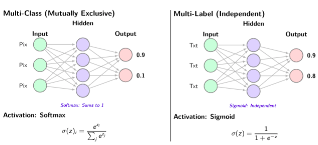

Based on the uploaded PDF — DA6401: Introduction to Deep Learning, Module 2A — here is the full slide-by-slide content extracted:

***

## Slide 1 — Title

**DA6401: Introduction to Deep Learning**
**Module 2A — BackPropagation in MLPs**

***

## Slide 2 — The Supervised Learning Setup (5 components)


1. **Data** — $\mathcal{D} = \{(x^{(i)}, y^{(i)})\}_{i=1}^n$ — labeled examples, typically from benchmarks/gold-standard datasets
2. **Model** — an approximation function mapping input $x$ to output $y$; specifically a Neural Network (MLP) with fixed hyperparameters (layers, neurons, etc.)
3. **Parameters** — unknown variables (weights & biases of the MLP) that must be learned

***

## Slide 3 — Key Components to Explore


4. **Objective / Loss Function** — a metric $J(\mathbf{w})$ quantifying the difference between prediction $\hat{y}$ and true label $y$
5. **Learning Algorithm** — optimization method to adjust parameters $\mathbf{w}$ to minimize the loss

***

## Slides 4–5 — Regression vs. Classification

- Goal: predict continuous quantities
- Example: predicting house price ($450k) & tax ($4.5k) from area, bedrooms, age
- Output is unbounded ($\mathbb{R}$)

- Goal: predict class probabilities
- Example: Is the image a cat or dog? Output: P(Cat), P(Dog)
- Question posed: *In which scenario should output probabilities sum to 1?*

***

## Slide 6 — Regression: Activations and Loss


**Loss Function 1 — MSE**:

$$\mathcal{L}_{MSE} = \frac{1}{N}\sum_{i=1}^{N}(y_i - \hat{y}_i)^2
$$

**Loss Function 2 — MAE** (more robust to outliers):

$$\mathcal{L}_{MAE} = \frac{1}{N}\sum_{i=1}^{N}|y_i - \hat{y}_i|
$$

***

## Slides 7–8 — Multi-Class vs. Multi-Label Classification

| | Multi-Class | Multi-Label |
|---|---|---|
| Constraint | Mutually exclusive (one-hot) | Independent / non-exclusive |
| Example | Digit is '3', not '5' | Movie is 'Action' AND 'Sci-Fi' |
| Activation | **Softmax** $\sigma(z)_i = \frac{e^{z_i}}{\sum_j e^{z_j}}$ | **Sigmoid** $\sigma(z) = \frac{1}{1+e^{-z}}$ |
| Output property | Sums to 1 | Each output independent |




***

## Slide 9 — Loss Functions for Classification

| | Multi-Class | Multi-Label |
|---|---|---|
| Loss | **Categorical Cross-Entropy** $\mathcal{L} = -\sum_{c=1}^C y_c \log(\hat{y}_c)$ | **Binary Cross-Entropy** $\mathcal{L} = -\frac{1}{M}\sum_{j=1}^M[y_j\log\hat{y}_j + (1-y_j)\log(1-\hat{y}_j)]$ |

***

## Slide 10 — Section: Introduction to Backpropagation

***

## Slide 11 — What is Backpropagation?

- **Definition:** Backpropagation ("backward propagation of errors") is an algorithm for computing the gradient of the loss function with respect to the weights.

- **Core Mechanism:** It applies the **Chain Rule** of calculus recursively from the output layer back to the input layer.

- **Purpose:** It tells us how much each weight contributed to the error, allowing us to adjust them to reduce error.

***

## Slide 12 — Use of Gradients

**The Goal: Minimize Loss $\mathcal{L}$**

- We view the Loss Surface as a landscape.
- The **Gradient** ($\nabla_\theta \mathcal{L}$) points in the direction of steepest ascent (up the hill).
- To minimize error, we want to move in the direction of **Steepest Descent**.

$$\Delta W \propto -\frac{\partial \mathcal{L}}{\partial W}$$

*Backprop provides this gradient vector.*

***

## Slide 13 — Objective of Backpropagation

Mathematically, for every weight $w_{jk}^{(l)}$ and bias $b_k^{(l)}$ in the network, we need to compute:

$$\frac{\partial \mathcal{L}}{\partial w_{jk}^{(l)}} \quad \text{and} \quad \frac{\partial \mathcal{L}}{\partial b_k^{(l)}}$$

**Where:**
- $\mathcal{L}$: The Loss function (e.g., MSE, Cross-Entropy).
- $w_{jk}^{(l)}$: Weight connecting neuron $j$ in layer $(l - 1)$ to neuron $k$ in layer $l$.
- $b_k^{(l)}$: Bias associated with neuron $k$ in layer $l$.

***

## Slide 14 — The Setup: Binary Classification

We want to train an MLP to predict the presence or absence of "Elephant" from an input image.

**Definitions:**
- $y$: True Label (1 = Elephant, 0 = Not).
- $\hat{y}$: Prediction (0.0 → 1.0).
- $z$: Weighted sum into the output node.

**Chain Rule:**

$$\frac{\partial \mathcal{L}}{\partial w_{jk}} = \frac{\partial \mathcal{L}}{\partial \hat{y}} \cdot \frac{\partial \hat{y}}{\partial z} \cdot \frac{\partial z}{\partial w_{jk}}$$

***

## Slide 15 — Step 1: Derivative of Loss (BCE)

**Loss Function: Binary Cross-Entropy**

$$\mathcal{L} = -[y \log(\hat{y}) + (1 - y) \log(1 - \hat{y})]$$

**The Derivative: How does error change as prediction $\hat{y}$ changes?**

$$\frac{\partial \mathcal{L}}{\partial \hat{y}} = \frac{-y}{1 - y} + \frac{1 - y}{1 - \hat{y}}$$

If we simplify this fraction:

$$\frac{\partial \mathcal{L}}{\partial \hat{y}} = \frac{\hat{y} - y}{\hat{y}(1 - \hat{y})}$$

***

## Slide 16 — Step 2: Derivative of Activation (Sigmoid)

**Activation Function: Sigmoid** — We squash the sum $z$ to a probability:

$$\hat{y} = \sigma(z) = \frac{1}{1 + e^{-z}}$$

**The Derivative: The slope of the sigmoid curve at $z$.**

$$\frac{\partial \hat{y}}{\partial z} = \sigma'(z) = \hat{y}(1 - \hat{y})$$

*Note: This matches the denominator from Step 1!*

***

## Slide 17 — The "Magic" Simplification

Before Step 3, let's combine Step 1 and Step 2 to find the local error $\delta$.

$$\delta = \text{Step 1} \times \text{Step 2}$$

$$\delta = \left(\frac{\hat{y} - y}{\hat{y}(1 - \hat{y})}\right) \cdot (\hat{y}(1 - \hat{y}))$$

$$\delta = \hat{y} - y$$

**Result: The local error is just the difference between prediction and truth!**

***

## Slide 18 — Step 3: Derivative of Weights

**Question: How much of the error is due to weight $w_{jk}$?**

Recall forward pass:

$$z = \cdots + w_{jk} \cdot a_j + \cdots$$

**Derivative:**

$$\frac{\partial z}{\partial w_{jk}} = a_j$$

where $a_j$ is the activation of the hidden neuron detecting "Elephant Features" (e.g., trunk shape).

***

## Slide 19 — Final Gradient Calculation

Combining all parts for the weight update:

$$\frac{\partial \mathcal{L}}{\partial w_{jk}} = (\hat{y} - y) \cdot a_j$$

**Interpretation:**
- If Prediction $\approx$ Truth, gradient is 0 (Stop learning).
- If Input $a_j$ is high (feature present) AND error is high, update weight significantly.

***

## Slide 20 — Extending to Deeper Layers: The Challenge

**What we've learned so far:**
- We know how to compute gradients for weights connecting the **hidden layer** to the **output layer**: $w_{jk}$
- Error at output: $\delta_k = \hat{y} - y$

**The Question: How do we update weights $v_{ij}$ connecting the input layer to the hidden layer?**

*Hint: We need to propagate the error backward through the network!*

***

## Slide 21 — Step 1: Error at the Output Layer (Review)

**Output Layer Error: We already computed this!**

$$\delta_k = \frac{\partial \mathcal{L}}{\partial z_k} = \hat{y} - y$$

where $z_k$ is the weighted sum into the output neuron.

**This is our starting point for backpropagation.**

***

## Slide 22 — Step 2: Error at the Hidden Layer

**Chain Rule to Hidden Neuron $j$:**

$$\delta_j = \frac{\partial \mathcal{L}}{\partial z_j} = \frac{\partial \mathcal{L}}{\partial z_k} \cdot \frac{\partial z_k}{\partial a_j} \cdot \frac{\partial a_j}{\partial z_j}$$

**Breaking it down:**
- $\frac{\partial \mathcal{L}}{\partial z_k} = \delta_k$ (from output)
- $\frac{\partial z_k}{\partial a_j} = w_{jk}$ (weight connecting $j$ to $k$)
- $\frac{\partial a_j}{\partial z_j} = \sigma'(z_j)$ (activation derivative)

$$\delta_j = \delta_k \cdot w_{jk} \cdot \sigma'(z_j)$$

Error propagates through the weight $w_{jk}$

***

## Slide 23 — Step 3: Updating Input-to-Hidden Weights

**Gradient for weight $v_{ij}$:**

Now that we have $\delta_j$ for the hidden layer, we can compute:

$$\frac{\partial \mathcal{L}}{\partial v_{ij}} = \delta_j \cdot x_i$$

where:
- $\delta_j$ = error at hidden neuron $j$
- $x_i$ = input from pixel/feature $i$

**Pattern Recognition: This has the exact same form as before!**

$$\frac{\partial \mathcal{L}}{\partial \text{weight}} = \text{error} \times \text{input}$$

***

## Slide 24 — Vectorization: Why the Outer Product?

**From Scalar to Matrix:** In a fully connected layer, we don't update weights one by one. We update the entire weight matrix $W^{(l)}$ at once.

**Individual Weight Gradient:**

$$\frac{\partial \mathcal{L}}{\partial w_{ij}} = \delta_i \cdot x_j$$

**Matrix Form:** To get the gradient for the whole matrix, we take the **Outer Product** of the error vector $\boldsymbol{\delta}$ and the input vector $\mathbf{x}^T$:

$$\nabla_W \mathcal{L} = \boldsymbol{\delta} \mathbf{x}^T$$

Since $z_i = \sum_j w_{ij} a_j$, the partial $\frac{\partial z_i}{\partial w_{ij}}$ is only non-zero ($= a_j$) when indices match, mapping every (error $i$, input $j$) combination into the gradient matrix slot.

***

## Slide 25 — Vectorization: Why the Outer Product? (Continued)

**Individual Weight Gradient:**

$$\frac{\partial \mathcal{L}}{\partial w_{ij}} = \delta_i \cdot x_j$$

**Matrix Form:** To get the gradient for the whole matrix, we take the **Outer Product** of the error vector $\boldsymbol{\delta}$ and the input vector $\mathbf{x}^T$:

$$\nabla_W \mathcal{L} = \boldsymbol{\delta} \mathbf{x}^T$$

**The Derivation:** Since $z_i = \sum_j w_{ij} a_j$, the partial $\frac{\partial z_i}{\partial w_{ij}}$ is only non-zero ($= a_j$) when the indices match. This maps every combination of (error $i$, input $j$) into the gradient matrix slot.

***

## Slide 26 — The General Backpropagation Recipe

For a network with $L$ layers, we backpropagate errors from layer $L$ to layer $1$:

**1. Output Layer (Layer $L$):**

$$\delta^{(L)} = \hat{y} - y$$

**2. Hidden Layers ($l = L - 1, L - 2, \ldots, 2$):**

$$\delta^{(l)} = \left(W^{(l+1)}\right)^T \delta^{(l+1)} \odot \sigma'(z^{(l)})$$

(where $\odot$ is element-wise multiplication)

**3. Weight Updates (all layers):**

$$\frac{\partial \mathcal{L}}{\partial W^{(l)}} = \delta^{(l)} \left(a^{(l-1)}\right)^T$$

The error "flows backward" through the weights, scaled by activation derivatives.

***

## Slide 27 — Key Insights: Why Backpropagation Works

- **Chain Rule is Everything:** We decompose the complex derivative into simple, local computations at each layer.

- **Reuse Computations:** Each $\delta$ is computed once and reused for all weights in that layer. This makes backprop efficient!

- **Error Attribution:** Weights that contributed more to the error (high $\delta \cdot$ input) get larger updates.

- **Vanishing/Exploding Gradients:** As we go deeper, $\delta$ can become very small (vanishing) or very large (exploding) due to repeated multiplication by $w \cdot \sigma'(z)$. This is why deep networks can be hard to train!

***

## Slide 28 — Automatic Differentiation in Frameworks

# Automatic Differentiation in Frameworks

***

## Slide 29 — The Mechanics of Autograd

To compute gradients, PyTorch builds a **Dynamic Directed Acyclic Graph (DAG)**.

- **Tensors (Nodes):** Store the data and the accumulated gradient (.grad).
- **Function Objects (Edges):** Every operation (add, mul, exp) creates a grad_fn that knows its own derivative.
- **Leaf Tensors:** Tensors created by the user (weights $w$, bias $b$, input $x$).

**Rule: Gradient at Node = Incoming Gradient × Local Derivative**

***

## Slide 30 — The Anatomy of a Graph Node

In PyTorch, every operation (e.g., +, ×, exp) is a node that implements a forward() and a backward() method.

**FORWARD: Compute out**

$$(f)$$

$$\text{out} = f(a, b)$$

**BACKWARD:** 

$$\frac{\partial \mathcal{L}}{\partial a} = \frac{\partial \mathcal{L}}{\partial \text{out}} \cdot \frac{\partial \text{out}}{\partial a}$$

$$\frac{\partial \mathcal{L}}{\partial b} = \frac{\partial \mathcal{L}}{\partial \text{out}} \cdot \frac{\partial \text{out}}{\partial b}$$

***

## Slide 31 — A 5-Step Example: $L = \sigma(w \cdot x + b)$

Let's decompose the operation $L = \frac{1}{1 + e^{-(wx + b)}}$ into atomic steps:

1. $z_1 = w \times x$ (Multiplication)
2. $z_2 = z_1 + b$ (Addition)
3. $z_3 = -z_2$ (Negation)
4. $z_4 = \exp(z_3)$ (Exponential)
5. $L = \frac{1}{1 + z_4}$ (Inverse + Addition)

***

## Slide 32 — Step-by-Step Backpropagation Trace

Starting with $\frac{\partial L}{\partial L} = 1$, we move backwards node-by-node:

| Node | Local Grad | Chain Rule Expression | Result |
|---|---|---|---|
| $L = \frac{1}{1+z_4}$ | $\frac{\partial L}{\partial z_4} = -L^2$ | $\frac{\partial L}{\partial z_4} = 1 \cdot (-L^2)$ | $\frac{\partial L}{\partial z_4} = -L^2$ |
| $z_4 = \exp(z_3)$ | $\frac{\partial z_4}{\partial z_3} = \exp(z_3)$ | $\frac{\partial L}{\partial z_3} = (-L^2) \cdot z_4$ | $\frac{\partial L}{\partial z_3} = -L^2z_4$ |
| $z_3 = -z_2$ | $\frac{\partial z_3}{\partial z_2} = -1$ | $\frac{\partial L}{\partial z_2} = (-L^2z_4) \cdot (-1)$ | $\frac{\partial L}{\partial z_2} = L^2z_4$ |
| $z_2 = z_1 + b$ | $\frac{\partial z_2}{\partial z_1} = 1$, $\frac{\partial z_2}{\partial b} = 1$ | (as shown) | $\frac{\partial L}{\partial z_1} = L^2z_4$, $\frac{\partial L}{\partial b} = L^2z_4$ |
| $z_1 = w \times x$ | $\frac{\partial z_1}{\partial w} = x$ | $\frac{\partial L}{\partial w} = (L^2z_4) \cdot x$ | $\frac{\partial L}{\partial w} = L^2z_4x$ |

**Key Point:** The weight gradient $\frac{\partial L}{\partial w}$ is the product of all local derivatives encountered on the path from $L$ back to $w$.

***

## Slide 33 — Why the Graph? Gradient Accumulation

If a variable $w$ affects $\mathcal{L}$ through two different paths, the gradients from different paths are **summed at the junction.**

- Path 1 gives: $\frac{\partial \mathcal{L}}{\partial w_1}$
- Path 2 gives: $\frac{\partial \mathcal{L}}{\partial w_2}$
- **Total:** $\frac{\partial \mathcal{L}}{\partial w} = \frac{\partial \mathcal{L}}{\partial w_1} + \frac{\partial \mathcal{L}}{\partial w_2}$

This is how PyTorch handles branching.

***

## Slide 34 — Step-by-Step Example: $L = (w \cdot x + b - y)^2$

Let's trace a forward pass with 5 operations:

1. $z_1 = w \times x$ (Multiplication)
2. $z_2 = z_1 + b$ (Addition)
3. $z_3 = z_2 - y$ (Subtraction)
4. $L = z_3^2$ (Power)

***

## Slide 35 — The Backward Pass: Message Passing

When we call `L.backward()`, the gradient $g = \frac{\partial L}{\partial L} = 1$ flows backward:

- **At Power Node** ($z_3^2$): Local $\frac{\partial L}{\partial z_3} = 2z_3$. Grad sent back: $1 \cdot 2z_3$.
- **At Subtraction Node** ($z_2 - y$): Local $\frac{\partial z_3}{\partial z_2} = 1$. Grad sent back: $(2z_3) \cdot 1$.
- **At Addition Node** ($z_1 + b$): Local $\frac{\partial z_2}{\partial z_1} = 1$ and $\frac{\partial z_2}{\partial b} = 1$.
- **At Multiplication Node** ($w \times x$): Local $\frac{\partial z_1}{\partial w} = x$. Final Grad: $(2z_3 \cdot 1) \cdot x$.

***

## Slide 36 — Key Features of the Graph Approach

**Efficiency:**
- Only local derivatives are calculated at each node.
- Intermediate results ($z_1, z_2, z_3$) are cached during forward pass.

**Gradient Accumulation:**
- If a tensor is used in multiple operations, the gradients from different paths are **summed** at that node.
- This is how PyTorch handles branching.

***

## Slide 37 — The Forward and Backward Pass

**1. Forward Pass:**
- Data flows from left to right.
- Each operation saves **intermediate values** (tensors) needed for the gradient.
- Each tensor points to a grad_fn (the recipe for its derivative).

**2. Backward Pass (loss.backward()):**
- The graph is traversed in **reverse**.
- Local gradients are computed using the saved values.
- Gradients are multiplied by the incoming "gradient from above" (Chain Rule).

***

## Slide 38 — From Math to Code

**The Graph Logic:**

- Define tensors with requires_grad=True.
- Perform operations (PyTorch builds the graph).
- Call .backward().
- Access .grad attribute.

***

## Slide 39 — Illustration of Backpropagation: Setup

**Tiny Network for Hand Calculation:**

- 2 input features: $x_1 = 0.5, x_2 = 1.0$
- 2 hidden neurons
- 1 output neuron (binary classification)
- Sigmoid activation: $\sigma(z) = \frac{1}{1 + e^{-z}}$
- True label: $y = 1$

**Initial Weights:**
- $v_{11} = 0.5, v_{12} = 0.5$
- $v_{21} = 0.5, v_{22} = 0.5$
- $w_1 = 1.0, w_2 = 1.0$

***

## Slide 40 — Step 1: Forward Pass - Hidden Layer

**Compute Hidden Layer Activations:**

**Hidden Neuron 1:**

$$z_1 = v_{11}x_1 + v_{21}x_2 = 0.5 \times 0.5 + 0.5 \times 1.0 = 0.75$$

$$h_1 = \sigma(z_1) = \frac{1}{1 + e^{-0.75}} \approx 0.679$$

**Hidden Neuron 2:**

$$z_2 = v_{12}x_1 + v_{22}x_2 = 0.5 \times 0.5 + 0.5 \times 1.0 = 0.75$$

$$h_2 = \sigma(z_2) = \frac{1}{1 + e^{-0.75}} \approx 0.679$$

Both hidden neurons have activation $\approx 0.679$

***

## Slide 41 — Step 2: Forward Pass - Output Layer

**Compute Output:**

**Weighted Sum:**

$$z_{\text{out}} = w_1h_1 + w_2h_2 = 1.0 \times 0.679 + 1.0 \times 0.679 = 1.358$$

**Final Prediction:**

$$\hat{y} = \sigma(z_{\text{out}}) = \frac{1}{1 + e^{-1.358}} \approx 0.796$$

**Loss (Binary Cross-Entropy):**

$$\mathcal{L} = -[y \log(\hat{y}) + (1 - y) \log(1 - \hat{y})]$$
$$= -[1 \times \log(0.796) + 0 \times \log(0.204)]$$
$$= -\log(0.796) \approx 0.228$$

***

## Slide 42 — Step 3: Backward Pass - Output Error

**Compute Output Layer Error:**

Recall the simplified formula for sigmoid + BCE:

$$\delta_{\text{out}} = \hat{y} - y = 0.796 - 1 = -0.204$$

(negative → predicted too low)

**Next Step:** Use this to compute gradients for $w_1$ and $w_2$.

***

## Slide 43 — Step 4: Gradients for Output Weights $(w_1, w_2)$

**Gradient Formula:** $\frac{\partial \mathcal{L}}{\partial w_i} = \delta_{\text{out}} \cdot h_i$

**For $w_1$:**

$$\frac{\partial \mathcal{L}}{\partial w_1} = \delta_{\text{out}} \cdot h_1 = (-0.204) \times 0.679 = -0.139$$

**For $w_2$:**

$$\frac{\partial \mathcal{L}}{\partial w_2} = \delta_{\text{out}} \cdot h_2 = (-0.204) \times 0.679 = -0.139$$

Both weights need to increase (negative gradients mean weights should increase)

***

## Slide 44 — Step 5: Hidden Layer Errors $(\delta_1, \delta_2)$

**Backpropagate Error to Hidden Layer:**

**Formula:** $\delta_j = \delta_{\text{out}} \cdot w_j \cdot \sigma'(z_j)$

First, compute $\sigma'(z) = h(1 - h)$:

$$\sigma'(z_1) = 0.679(1 - 0.679) = 0.218$$

**For Hidden Neuron 1:**

$$\delta_1 = \delta_{\text{out}} \cdot w_1 \cdot \sigma'(z_1) = (-0.204) \times 1.0 \times 0.218 = -0.044$$

**For Hidden Neuron 2:**

$$\delta_2 = \delta_{\text{out}} \cdot w_2 \cdot \sigma'(z_2) = (-0.204) \times 1.0 \times 0.218 = -0.044$$

Hidden errors computed! Error propagated backward

***

## Slide 45 — Step 6: Gradients for Hidden Weights $(v_{ij})$

**Gradient Formula:** $\frac{\partial \mathcal{L}}{\partial v_{ij}} = \delta_j \cdot x_i$

**Weights to Hidden Neuron 1:**

$$\frac{\partial \mathcal{L}}{\partial v_{11}} = \delta_1 \cdot x_1 = (-0.044) \times 0.5 = -0.022$$

$$\frac{\partial \mathcal{L}}{\partial v_{21}} = \delta_1 \cdot x_2 = (-0.044) \times 1.0 = -0.044$$

**Weights to Hidden Neuron 2:**

$$\frac{\partial \mathcal{L}}{\partial v_{12}} = \delta_2 \cdot x_1 = (-0.044) \times 0.5 = -0.022$$

$$\frac{\partial \mathcal{L}}{\partial v_{22}} = \delta_2 \cdot x_2 = (-0.044) \times 1.0 = -0.044$$

**All Gradients Computed! All hidden layer weights have negative gradients → should increase.**

***

## Slide 46 — Connecting Backpropagation to Optimization

**The Story So Far:**

- **Forward Pass:** We mapped inputs to predictions and calculated the Loss $\mathcal{L}$.
- **Backpropagation:** We used the chain rule to find exactly how each weight contributes to that loss ($\nabla W$).

**The Missing Link:** Now that we have the gradients, how do we actually improve the model?

- The gradient $\frac{\partial \mathcal{L}}{\partial W}$ points in the direction of steepest **increase**.
- To minimize error, we must move in the **opposite direction**.

**Next Step:** Gradient Descent Algorithm and its variants

We will now see how this update rule allows the model to "learn" by iteratively descending the loss landscape.
2. **Hidden layers** $(\ell = L-1, \ldots, 2)$:

$$\delta^{(\ell)} = \left(W^{(\ell+1)}\right)^T \delta^{(\ell+1)} \odot \sigma'\left(z^{(\ell)}\right)
$$
3. **Weight updates**:

$$\frac{\partial \mathcal{L}}{\partial W^{(\ell)}} = \delta^{(\ell)} \left(a^{(\ell-1)}\right)^T
$$

***

## Slide 27 — Key Insights


1. **Chain rule** — complex derivatives decomposed into simple local computations
2. **Reuse** — each $\delta$ computed once, reused for all weights in that layer → efficiency
3. **Error attribution** — high $\delta \cdot \text{input}$ → larger weight update
4. **Vanishing/Exploding gradients** — repeated multiplication by $w \cdot \sigma'(z)$ can cause $\delta \to 0$ (vanishing) or $\delta \to \infty$ (exploding) in deep networks

***

## Slide 28 — Section: Automatic Differentiation in Frameworks


***

## Slides 29–30 — PyTorch Autograd & DAG

- **Tensors (nodes)**: store data + accumulated gradient (`.grad`)
- **Function objects (edges)**: each op (add, mul, exp) creates a `grad_fn`
- **Leaf tensors**: user-created (weights $w$, bias $b$, input $x$)

**Rule**: Gradient at node = Incoming gradient × Local derivative

Each operation implements `forward()` and `backward()`:

$$\frac{\partial \mathcal{L}}{\partial a} = \frac{\partial \mathcal{L}}{\partial out} \cdot \frac{\partial out}{\partial a}
$$

***

## Slide 31 — 5-Step Example: $L = \sigma(wx + b)$


1. $z_1 = w \times x$ — Mul
2. $z_2 = z_1 + b$ — Add
3. $z_3 = -z_2$ — Neg
4. $z_4 = \exp(z_3)$ — Exp
5. $L = \frac{1}{1+z_4}$ — Inv + Add

***

## Slide 32 — Step-by-Step Backprop Trace


| Node | Local grad | Result |
|---|---|---|
| $L = \frac{1}{1+z_4}$ | $-\frac{1}{(1+z_4)^2}$ | $\frac{\partial L}{\partial z_4} = -L^2$ |
| $z_4 = \exp(z_3)$ | $\exp(z_3)$ | $-L^2 z_4$ |
| $z_3 = -z_2$ | $-1$ | $L^2 z_4$ |
| $z_2 = z_1 + b$ | $1$ | $\frac{\partial L}{\partial b} = L^2 z_4$ |
| $z_1 = w \cdot x$ | $x$ | $\frac{\partial L}{\partial w} = L^2 z_4 x$ |


***

## Slide 33 — Gradient Accumulation


$$\frac{\partial L}{\partial w} = \frac{\partial L}{\partial p_1} + \frac{\partial L}{\partial p_2}
$$

***

## Slide 34 — Example: $L = (wx + b - y)^2$

1. $z_1 = w \cdot x$ — Multiplication
2. $z_2 = z_1 + b$ — Addition
3. $z_3 = z_2 - y$ — Subtraction
4. $L = z_3^2$ — Power

***

## Slide 35 — Backward Pass: Message Passing

- **Power node**: local $\frac{\partial L}{\partial z_3} = 2z_3$, grad back = $2z_3$
- **Subtraction**: grad back = $2z_3 \cdot 1$
- **Addition**: to both $z_1$ and $b$
- **Multiplication**: final grad = $2z_3 \cdot x$ for $w$

***

## Slide 36 — Key Features of Graph Approach

- Only local derivatives at each node
- Intermediate values $(z_1, z_2, z_3)$ cached during forward pass

**Gradient Accumulation**:
- Tensor used in multiple operations → gradients from all paths are summed

***

## Slides 37–38 — Forward and Backward Pass / From Math to Code


**Backward pass** (`loss.backward()`): graph traversed in reverse; gradients multiplied by incoming gradient (chain rule)

**PyTorch code**:
```python
x = torch.tensor(1.0, requires_grad=True)
w = torch.tensor(2.0, requires_grad=True)
b = torch.tensor(0.5, requires_grad=True)
z = w * x + b
loss = z**2
loss.backward()
print(w.grad)  # dLoss/dw
```

***

## Slides 39–45 — Hand Calculation: Full Backprop Illustration


**Step 1 — Forward: hidden layer**:
- $z_1 = z_2 = 0.75$, $h_1 = h_2 = \sigma(0.75) \approx 0.679$

**Step 2 — Forward: output layer**:
- $z_{out} = 1.358$, $\hat{y} \approx 0.796$, loss $\approx 0.228$

**Step 3 — Output error**:
- $\delta_{out} = \hat{y} - y = -0.204$ (negative → predicted too low)

**Step 4 — Gradients for $w_1, w_2$**:
- $\frac{\partial \mathcal{L}}{\partial w_1} = \frac{\partial \mathcal{L}}{\partial w_2} = (-0.204)(0.679) = -0.139$ → both weights need to increase

**Step 5 — Hidden layer errors**:
- $\sigma'(z) = 0.679(1-0.679) = 0.218$
- $\delta_1 = \delta_2 = (-0.204)(1.0)(0.218) = -0.044$

**Step 6 — Gradients for $v_{ij}$**:
- $\frac{\partial \mathcal{L}}{\partial v_{11}} = \frac{\partial \mathcal{L}}{\partial v_{12}} = (-0.044)(0.5) = -0.022$
- $\frac{\partial \mathcal{L}}{\partial v_{21}} = \frac{\partial \mathcal{L}}{\partial v_{22}} = (-0.044)(1.0) = -0.044$

***

## Slide 46 — Connecting Backpropagation to Optimization

- Forward pass → predictions + loss
- Backpropagation → gradients $\nabla W$ via chain rule

**Missing link**: How do we actually improve the model?

- Gradient $\frac{\partial \mathcal{L}}{\partial W}$ points in direction of steepest **increase**
- To minimize error, move in the **opposite direction**

