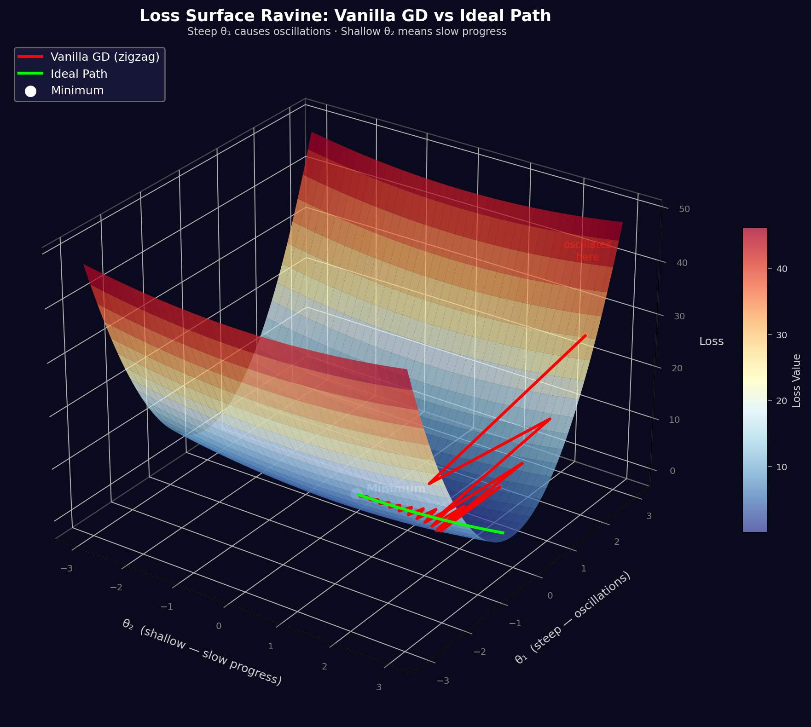
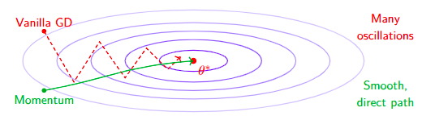
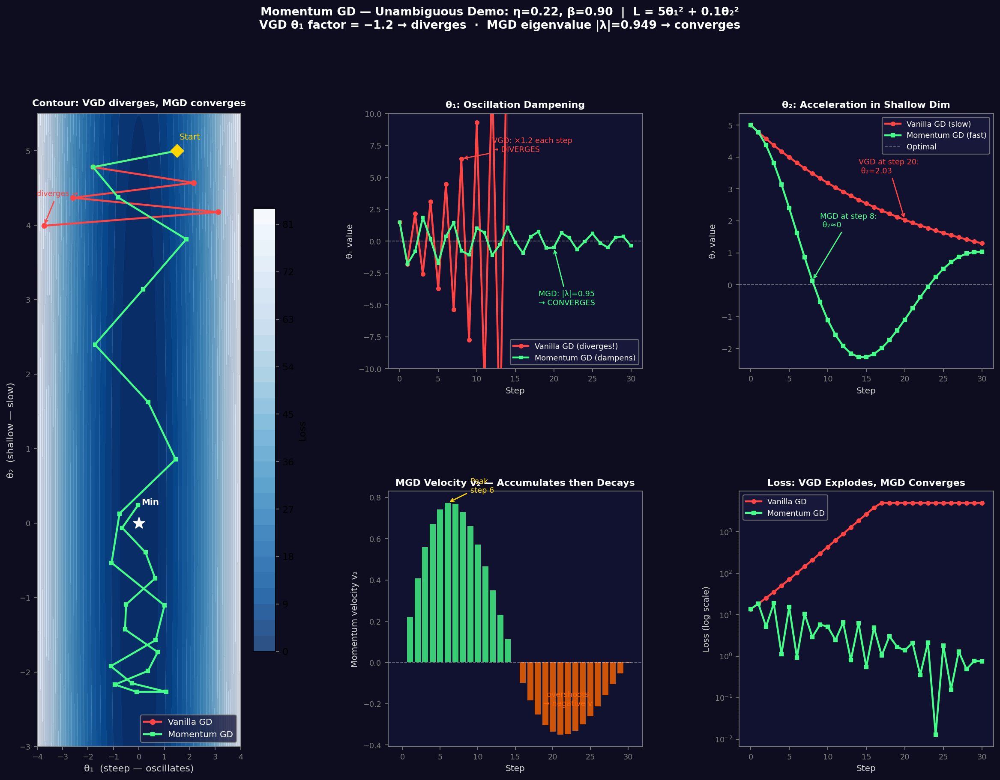
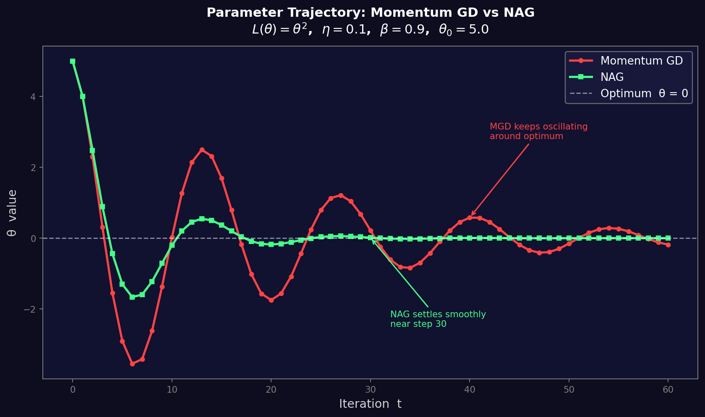

### Limitations of Vanilla Gradient Descent

**Ravines and Slow Convergence**
- A ravine is a region where the loss surface curves much more steeply in one dimension than another
- Vanilla GD oscillates across the narrow dimension while crawling slowly along the bottom
- Results in inefficient **zigzag patterns** instead of a direct path to the minimum



*Visualizing the Problem: Vanilla GD in Ravines - Zigzag path, slow progress, many oscillations. Vanilla GD makes slow progress toward optimum, wasting steps on oscillations perpendicular to the optimal direction.*

**Oscillations Around Minima**
- When gradient directions change rapidly, GD bounces back and forth near the minimum
- This wastes computation and prevents smooth, stable convergence

**No Acceleration Mechanism**
- Each update is **independent** — there is no memory of past gradient directions
- Update rule: $\theta_{t+1} = \theta_t - \eta \nabla_\theta \mathcal{L}(\theta_t)$
- For Vanilla GD The update magnitude depends *only* on the current gradient, so GD:
  - Cannot speed up along directions where the gradient consistently points the same way
  - Cannot dampen movement in directions where it keeps oscillating

**Core Insight**
All three problems stem from the same root cause — GD has no way to **accumulate velocity** in favorable directions or **suppress oscillations** in unfavorable ones. This is the key motivation for momentum-based optimizers like SGD with Momentum and Adam.

---

## Momentum-based Gradient Descent

### Update Rule

**Momentum Update Rule:**

**Momentum Gradient Descent**
Initialize velocity: $v_0 = 0$
At each iteration t:

$$v_{t+1} = \gamma v_t + \eta \nabla_\theta \mathcal{L}(\theta_t)$$

$$\theta_{t+1} = \theta_t - v_{t+1}$$

**Parameters:**
- $\gamma \in [0, 1)$: Momentum coefficient (typically 0.9 or 0.99)
- $\eta > 0$: Learning rate
- $v_t$: Velocity (accumulated gradient)

**Special Cases:**
- $\gamma = 0$: Reduces to vanilla gradient descent
- $\gamma \to 1$: Maximum momentum, very smooth trajectory

### Momentum: Dampening Oscillations

Consider oscillating gradients:
Suppose gradients alternate: $g_1 = +5, g_2 = -4, g_3 = +5, g_4 = -4, ...$

**Vanilla GD:** (with $\eta = 0.1$)
$\Delta \theta_1 = -0.5,$
$\Delta \theta_2 = +0.4,$
$\Delta \theta_3 = -0.5,$
$\Delta \theta_4 = +0.4$

Large oscillations persist!

**Momentum GD:** (with $\eta = 0.1, \gamma = 0.9$)
$v_1 = 0.9(0) + 0.1(5) = 0.5$

$v_2 = 0.9(0.5) + 0.1(-4) = 0.45 - 0.4 = 0.05$

$v_3 = 0.9(0.05) + 0.1(5) = 0.045 + 0.5 = 0.545$

$v_4 = 0.9(0.545) + 0.1(-4) = 0.49 - 0.4 = 0.09$

Oscillations dampened! Velocity stabilizes around 0.

### Understanding Momentum: Exponential Moving Average

**Claim:** Velocity $v_t$ is an exponential moving average (EMA) of all past gradients.

**Proof:** Expand the recursion $v_{t+1} = \gamma v_t + \eta \nabla_\theta \mathcal{L}(\theta_t)$

Starting from $v_0 = 0$:
$v_1 = \gamma v_0 + \eta g_0 = \eta g_0$

$v_2 = \gamma v_1 + \eta g_1 = \gamma \eta g_0 + \eta g_1$

$v_t = \eta \sum_{i=0}^{t-1} \gamma^{t-1-i} g_i$

where $g_i = \nabla_\theta \mathcal{L}(\theta_i)$

**General Form:**

$$v_t = \eta \sum_{i=0}^{t-1} \gamma^{t-1-i} \nabla_\theta \mathcal{L}(\theta_i)$$

### Understanding Momentum: Weighted Sum of Gradients

$$v_t = \eta (g_{t-1} + \gamma g_{t-2} + \gamma^2 g_{t-3} + \gamma^3 g_{t-4} + \cdots)$$

Recent gradients have weight $\gamma^0 = 1$ (most influence)
Gradients decay exponentially with age: $\gamma^1, \gamma^2, \gamma^3, ...$

**With $\gamma = 0.9$:**
- $g_{t-1}$: weight = 1.0
- $g_{t-2}$: weight = 0.9
- $g_{t-3}$: weight = 0.81
- $g_{t-10}$: weight = 0.35

**Interpretation:** Momentum smooths out gradient noise by averaging over history!

### Momentum vs Vanilla GD: Visual Comparison



**Vanilla GD:** Many oscillations, Zigzag pattern, slow convergence

**Momentum:** Smooth, direct path, faster convergence

### Momentum-based Gradient Descent: Complete Algorithm

**Momentum Gradient Descent**
**Input:** $D = \{(x^{(i)}, y^{(i)})\}_{i=1}^N$, learning rate $\eta$, momentum $\gamma$, epochs $E$, batch size $b$

**Initialize:** $\theta_0$ randomly, $v_0 = 0$

**For epoch $e = 1$ to $E$:**
1. Shuffle $D$
2. **For each mini-batch $B_t$:**
   1. Forward: $\hat{y} = f(x; \theta)$ for $(x, y) \in B_t$
   2. Loss: $L_{B_t} = \frac{1}{|B_t|} \sum_{(x,y) \in B_t} \ell(\hat{y}, y)$
   3. Backward: $g_t = \nabla_\theta L_{B_t}$
   4. Update velocity: $v_{t+1} = \gamma v_t + \eta g_t$
   5. Update parameters: $\theta \leftarrow \theta - v_{t+1}$
3. Evaluate on validation set

**Return:** $\theta^*$

### Practical Considerations

**Choosing Momentum Coefficient $\gamma$:**
- $\gamma = 0.9$: Standard choice, good for most problems
- $\gamma = 0.95$ or $0.99$: More aggressive, useful for very noisy gradients
- $\gamma < 0.9$: Less common, reduces momentum effect

**Learning Rate with Momentum:**
- **Adjustment needed**: Learning rate typically needs to be reduced compared to vanilla GD
- **Effective step size**: Momentum amplifies the actual step taken during optimization
- **Practical guideline**: If using learning rate $\eta$ with vanilla GD, try $\eta/2$ or $\eta/3$ with momentum

**When to Use Momentum:**
Always recommended for deep neural networks
Particularly effective for:
- High-dimensional optimization
- Noisy gradients (mini-batch SGD)
- Ill-conditioned loss surfaces (ravines, plateaus)

### Summary: Momentum-based Gradient Descent

**Key Ideas**
1. Accumulates velocity: $v_{t+1} = \gamma v_t + \eta g_t$
2. Exponential moving average of gradients
3. Dampens oscillations, accelerates in consistent directions
4. Converges faster than vanilla GD
5. Note: Both Stochastic and Mini-batch variants of momentum GD exist

---

## Numerical Comparison: Momentum vs Vanilla GD



### Setup

$$L(\theta_1, \theta_2) = 5\theta_1^2 + 0.1\theta_2^2, \quad \nabla L = [10\theta_1,\ 0.2\theta_2]$$
$$\eta = 0.22,\quad \gamma = 0.90,\quad \text{Start: } \theta_1 = 1.5,\ \theta_2 = 5.0$$

### Vanilla GD — Step by Step

**Update rule:** $\theta_{t+1} = \theta_t - \eta \cdot \nabla L(\theta_t)$

| Step | θ₁ | θ₂ | g₁ = 10θ₁ | g₂ = 0.2θ₂ | Δθ₁ = −η·g₁ | Δθ₂ = −η·g₂ | Loss |
|------|------|------|-----------|-----------|------------|------------|------|
| 0 | 1.5000 | 5.0000 | 15.000 | 1.000 | −3.300 | −0.220 | 13.75 |
| 1 | −1.8000 | 4.7800 | −18.000 | 0.956 | +3.960 | −0.210 | 18.48 |
| 2 | +2.1600 | 4.5697 | +21.600 | 0.914 | −4.752 | −0.201 | 25.42 |
| 3 | −2.5920 | 4.3686 | −25.920 | 0.874 | +5.702 | −0.192 | 35.50 |
| 5 | −3.7325 | 3.9926 | −37.325 | 0.799 | +8.212 | −0.176 | 71.25 |
| 8 | +6.4497 | 3.4885 | +64.497 | 0.698 | −14.189 | −0.154 | **209.21** 💥 |
| 11 | −11.145 | 3.0479 | −111.45 | 0.610 | +24.519 | −0.134 | **622.0** 💥 |

**Key observation:** θ₁ multiplies by $1 - \eta \cdot 10 = -1.2$ every step → flips sign AND grows by ×1.2. Loss explodes. θ₂ barely moves.

### Momentum GD — Step by Step

**Update rule:** $v_{t+1} = \gamma \cdot v_t + \eta \cdot \nabla L(\theta_t)$, then $\theta_{t+1} = \theta_t - v_{t+1}$

| Step | θ₁ | θ₂ | g₁ | g₂ | v₁ (prev) | v₂ (prev) | v₁ (new) | v₂ (new) | Loss |
|------|------|------|------|------|-----------|-----------|---------|---------|------|
| 0 | 1.5000 | 5.0000 | 15.000 | 1.000 | 0.000 | 0.000 | **3.300** | **0.220** | 13.75 |
| 1 | −1.8000 | 4.7800 | −18.000 | 0.956 | +3.300 | 0.220 | **−0.990** | **0.408** | 18.48 |
| 2 | −0.8100 | 4.3717 | −8.100 | 0.874 | −0.990 | 0.408 | **−2.673** | **0.560** | 5.19 |
| 3 | +1.8630 | 3.8118 | +18.630 | 0.762 | −2.673 | 0.560 | **+1.693** | **0.672** | 18.81 |
| 4 | +0.1701 | 3.1403 | +1.701 | 0.628 | +1.693 | 0.672 | **+1.898** | **0.743** | 1.13 |
| 5 | −1.7277 | 2.3977 | −17.277 | 0.480 | +1.898 | 0.743 | **−2.093** | **0.774** ← peak | 15.50 |
| 8 | −0.7623 | 0.1272 | −7.623 | 0.025 | +2.208 | 0.729 | **+0.310** | **0.662** | 2.91 |
| 11 | +0.6626 | −1.572 | +6.626 | −0.314 | +0.345 | 0.466 | **+1.768** | **0.350** | **2.44** ✅ |

### The Dampening Mechanism — Step 1 in Detail

At step 1, θ₁ = −1.8, so the gradient **flips sign**: g₁ = −18 (negative).
But the velocity carried from step 0 is **v₁ = +3.3** (positive):

$$v_1^{\text{new}} = \underbrace{0.9 \times (+3.3)}_{\text{memory }= +2.97} + \underbrace{0.22 \times (-18)}_{\text{gradient }= -3.96} = -0.99$$

The opposing memory term **cancels most of the gradient** → actual step in θ₁ is only **−(−0.99) = +0.99**, vs Vanilla GD's full step of **+3.96**. That is a **4× smaller update** — this is the dampening.

### The Acceleration Mechanism — θ₂ Velocity Buildup

Since g₂ is consistently positive (θ₂ > 0 for the first several steps), each velocity update **adds onto the previous**:

$$v_2: 0 \to 0.220 \to 0.408 \to 0.560 \to 0.672 \to 0.743 \to \mathbf{0.774} \text{ (peak at step 5)}$$

Compare VGD which takes a fixed step of $\eta \cdot g_2 \approx 0.22$ — Momentum's effective step grows to **3.5× larger** at peak. That is the acceleration.

---

## Nesterov Accelerated Gradient (NAG)

### Limitations of Momentum-based GD

**The Problem**: Momentum builds up velocity but cannot anticipate turns, leading to:
- Excessive overshooting past the minimum
- Unnecessary oscillations (U-turns)
- Slower convergence near the minimum

**Mathematical Analysis**:
At iteration t, momentum GD computes:
$$v_{t+1} = \gamma v_t + \eta \nabla_\theta \mathcal{L}(\theta_t)$$

**The Issue**: Gradient $\nabla_\theta \mathcal{L}(\theta_t)$ is evaluated at current position $\theta_t$, but the update moves in direction $v_{t+1}$ which includes momentum from $v_t$. No "look-ahead" to see where we're actually going.

**Consequence**: When approaching minimum from one direction with high velocity, the algorithm overshoots and must correct course in the next iteration.

### Intuition behind NAG

**Key Idea**: "Look ahead" before computing the gradient

**NAG Philosophy**:
1. First, take a step in the direction of accumulated momentum: $\theta_t - \gamma v_t$
2. Then, compute gradient at this "look-ahead" position
3. Make a correction based on this anticipated gradient

### Momentum GD vs NAG

**Momentum GD**: Gradient at $\theta_t$ (blind to future)

**NAG**: Gradient at look-ahead (anticipates future)

**Result**: NAG corrects the trajectory before overshooting, leading to:
- Fewer oscillations
- Smoother convergence
- Better performance near the minimum

### Update Rule for NAG

**Nesterov Accelerated Gradient (Original Formulation)**:
$$v_{t+1} = \gamma v_t + \eta \nabla_\theta \mathcal{L}(\theta_t - \gamma v_t)$$
$$\theta_{t+1} = \theta_t - v_{t+1}$$

**where**:
- $\theta_t - \gamma v_t$ is the "look-ahead" position
- $\gamma \in [0, 1)$ is the momentum coefficient (typically 0.9)
- $\eta > 0$ is the learning rate

**Key Difference from Momentum GD**:
- **Momentum**: $\nabla_\theta \mathcal{L}(\theta_t)$ (gradient at current position)
- **NAG**: $\nabla_\theta \mathcal{L}(\theta_t - \gamma v_t)$ (gradient at look-ahead)

### Mathematical Comparison



| Method | Update Rule |
|---|---|
| **Vanilla GD** | $\theta_{t+1} = \theta_t - \eta \nabla_\theta \mathcal{L}(\theta_t)$ |
| **Momentum GD** | $v_{t+1} = \gamma v_t + \eta \nabla_\theta \mathcal{L}(\theta_t)$<br>$\theta_{t+1} = \theta_t - v_{t+1}$ |
| **NAG** | $v_{t+1} = \gamma v_t + \eta \nabla_\theta \mathcal{L}(\theta_t - \gamma v_t)$<br>$\theta_{t+1} = \theta_t - v_{t+1}$ |

**Computational Cost**: Same as momentum GD: one gradient evaluation per iteration. Slight overhead: computing $\theta_t - \gamma v_t$ before gradient. Negligible compared to gradient computation cost.

### Advantages of NAG

**Compared to Vanilla GD**:
- Faster convergence: $O(1/t^2)$ vs $O(1/t)$
- Better handling of ill-conditioned problems: Accumulates velocity in consistent directions
- Reduced sensitivity to learning rate: Momentum provides stability

**Compared to Momentum GD**:
- Reduced oscillations: Look-ahead mechanism anticipates turns
- Better convergence near minimum: Less overshooting
- Theoretically optimal: Proven optimal convergence rate for first-order methods
- More responsive: Adapts to changing gradient directions faster

**Practical Benefits**:
- Same computational cost as momentum GD
- Simple to implement (one-line change from momentum)
- Works well in practice for deep learning
- Particularly effective for problems with elongated valleys and high condition number optimization landscapes

**Empirical Observation**: In machine learning applications, NAG often converges in 30-50% fewer iterations than standard momentum GD while using the same hyperparameters.

### Algorithm: Nesterov Accelerated Gradient (NAG)

**Nesterov Accelerated Gradient**
**Input**: $D = \{(x^{(i)}, y^{(i)})\}_{i=1}^N$, learning rate $\eta$, momentum $\gamma$, epochs $E$, batch size $b$

**Initialize**: $\theta_0$ randomly, $v_0 = 0$

**For epoch $e = 1$ to $E$:**
1. Shuffle $D$
2. **For each mini-batch $B_t$:**
   1. Look-ahead: $\tilde{\theta} = \theta - \gamma v_t$
   2. Forward: $\hat{y} = f(x; \tilde{\theta})$ for $(x, y) \in B_t$
   3. Loss: $L_{B_t} = \frac{1}{|B_t|} \sum_{(x,y) \in B_t} \ell(\hat{y}, y)$
   4. Backward: $g_t = \nabla_{\tilde{\theta}} L_{B_t}$
   5. Update velocity: $v_{t+1} = \gamma v_t + \eta g_t$
   6. Update parameters: $\theta \leftarrow \theta - v_{t+1}$
3. Evaluate on validation set

**Return**: $\theta^*$

### Practical Considerations

**When to use NAG**:
- Optimization problems with ravines or valleys
- When momentum GD shows oscillatory behavior
- When faster convergence is desired with minimal tuning

**Hyperparameter tuning**:
- Start with $\gamma = 0.9, \eta = 0.01$
- Increase $\gamma$ (up to 0.99) for smoother optimization surfaces
- Decrease $\gamma$ if oscillations persist
- Use learning rate schedules for best performance

### NAG: Limitation on Sparse & Dense Features

**Root cause:** NAG still uses a single global $\eta$ — it only improves *direction* (look-ahead), never *per-weight step size*.

---

**Sparse Features:**
- Gradient arrives rarely $\to$ velocity decays to $\approx 0$ between appearances
- When gradient finally arrives, $\gamma v_t \approx 0$, so look-ahead $\tilde{\theta} \approx \theta_t$
- NAG reduces to **Vanilla GD** for sparse weights — no benefit

**Dense Features:**
- Velocity accumulates to $\frac{\eta g}{1-\gamma}$ — up to **10× the base step** at steady state
- Cannot slow down near convergence — overshoots for well-trained dense weights

**The Dilemma:**

$$\text{Small } \eta \Rightarrow \text{sparse features starve} \quad | \quad \text{Large } \eta \Rightarrow \text{dense features explode}$$

No single $\eta$ satisfies both simultaneously.

---

**What's Missing:**
NAG needs a **per-parameter denominator** that automatically scales each weight's step by its gradient history — large steps for sparse weights, small steps for dense ones. This is the motivation for **AdaGrad** $\to$ **RMSProp** $\to$ **Adam**.

### Summary: Nesterov Accelerated Gradient

**Key Takeaways**
1. NAG improves momentum GD by computing gradients at "look-ahead" positions
2. Achieves optimal $O(1/t^2)$ convergence for smooth convex functions
3. Reduces oscillations and overshooting near minima
4. Same computational cost as momentum GD
5. Both Stochastic and Mini-batch variants exist

**The NAG Principle**: "Anticipate where you're going, then correct course accordingly"

---

## The Learning Rate Dilemma

### Standard Update Rule (SGD)

**Standard Update Rule (SGD)**:
$$w_{\text{new}} = w_{\text{old}} - \eta \cdot \frac{\partial L}{\partial w}$$

### The Core Problem: Single Learning Rate for All Parameters

When you do any gradient update — Vanilla GD, Momentum, NAG — the rule always looks like:

$$\theta_{t+1} = \theta_t - \eta \cdot g_t$$

That **same scalar $\eta$** multiplies every gradient, for every weight, at every step. This assumes all weights deserve equally-sized updates — which is almost never true.

### Sparse vs Dense Features

**Dense feature** — appears in almost every training example.
- Example: a "length of sentence" feature in NLP, or a common word like *"the"*
- Its gradient is updated **every single batch** → accumulates large, reliable signal
- Needs a **small η** — already getting plenty of updates, don't overshoot

**Sparse feature** — appears rarely across training examples.
- Example: a rare word like *"photosynthesis"* in a vocabulary embedding
- Its gradient is **non-zero only occasionally** → gets very few updates
- Needs a **large η** — must make the most of each rare update it gets

### Concrete Example: Text Classification Network

Imagine a text classification network with a vocabulary of 50,000 words:

| Weight | How often updated | What happens with fixed η |
|---|---|---|
| Embedding for *"the"* | Every batch (dense) | Overfit / overshoots — too many large steps |
| Embedding for *"photosynthesis"* | Once in 1000 batches (sparse) | Barely learns — each rare update is too small |
| Bias term | Every batch | Fine with medium η |

With a single $\eta = 0.01$, the word *"the"* might converge just fine, but *"photosynthesis"* almost **never gets a meaningful update**. If you raise $\eta$ to help sparse features, you blow up the dense ones.

### Why Momentum & NAG Don't Solve This

Momentum and NAG **accumulate velocity** — but they still scale every weight by the same $\eta$. They help with the *direction* problem (ravines, oscillations) but do nothing about the *magnitude* problem (sparse vs dense). A sparse feature's velocity never builds up meaningfully because it's zero most of the time, so momentum gives it no advantage.

### Additional Challenges: Loss Landscape

The loss surface is not a perfect bowl. It has cliffs, valleys, and plateaus. A rate that works at the start (steep area) might be terrible at the end (flat area).

**High η**: The model overshoots the minimum and may diverge (explode)

**Low η**: The model learns painfully slowly and gets stuck in local minima

### The Solution: Per-Parameter Learning Rates

The solution is to give **each weight its own effective learning rate**, automatically scaled based on its update history:

$$\theta_{t+1}^{(i)} = \theta_t^{(i)} - \frac{\eta}{\text{(something based on past gradients of weight } i\text{)}} \cdot g_t^{(i)}$$

- Weights with **large, frequent gradients** → denominator grows large → effective η shrinks
- Weights with **small, rare gradients** → denominator stays small → effective η stays large

This is exactly what **AdaGrad** does (accumulates squared gradients), and what **Adam** refines further. The single scalar $\eta$ becomes a *base* learning rate, and the actual per-weight step size is adapted automatically.

### Next Steps: Adaptive Algorithms

We need algorithms that adapt the learning rate automatically for each parameter.

**RMSProp**: Adjusts rate based on recent gradient magnitude.
**Adam**: Combines both Momentum and RMSProp.

---

## Testing Code for GD, Momentum GD, and NAG

```python
import numpy as np

delLoss = lambda x, y: np.array([10*x, 0.2*y])
neta = 0.01
gamma = 0.9
theta = [np.array([1.5, 5.0])]
v = np.zeros(2)  # velocity initialized to zero

for i in range(300):
    theta_arg = theta[-1] - gamma*v # NAG
    #theta_arg = theta[-1]  # Momentum
    grad = delLoss(*theta_arg)
    v = gamma * v + neta * grad # Momentum
    #v = neta * grad    # VGD
    newTheta = theta[-1] - v
    theta.append(newTheta)

for t in theta:
    print(t)
```

**Usage Instructions:**
- **Vanilla GD**: Uncomment `v = neta * grad` and comment out `v = gamma * v + neta * grad`
- **Momentum GD**: Use `theta_arg = theta[-1]` and `v = gamma * v + neta * grad`
- **NAG**: Use `theta_arg = theta[-1] - gamma*v` and `v = gamma * v + neta * grad`
---

# Advanced Optimizers

## Fixed Learning Rate Optimizers
- **Same learning rate for all parameters**: This is suboptimal because neural network parameters have varying gradient scales. Some features update frequently with large gradients (dense features), while others have infrequent small updates (sparse features). A uniform fixed rate either overshoots active parameters (causing instability) or underupdates sparse ones (slowing progress).
- **Difficult to choose learning rate**: 
  - Too large: Leads to divergence (unstable training).
  - Too small: Results in slow convergence.
- **Manual learning rate schedules**: Require expert knowledge and problem-specific tuning, making it less efficient and more error-prone.

## Adaptive Learning Rates
Adapt the learning rate for each parameter individually based on:
- History of gradients
- Frequency of updates
- Magnitude of updates 

### Methods Covered:
- AdaGrad
- RMSProp
- AdaDelta
- Adam

## AdaGrad Optimizer
- **Algorithm**: Adaptive Gradient Algorithm (Duchi et al., 2011)
- **Key Innovation**:
  - Accumulates squared gradients
  - **Main Principle**: Parameters with large gradients should have their learning rate reduced, while parameters with small gradients should have their learning rate increased.
- **Ideal For**:
  - Sparse data (e.g., NLP Tasks)
  - Features with different frequencies
- **Main Principle**: Parameters with large gradients should have their learning rate reduced, while parameters with small gradients should have their learning rate increased.

**Example (Word Embedding Model)**:
  - Word "the" appears frequently → Large gradients accumulated → Reduce learning rate (already learned well).
  - Word "aardvark" appears rarely → Small gradients accumulated → Increase learning rate (needs more learning).

**General Principle**:
  - Frequently updated parameters → Smaller effective learning rate.
  - Infrequently updated parameters → Larger effective learning rate.
  - Automatically balances the learning process.

### AdaGrad Algorithm:
- **Initialization**:
  - $\theta_0$ (parameters), learning rate $\eta$, small constant $\epsilon$ (e.g., $10^{-8}$)
  - Gradient accumulator $G_0 = 0$
- **Algorithm Steps**:
  1. Compute gradient: $g_t = \nabla_{\theta} J(\theta_t)$
  2. Accumulate squared gradient: $G_t = G_{t-1} + g_t \odot g_t$ (element-wise)
  3. Update parameters: $\theta_{t+1} = \theta_t - \frac{\eta}{\sqrt{G_t + \epsilon}} \odot g_t$
- **Key Points**:
  - $G_t$: Accumulates sum of squared gradients (element-wise).
  - $\odot$: Element-wise multiplication.
  - $\epsilon$: Prevents division by zero.
  - Effective learning rate: $\frac{\eta}{\sqrt{G_t + \epsilon}}$ (decreases over time).

### Analyzing AdaGrad:
- **Advantages**:
  - **Automatic Learning Rate Adaptation**: No manual tuning required; each parameter gets its own learning rate based on gradient history
  - **Sparse Feature Optimization**: Excellent for sparse data where parameters need larger effective learning rates
  - **Dimension-wise Scaling**: Automatically scales learning rate for each dimension, reducing oscillations in steep directions while maintaining progress in flat directions
  - **Theoretical Guarantees**: Proven convergence properties and automatic per-parameter adaptation
- **Observations & Limitations**:

  - **Critical Problem: Aggressive Learning Rate Decay**
    - $G_t = \sum_{\tau=1}^{t} g_{\tau}^{2}$ grows monotonically without bound
    - Effective learning rate $\frac{\eta}{\sqrt{G_t + \epsilon}} \to 0$ as $t \to \infty$
    - Learning rate becomes infinitesimally small, training stops
  - **Consequences**:
    - Early gradients have lasting impact (all past gradients have equal weight)
    - Cannot escape local minima late in training
    - Learning rate monotonically decreases, never recovers

## RMSProp Optimizer
- **Origin**: Proposed by Geoffrey Hinton (Coursera, 2012).
- **Key Idea**: Maintain an exponential moving average (EMA) of squared gradients to address AdaGrad's limitations. This approach:
  - Gives recent gradients more influence than old ones
  - Prevents aggressive learning rate decay
  - Keeps learning rates non-zero for continued learning
  - Adapts to recent gradient behavior
  - Better suited for non-convex and online learning settings

### Intuition
- Early training often has large, noisy gradients; later training has smaller, stable gradients.
- AdaGrad permanently reduces learning rates based on early gradients; RMSProp gradually “forgets” old gradients via EMA, focusing on recent behavior.
- **EMA of squared gradients**:
  - $E[g^2]_t = \beta E[g^2]_{t-1} + (1 - \beta) g_t^2$
  - Typical $\beta \approx 0.9$. Recent gradients get weight $(1-\beta)$, older gradients decay by $\beta$ each step. Roughly the past $\frac{1}{1-\beta}$ steps remain influential.

### Algorithm
1. **Initialize**: parameters $\theta_0$, base learning rate $\eta$, decay $\beta$ (≈0.9), moving average $E[g^2]_0 = 0$, small constant $\epsilon = 10^{-8}$.
2. **Iterate for each step $t$**:
   1. Compute gradient $g_t = \nabla_{\theta} J(\theta_t)$.
   2. Update EMA: $E[g^2]_t = \beta E[g^2]_{t-1} + (1 - \beta)(g_t \odot g_t)$.
   3. Parameter update: $\theta_{t+1} = \theta_t - \frac{\eta}{\sqrt{E[g^2]_t + \epsilon}} \odot g_t$.
- **Key difference from AdaGrad**: AdaGrad sums all squared gradients ($G_t = G_{t-1} + g_t^2$), causing monotonic decay; RMSProp bounds the moving average through $\beta$, so learning rates can stabilize instead of vanishing.

### Comparison: AdaGrad vs RMSProp
- **Learning rate behavior**: AdaGrad only decreases; RMSProp can increase or decrease depending on recent gradients.
- **Long training**: AdaGrad often stops learning; RMSProp continues learning by maintaining adaptive rates.
- **Gradient memory**: AdaGrad treats all history equally; RMSProp emphasizes recent gradients via EMA.
- **Hyperparameters**: AdaGrad mainly needs $\eta$; RMSProp introduces $\beta$ alongside $\eta$.

### Limitations
- **Learning rate sensitivity**: RMSProp still depends heavily on the global learning rate $\eta$—too large causes instability/divergence, too small slows convergence, so manual tuning is required.
- **Unit inconsistency**: Update step $\Delta \theta = \frac{\eta}{\sqrt{E[g^2]_t}} g_t$ can have units that do not match the parameter scale, which may complicate optimization.
- **Extra hyperparameters**: Both $\eta$ and $\beta$ must be tuned, and their optimal values vary across problems.

### Decay Factor $\beta$ (a.k.a. $\gamma$)
- Controls the trade-off between remembering past squared gradients versus reacting to the latest gradient.
- Cache update: $E[g^2]_t = \beta E[g^2]_{t-1} + (1 - \beta) g_t^2$.
- $\beta E[g^2]_{t-1}$ is the memory term; $(1-\beta) g_t^2$ is the immediate sensitivity term.
- Higher $\beta$ (close to 1) emphasizes history and smooths updates; lower $\beta$ reacts sharply to current gradients.

  | $\beta$ (decay factor) | Combined Behavior & Characteristics | Problem |
  | --- | --- | --- |
  | $0$ | Only current gradient → jumps erratically, unstable with no memory | Too reactive |
  | Low (e.g., $0.5$) | Fast, volatile cache → highly reactive, noisy updates with frequent overshoot | Unstable |
  | $0.9$ (default) | ~10-step window → stable, adapts well (recommended baseline) | ✅ Sweet spot |
  | $\approx 1.0$ (e.g., $0.99$) | Very long memory → shrinks slowly, approaches AdaGrad behaviour (over-smoothed) | Over-smoothed |
  | $1$ | Frozen at $E[g^2]_0 = 0$ → $\frac{\eta}{\epsilon}$ (huge), explodes immediately | **Catastrophic** |

> **Critical Warning**: $\beta = 1$ is the worst possible setting — the denominator never adapts, and division by $\epsilon$ turns every gradient step into a catastrophically large update. In practice, $\beta$ is always kept strictly less than 1.

### Why $\beta$ fixes AdaGrad
- AdaGrad sums all squared gradients, so $G_t$ grows indefinitely and learning rates shrink toward zero.
- RMSProp exponentially decays old gradients: a gradient from $k$ steps ago is weighted by $\beta^k (1-\beta)$; as $k$ grows, its influence becomes negligible.
- This keeps $E[g^2]_t$ bounded and allows the effective learning rate $\frac{\eta}{\sqrt{E[g^2]_t + \epsilon}}$ to recover in flat regions.

- **Steep regions**: gradients are large, $E[g^2]_t$ swells, effective LR shrinks → prevents overshoot.
- **Flat regions**: gradients are small, historical large gradients decay via $\beta^k$, effective LR increases → maintains progress.
- Net effect: LR shrinks in steep directions and self-corrects upward in flat zones, unlike AdaGrad.

### Unrolling the recursion & gradient fade-out
- Recursively expanding the cache: $E[g^2]_t = (1-\beta) g_t^2 + \beta(1-\beta) g_{t-1}^2 + \beta^2(1-\beta) g_{t-2}^2 + \dots$

- Gradient from $k$ steps ago has weight $\beta^k (1-\beta)$ (geometric decay).

  **Weight table for $\beta = 0.9$**

  | Steps ago $k$ | Weight $0.9^k \times 0.1$ | % contribution |
  | --- | --- | --- |
  | 0 | 0.1000 | 10.0% |
  | 1 | 0.0900 | 9.0% |
  | 5 | 0.0590 | 5.9% |
  | 10 | 0.0349 | 3.5% |
  | 20 | 0.0122 | 1.2% |
  | 50 | 0.0005 | ~0.05% |

  Historical gradients vanish quickly; by 50 steps their weight is essentially zero.

### Effective memory window vs $\beta$

Approximate window $\approx \frac{1}{1-\beta}$ steps.

  | $\beta$ | Eff. window | Weight @ $k=5$ | Weight @ $k=20$ | Behavior |
  | --- | --- | --- | --- | --- |
  | 0.5 | ~2 steps | $0.5^5 \times 0.5 \approx 0.016$ | ≈0 | Forgets extremely fast; highly reactive |
  | 0.9 | ~10 steps | 0.059 | 0.012 | Balanced default |
  | 0.99 | ~100 steps | 0.048 | 0.016 | Long memory; smooth but slow |

### Non-monotonic effective learning rate
- AdaGrad’s $G_t$ only increases, so $\eta_{\text{eff}} = \frac{\eta}{\sqrt{G_t + \epsilon}}$ only decreases.
- RMSProp’s $E[g^2]_t$ can rise or fall because of decay, so $\eta_{\text{eff}}$ is non-monotonic: it shrinks in steep bursts and recovers in flatter stretches.
- Numeric illustration ($\beta=0.9, \eta=0.1$):

  | Step | $g_t$ | $E[g^2]_t$ | $\eta_{\text{eff}} = \frac{0.1}{\sqrt{E[g^2]_t}}$ | Trend |
  | --- | --- | --- | --- | --- |
  | 1 | 5.0 | 2.50 | 0.063 | ↓ |
  | 2 | 5.0 | 4.75 | 0.046 | ↓ |
  | 3 | 0.5 | 4.30 | 0.048 | ↑ |
  | 4 | 0.5 | 3.895 | 0.051 | ↑ |
  | 5 | 0.5 | 3.53 | 0.053 | ↑ |

- This non-monotonicity helps navigate non-convex landscapes: shrink steps across cliffs, grow them in plateaus/saddles.

### Convergence despite LR recovery
- Actual parameter step is $\Delta \theta_t = \frac{\eta}{\sqrt{E[g^2]_t + \epsilon}} g_t$.
- Even if $\eta_{\text{eff}}$ rises near minima, $g_t$ simultaneously shrinks, so $\Delta \theta_t \to 0$.
- Example ($\eta=0.1, \beta=0.9$):

    | Step | $g_t$ | $E[g^2]_t$ | $\eta_{\text{eff}}$ | Actual step $= \eta_{\text{eff}} \cdot g_t$ |
    | --- | --- | --- | --- | --- |
    | 1 | 1.000 | 0.100 | 0.316 | 0.316 |
    | 2 | 0.500 | 0.115 | 0.295 | 0.147 |
    | 3 | 0.100 | 0.1045 | 0.309 | 0.031 |
    | 4 | 0.010 | 0.0941 | 0.326 | 0.003 |
    | 5 | 0.001 | 0.0847 | 0.344 | 0.0003 |

- Eventually $g_t^2 \ll \epsilon$, the denominator is dominated by $\epsilon$, and steps become directly proportional to $g_t$, ensuring convergence.

#### Why the Actual Step Still Vanishes
Near the true minimum, gradients become consistently tiny across many steps. The cache $E[g^2]_t$ follows with a lag but also shrinks. Eventually, when $g_t^2 \ll \epsilon$, the $\epsilon$ term dominates the denominator, and:
$$\Delta \theta_t \approx \frac{\eta g_t}{\sqrt{\epsilon}} \propto g_t \to 0$$
So $\epsilon$ is the actual convergence anchor — once gradients are tiny enough, the denominator stops shrinking further and the step size becomes purely proportional to the gradient. This is why $\epsilon$ is not just a numerical-stability trick; it plays a structural role in ensuring convergence.

## AdaDelta Optimizer
### Origin
- Matthew D. Zeiler, 2012: "ADADELTA: An Adaptive Learning Rate Method"

### Key Innovation
- No learning rate parameter needed - uses only exponential decay rates
- Corrects unit mismatch in RMSProp by accumulating both gradients and updates ($\Delta \theta$)
- Uses RMS of updates to scale learning for automatic unit correction
- More robust to hyperparameters

### Unit Inconsistency Problem and AdaDelta Solution
**Why RMSProp is "Inconsistent"**
RMSProp scales the gradient by the square root of the moving average of squared gradients. The update rule is:
$$\Delta \theta_t = -\frac{\eta}{\sqrt{E[g^2]_t + \epsilon}} g_t$$

**The Units of RMSProp**


- The gradient $g_t$ represents the change in loss over the change in parameters, so its units are $[\theta]/[L]$.

- The denominator $\sqrt{E[g^2]_t}$ is the root mean square of the gradient, so it also carries units of $[\theta]/[L]$.

- Dividing them cancels the units entirely:
  $\frac{[\theta]/[L]}{[\theta]/[L]} = 1$ (unitless)

Therefore, the units of the update $\Delta \theta_t$ are simply the units of the learning rate $\eta$. The update has no relationship to the units of the weight parameters. If your parameters $\theta$ are in "kilograms" and your learning rate is just a scalar, you are effectively trying to update kilograms with a unitless number.

**Scale Cancellation Problem:** RMSProp's normalization creates scale-blindness. Imagine your gradient $g$ is 1. If you scale your weights by 10, your gradient $g$ also becomes 10. The RMSProp update yields:
- Original: $\Delta \theta = \frac{\eta}{\sqrt{1^2}} \cdot 1 = \eta$
- Scaled by 10: $\Delta \theta = \frac{\eta}{\sqrt{(10g)^2}} \cdot (10g) = \eta$

The result is the same! Even though your weights are now 10× larger, RMSProp still takes the exact same "step size" ($\eta$).

**[!IMPORTANT]**
This is a problem because if your parameters are huge, a tiny step of size $\eta$ will take forever to reach the minimum. You would have to manually go back and increase your learning rate ($\eta$) to 10× the original value to compensate.

**How AdaDelta Solves Both Problems**
AdaDelta replaces the fixed $\eta$ with a moving average of past updates (RMS[$\Delta \theta$]). The update rule is:
$$\Delta \theta_t = -\frac{\text{RMS}[\Delta \theta]_{t-1}}{\text{RMS}[g]_t} g_t$$

**Unit Consistency:** $\text{Units} = \dfrac{[\theta]}{[L]/[\theta]} \cdot \dfrac{[L]}{[\theta]} = [\theta]$. By including the RMS of previous updates $\text{RMS}[\Delta\theta]$ (units: $[\theta]$) in the numerator to cancel the $[L]/[\theta]$ denominator from $\text{RMS}[g_t]$, AdaDelta ensures the final update has the correct dimensions $[\theta]$, achieving unit consistency — entirely without needing a manually set $\eta$.

**Scale Adaptation:** The numerator acts as a "memory" of the scale of the weights. In the same 10× scaling scenario:
- If your weights are 10× larger, your gradients $g$ are 10× larger
- The denominator (RMS[$g$]) scales by 10
- Crucially, because your weights are larger, your previous updates ($\Delta \theta$) have also become 10× larger over time. So the numerator (RMS[$\Delta \theta$]) also scales by 10

$$\Delta \theta_{\text{new}} = \frac{10 \cdot \text{RMS}[\Delta \theta]}{10 \cdot \text{RMS}[g]} \cdot (10g) = 10 \cdot \Delta \theta_{\text{old}}$$

AdaDelta "sees" that the parameters are on a larger scale and automatically increases the step size to match. You don't have to touch a single hyperparameter.

### Update Rule
**Algorithm:**
1. Initialize: $\theta_0$, decay rate $\rho$ (typically 0.9 or 0.95)
2. Initialize: $E[g^2]_0 = 0$, $E[\Delta \theta^2]_0 = 0$, $\epsilon = 10^{-6}$
3. For $t = 1$ to $T$:
   - Compute gradient: $g_t = \nabla_\theta J(\theta_t)$
   - Accumulate gradient: $E[g^2]_t = \rho E[g^2]_{t-1} + (1-\rho) g_t \odot g_t$
   - Compute update: $\Delta \theta_t = -\frac{\sqrt{E[\Delta \theta^2]_{t-1} + \epsilon}}{\sqrt{E[g^2]_t + \epsilon}} \odot g_t$
   - Accumulate updates: $E[\Delta \theta^2]_t = \rho E[\Delta \theta^2]_{t-1} + (1-\rho) \Delta \theta_t \odot \Delta \theta_t$
   - Update parameters: $\theta_{t+1} = \theta_t + \Delta \theta_t$

**Key Points:**
- No learning rate $\eta$! Only decay rate $\rho$
- Maintains two exponential moving averages: gradients and updates
- RMS = Root Mean Square: $\text{RMS}[x]_t = \sqrt{E[x^2]_t + \epsilon}$

### Advantages
- No manual learning rate tuning required
- Robust to choice of $\rho$ (typically 0.9-0.95 works well)
- Continues learning even after many iterations
- Unit-consistent updates

### Summary Comparison


| Method | Key Idea | Advantages | Limitations |
| --- | --- | --- | --- |
| AdaGrad | Accumulate all squared gradients | Per-parameter LR, Great for sparse data | LR → 0 and Stops learning |
| RMSProp | Exponential moving average of squared gradients | Continues learning, Non-convex friendly | Needs LR tuning and Unit mismatch |
| AdaDelta | Uses RMS of updates instead of LR | No LR needed, Unit consistent | Sometimes slower, One more hyperparameter |

## Adam Optimizer
### Origin
- **Adam** (Adaptive Moment Estimation): Kingma & Ba, 2015: "Adam: A Method for Stochastic Optimization"

### Key Innovation & Why Adam?
- Combines Momentum (first moment) + RMSProp (second moment) with bias correction for moments
- Most popular optimizer in deep learning - works well with minimal tuning
- Efficient computation and good default choice
- Bias correction especially important early in training
- Combines momentum direction with adaptive scaling

### Components
**Two Key Components:**

1. **First Moment (Mean) - Momentum:**
   $$m_t = \beta_1 m_{t-1} + (1 - \beta_1) g_t$$
   - Exponential moving average of gradients
   - Provides direction and velocity
   - Typical value: $\beta_1 = 0.9$

2. **Second Moment (Variance) - Adaptive LR:**
   $$v_t = \beta_2 v_{t-1} + (1 - \beta_2) g_t^2$$
   - Exponential moving average of squared gradients
   - Controls step size per parameter
   - Typical value: $\beta_2 = 0.999$

**Intuition:**
- $m_t$: "Where should we go?" (direction with momentum)
- $v_t$: "How big should our steps be?" (adaptive scaling)

### Bias Correction: Why It's Critical


**The Root Cause: Zero Initialization**
Adam initializes both moving averages at zero — $m_0 = 0$ and $v_0 = 0$. This is the **"original sin"** that creates bias. The moving average is a weighted sum of all past gradients, but at the start, one of those "past values" is the hard-coded zero, which artificially pulls estimates downward.

**Mathematical Derivation:**
Unrolling the first moment recursion $m_t = \beta_1 m_{t-1} + (1-\beta_1)g_t$:
$$m_1 = (1-\beta_1)g_1$$
$$m_2 = \beta_1(1-\beta_1)g_1 + (1-\beta_1)g_2$$
$$m_3 = \beta_1^2(1-\beta_1)g_1 + \beta_1(1-\beta_1)g_2 + (1-\beta_1)g_3$$

General closed form: $m_t = (1-\beta_1)\sum_{i=1}^{t}\beta_1^{t-i}g_i$

General closed form: $v_t = (1-\beta_2)\sum_{i=1}^{t}\beta_2^{t-i}g_i^2$

Taking expected value (assuming i.i.d. gradients):
$$E[m_t] = E[g_t] \cdot (1 - \beta_1^t)$$
$$E[v_t] = E[g_t^2] \cdot (1 - \beta_2^t)$$

Since $(1-\beta_1^t) < 1$ always, both are **biased estimators** pulled toward zero. The same holds for $v_t$ with $\beta_2$.

**Why Biases Don't Cancel**

An intuitive (but incorrect) assumption is that since both $m_t$ and $v_t$ are underestimated, they might cancel in the update ratio. They do not, for two reasons:

*Reason 1: The Square Root Shield*
At $t=1$, the uncorrected update:
$$\text{Step} = \frac{(1-\beta_1)g}{\sqrt{(1-\beta_2)g^2}} = \frac{0.1g}{\sqrt{0.001}|g|} \approx 3.16$$
- Numerator $m_1$ is $\frac{1}{10}$ of true value
- Denominator $\sqrt{v_1}$ is $\frac{1}{31.6}$ of true value — the square root **softens** the underestimation of $v_t$, but not enough to match the numerator's underestimation
- Result: $\frac{1/10}{1/31.6} = 3.16$ — the step is still **3× larger than intended**

*Reason 2: Different Decay Rates ($\beta_1$ vs $\beta_2$)*
$\beta_1 = 0.9$ is deliberately chosen smaller so momentum adapts quickly to gradient direction. $\beta_2 = 0.999$ is deliberately large for a stable, long-term scale estimate. This asymmetry means the biases vanish at very different speeds:

| Iteration | $\beta_1^t = 0.9^t$ (m bias) | $\beta_2^t = 0.999^t$ (v bias) | Effect |
| --- | --- | --- | --- |
| 1 | 0.9 | 0.999 | Both heavily biased |
| 10 | 0.349 | 0.990 | $m_t$ recovering, $v_t$ still tiny |
| 50 | 0.005 | 0.951 | $m_t$ ~warmed up, $v_t$ still heavily biased |
| 100 | ≈0 | 0.905 | $m_t$ fully accurate, $v_t$ still lagging |
| 1000 | ≈0 | ≈0 | Both accurate |

Between iterations 10–100, the numerator recovers its true scale much faster than the denominator, causing a **mid-training spike** in effective learning rate — arguably more dangerous than the initial instability.

**The Correction Mechanism**
The bias-corrected estimates divide each moment by its remaining bias factor:
$$\hat{m}_t = \frac{m_t}{1-\beta_1^t}, \qquad \hat{v}_t = \frac{v_t}{1-\beta_2^t}$$

*At $t=1$:* Both corrections fully restore true values:
$$\hat{m}_1 = \frac{(1-\beta_1)g_1}{1-\beta_1} = g_1, \qquad \hat{v}_1 = \frac{(1-\beta_2)g_1^2}{1-\beta_2} = g_1^2$$

*At $t=100$:* Since $0.9^{100} \approx 0$ and $0.999^{100} \approx 0.905$, the corrections become:
$$\hat{m}_{100} \approx m_{100}, \qquad \hat{v}_{100} = \frac{v_{100}}{0.095}$$

Note that even at $t=100$, $\hat{v}_t$ still requires a non-trivial correction (dividing by 0.095 ≈ a **10.5× boost**), while $\hat{m}_t$ has already converged to its true value. This confirms that $v_t$'s bias lingers far longer and is the dominant source of instability without correction.

Once both $\beta_1^t$ and $\beta_2^t$ vanish (around $t \sim 1000$), both corrections become no-ops — they automatically phase themselves out.

**Impact on Stability**
Without bias correction, the effective step at $t=1$ with learning rate $\eta$ is:
$$\Delta\theta \approx \frac{\eta \cdot m_1}{\sqrt{v_1} + \epsilon} = \frac{\eta \cdot 0.1\,g}{\sqrt{0.001\,g^2}} \approx 3.16\,\eta \times \text{(gradient direction)}$$

The denominator $\sqrt{v_1}$ is **31.6× smaller** than its true value, while the numerator $m_1$ is only **10× smaller** — the denominator's collapse dominates, amplifying the step to 3× the intended learning rate during the most unstable initial phase.

With both corrections applied, the corrected update:
$$\theta_{t+1} = \theta_t - \frac{\eta}{\sqrt{\hat{v}_t} + \epsilon}\hat{m}_t$$

restores the ratio $\frac{\hat{m}_t}{\sqrt{\hat{v}_t}} \approx 1$ in terms of scale from the very first update, ensuring the **effective step size is approximately $\eta$ throughout training**. Without correcting $\hat{v}_t$ specifically, even a correctly scaled $\hat{m}_t$ would still produce an exploding denominator — the two corrections are inseparable for predictable training.

### Update Rule
**Algorithm:**
1. Initialize: $\theta_0$, stepsize $\alpha$ (default: 0.001)
2. Initialize: $\beta_1 = 0.9$, $\beta_2 = 0.999$, $\epsilon = 10^{-8}$
3. Initialize: $m_0 = 0$, $v_0 = 0$
4. For $t = 1$ to $T$:
   - Compute gradient: $g_t = \nabla_\theta J(\theta_t)$
   - Update biased first moment: $m_t = \beta_1 m_{t-1} + (1 - \beta_1) g_t$
   - Update biased second moment: $v_t = \beta_2 v_{t-1} + (1 - \beta_2) g_t^2$
   - Compute bias-corrected first moment: $\hat{m}_t = \frac{m_t}{1 - \beta_1^t}$
   - Compute bias-corrected second moment: $\hat{v}_t = \frac{v_t}{1 - \beta_2^t}$
   - Update parameters: $\theta_{t+1} = \theta_t - \alpha \frac{\hat{m}_t}{\sqrt{\hat{v}_t} + \epsilon}$

**Default hyperparameters:** Learning rate $\alpha = 0.001$, $\beta_1 = 0.9$, $\beta_2 = 0.999$, $\epsilon = 10^{-8}$

## NAdam Optimizer
### Origin
- Dozat, 2016: "Incorporating Nesterov Momentum into Adam"
- Full Name: Nesterov-accelerated Adam

### Key Innovation & Advantages
NAdam combines Adam's adaptive learning rates with Nesterov momentum to create a superior optimizer that leverages the best of both worlds. Adam provides per-parameter adaptive scaling while Nesterov momentum introduces look-ahead capability that computes gradients at anticipated positions rather than current positions.

This combination yields faster convergence than Adam, especially in computer vision tasks, while maintaining Adam's robustness and ease of use through superior gradient evaluation and momentum correction.

### Understanding Nesterov Momentum

**Key Insight:** Nesterov evaluates gradient at the anticipated position, allowing for better correction when overshooting.

### Update Rule
**Algorithm:**
1. Initialize: $\theta_0$, stepsize $\alpha$ (default: 0.002)
2. Initialize: $\beta_1 = 0.9$, $\beta_2 = 0.999$, $\epsilon = 10^{-8}$
3. Initialize: $m_0 = 0$, $v_0 = 0$
4. For $t = 1$ to $T$:
   - Compute gradient: $g_t = \nabla_\theta J(\theta_t)$
   - Update first moment: $m_t = \beta_1 m_{t-1} + (1 - \beta_1) g_t$
   - Update second moment: $v_t = \beta_2 v_{t-1} + (1 - \beta_2) g_t^2$
   - Bias-corrected moments: $\hat{m}_t = \frac{m_t}{1-\beta_1^t}$, $\hat{v}_t = \frac{v_t}{1-\beta_2^t}$
   - Nesterov modification: $\bar{m}_t = \beta_1 \hat{m}_t + \frac{(1-\beta_1) g_t}{1-\beta_1^t}$
   - Update parameters: $\theta_{t+1} = \theta_t - \alpha \frac{\bar{m}_t}{\sqrt{\hat{v}_t} + \epsilon}$

### Convergence Adaptability
**The Core Problem with Adam's Momentum**
Adam uses classical momentum — it evaluates the gradient at the current position $\theta_t$, computes a moving average $m_t$ of past gradients, and steps in that accumulated direction. While effective, this creates an **overshoot problem**: when the optimizer is moving fast down a steep region and the minimum appears suddenly, Adam's momentum carries it past the minimum before it can react. It is reactive, not anticipatory — it can only course-correct *after* it has already overshot.

**What NAdam Changes**
NAdam incorporates Nesterov Accelerated Gradient (NAG), which flips the classical momentum logic:

| Logic Step | Classical Momentum (Adam) | Nesterov Momentum (NAdam) |
| --- | --- | --- |
| Order of operations | Look at slope → Adjust speed → Step | Leap based on past speed → Look at slope there → Correct course |
| Gradient evaluation | At current position $\theta_t$ | At anticipated (future) position |
| Reaction to change | After gradient is averaged over iterations | Immediately, via current $g_t$ |
| Braking power | Weak — relies on average slowly changing sign | Strong — current $g_t$ can instantly counter-act momentum |

By evaluating where the momentum *would* take the optimizer before committing to the full step, NAdam can begin correcting its trajectory before overshooting rather than after.

**The Mathematical "Cheat Code"**
Computing the gradient at a future position $\nabla J(\theta + \beta m)$ directly would require a second forward/backward pass — computationally expensive. Dozat's key insight was to **simulate the look-ahead algebraically** using only the current gradient $g_t$, with no extra computation.

In Adam, the update uses the bias-corrected first moment $\hat{m}_t$ directly. In NAdam, this is replaced by a **modified momentum** $\bar{m}_t$:
$$\bar{m}_t = \underbrace{\beta_1 \hat{m}_t}_{\text{Past momentum (decayed)}} + \underbrace{\frac{(1-\beta_1)\, g_t}{1-\beta_1^t}}_{\text{Instantaneous correction}}$$

- The **past momentum term** $\beta_1 \hat{m}_t$ carries the accumulated direction from all prior steps, decayed by $\beta_1$
- The **instantaneous correction term** directly injects the current gradient $g_t$ into this update with its full bias-corrected weight, reasoning: *"since $g_t$ will become part of my next step's momentum anyway, apply its influence right now"*

This effectively shifts the momentum calculation **one time-step forward** without any additional gradient evaluation — the look-ahead is achieved purely through algebraic rearrangement.

**Why This Is "Aggressive"**
Adam dilutes the current gradient's influence by averaging it into $m_t$ over several iterations before it meaningfully affects the update. NAdam gives the raw current gradient a **direct seat at the table** in the current update, bypassing the lag of the moving average.

**The downhill skier analogy:**
- **Adam:** High momentum from past steep gradients dominates. Even as the slope flattens at the minimum, $m_t$ is slow to reflect this. The optimizer flies past the bottom and oscillates.
- **NAdam:** The moment $g_t$ starts pointing in the opposite direction (indicating the minimum has been reached or passed), the instantaneous correction term acts as an **emergency brake** — countering the historical momentum before the optimizer travels too far in the wrong direction.

**Adam vs. NAdam at a Glance**

| Feature | Adam | NAdam |
| --- | --- | --- |
| **Momentum type** | Classical | Nesterov (look-ahead) |
| **Momentum lag** | Significant; reacts after averaging | Minimal; reacts instantly via $g_t$ |
| **Update rule** | Uses $\hat{m}_t$ directly | Uses modified $\bar{m}_t$ |
| **Path shape** | "Lazy" curves, may oscillate near minima | Sharp, responsive, hugs the minimum |
| **Convergence** | Standard, robust, gold standard | Often faster in complex landscapes |
| **Complexity** | Slightly simpler | Slightly more complex |

### NAdam vs Adam

| Aspect | Adam | NAdam |
| --- | --- | --- |
| **Stability** | Very stable | Stable, occasionally more sensitive |
| **Best for** | General purpose, default choice; reliable, well-tested optimizer | CNNs, vision tasks; when you have compute budget for potentially faster convergence; want to squeeze out extra performance from well-tuned models |

## Hyperparameters Comparison

| Optimizer  | Hyperparameters | Ones you actually tune |
| ---------- | --------------- | ---------------------- |
| Vanilla GD | η | η |
| Momentum   | η,γ | η |
| AdaGrad    | η,ϵ | η |
| RMSprop    | η,ρ,ϵ | η |
| AdaDelta   | ρ,ϵ | nothing (rarely even ρ) |
| Adam       | α,β₁,β₂,ϵ | α |